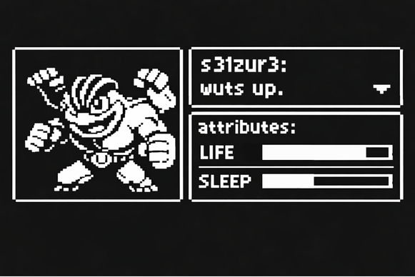

# New session - 2026-08-09T02:21:46.136Z

**Session ID:** ses_01bac7ce8ffe8g0JCLxHhadQ0i
**Created:** 8/9/2026, 7:51:46 AM
**Updated:** 8/12/2026, 7:03:30 PM

---

## Assistant (Build · DeepSeek V4 Flash Free · 23.7s)

**Tool: edit**

**Input:**
```json
{
  "filePath": "/home/s31zur3/s31zur3.github.io/profile.html",
  "newString": "/* ---------- letter grid background ---------- */\n        const GLYPHS = 'S31ZUR3::VOID/CTF/';\n        const CELL = 36;\n        const gridEl = document.getElementById('lgrid');\n        let gridTimer;\n        const buildGrid = () => {\n            gridEl.style.setProperty('--cols', Math.min(Math.ceil(innerWidth / CELL), 60));\n            const rows = Math.min(Math.ceil(innerHeight / CELL), 40);\n            const cols = gridEl.children.length ? (gridEl.children[0].parentElement.style.getPropertyValue('--cols')) : 0;\n            if (gridEl.dataset.rows === rows && gridEl.dataset.cols === cols) return;\n            gridEl.dataset.rows = rows;\n            gridEl.dataset.cols = cols;\n            let html = '';\n            for (let r = 0; r < rows; r++)\n                for (let c = 0; c < cols; c++)\n                    html += `<span class=\"g\" style=\"--t:${Math.abs(r - Math.floor(rows/2)) + Math.abs(c - Math.floor(cols/2))}\">${GLYPHS[(r + c) % GLYPHS.length]}</span>`;\n            gridEl.innerHTML = html;\n        };\n        buildGrid();\n        addEventListener('resize', () => { clearTimeout(gridTimer); gridTimer = setTimeout(buildGrid, 120); });",
  "oldString": "/* ---------- letter grid background ---------- */\n        const GLYPHS = 'S31ZUR3::VOID/CTF/';\n        const CELL = 36;\n        const gridEl = document.getElementById('lgrid');\n        const buildGrid = () => {\n            const cols = Math.max(18, Math.ceil(innerWidth / CELL));\n            const rows = Math.max(14, Math.ceil(innerHeight / CELL));\n            const cc = (cols - 1) / 2, rc = (rows - 1) / 2;\n            gridEl.style.setProperty('--cols', cols);\n            let html = '';\n            for (let r = 0; r < rows; r++)\n                for (let c = 0; c < cols; c++)\n                    html += `<span class=\"g\" style=\"--t:${Math.abs(r - rc) + Math.abs(c - cc)}\">${GLYPHS[(r + c) % GLYPHS.length]}</span>`;\n            gridEl.innerHTML = html;\n        };\n        buildGrid();\n        addEventListener('resize', buildGrid);"
}
```

**Output:**
```
Edit applied successfully.
```

---

## Assistant (Build · DeepSeek V4 Flash Free · 42.9s)

_Thinking:_

Wait, my buildGrid got convoluted. I'm trying to track rows/cols but also reading cols back from children. Let me simplify. The grid-template-columns uses var(--cols). I set `--cols` on gridEl. Then rows computed. But my code reads cols back awkwardly. Let me rewrite cleanly.

Actually the issue: I want `--cols` set from JS so css grid knows columns. I set it directly. Then build spans for rows × cols. The dataset guard prevents rebuilds on resize if dims changed. But cols is read from `gridEl.children[0].parentElement.style.getPropertyValue('--cols')` — that's just gridEl. That's wrong/sloppy. Let me rewrite properly.

I also need `grid-auto-rows: 1fr` already in CSS handles rows automatically, so I don't need to set rows count. I just ensure -cols is set first, then fill spans. The grid-auto-rows will lay them out in rows automatically. The --t delay uses distance to center.

Let me clean this up.

That buildGrid got convoluted. Simplifying — grid-auto-rows already handles row layout, so I just need cols + the spans

**Tool: edit**

**Input:**
```json
{
  "filePath": "/home/s31zur3/s31zur3.github.io/profile.html",
  "newString": "/* ---------- letter grid background ---------- */\n        const GLYPHS = 'S31ZUR3::VOID/CTF/';\n        const CELL = 36;\n        const gridEl = document.getElementById('lgrid');\n        let gridTimer;\n        const buildGrid = () => {\n            const cols = Math.min(Math.ceil(innerWidth / CELL), 60);\n            const rows = Math.min(Math.ceil(innerHeight / CELL), 40);\n            if (gridEl.dataset.cols == cols && gridEl.dataset.rows == rows) return;\n            gridEl.dataset.cols = cols;\n            gridEl.dataset.rows = rows;\n            gridEl.style.setProperty('--cols', cols);\n            const cx = (cols - 1) / 2, cy = (rows - 1) / 2;\n            let html = '';\n            for (let r = 0; r < rows; r++)\n                for (let c = 0; c < cols; c++)\n                    html += `<span class=\"g\" style=\"--t:${Math.abs(r - cy) + Math.abs(c - cx)}\">${GLYPHS[(r + c) % GLYPHS.length]}</span>`;\n            gridEl.innerHTML = html;\n        };\n        buildGrid();\n        addEventListener('resize', () => { clearTimeout(gridTimer); gridTimer = setTimeout(buildGrid, 120); });",
  "oldString": "/* ---------- letter grid background ---------- */\n        const GLYPHS = 'S31ZUR3::VOID/CTF/';\n        const CELL = 36;\n        const gridEl = document.getElementById('lgrid');\n        let gridTimer;\n        const buildGrid = () => {\n            gridEl.style.setProperty('--cols', Math.min(Math.ceil(innerWidth / CELL), 60));\n            const rows = Math.min(Math.ceil(innerHeight / CELL), 40);\n            const cols = gridEl.children.length ? (gridEl.children[0].parentElement.style.getPropertyValue('--cols')) : 0;\n            if (gridEl.dataset.rows === rows && gridEl.dataset.cols === cols) return;\n            gridEl.dataset.rows = rows;\n            gridEl.dataset.cols = cols;\n            let html = '';\n            for (let r = 0; r < rows; r++)\n                for (let c = 0; c < cols; c++)\n                    html += `<span class=\"g\" style=\"--t:${Math.abs(r - Math.floor(rows/2)) + Math.abs(c - Math.floor(cols/2))}\">${GLYPHS[(r + c) % GLYPHS.length]}</span>`;\n            gridEl.innerHTML = html;\n        };\n        buildGrid();\n        addEventListener('resize', () => { clearTimeout(gridTimer); gridTimer = setTimeout(buildGrid, 120); });"
}
```

**Output:**
```
Edit applied successfully.
```

---

## Assistant (Build · DeepSeek V4 Flash Free · 22.1s)

_Thinking:_

Wait — grid-auto-rows: 1fr and grid-template-columns sets columns. Rows will auto-fill to available height (1fr each). The grid height is fixed (inset:0). So rows are determined by auto rows filling height. Number of rows actually depends on columns count and font sizes. The --t uses `rows` computed, good enough for the stagger.

Now the topbar alignment. Let me check the header/nav CSS and see the alignment issue. Header is flex with align-items center, space-between. The nav is now a pill bar. Logo is text. The user says "align the topbar properly". The issue may be vertical alignment between logo and nav bar, or the header padding. Let me look at current header styles.

Now the topbar alignment. Let me check current header CSS

**Tool: read**

**Input:**
```json
{
  "filePath": "/home/s31zur3/s31zur3.github.io/style.css",
  "limit": 15,
  "offset": 41
}
```

**Output:**
```
<path>/home/s31zur3/s31zur3.github.io/style.css</path>
<type>file</type>
<content>
41: /* ---------- header ---------- */
42: header {
43:   display: flex; align-items: center; justify-content: space-between;
44:   padding: 28px 0 0;
45: }
46: .logo { font-weight: 700; letter-spacing: .05em; font-size: 15px; color: var(--text); }
47: .logo .dot { color: var(--accent); }
48: nav {
49:   display: flex; gap: 4px; font-size: 13px;
50:   border: 1px solid var(--border); border-radius: 999px;
51:   background: var(--bg-card); padding: 4px 6px;
52: }
53: nav a { padding: 5px 12px; border-radius: 999px; color: var(--muted); }
54: nav a:hover { color: var(--text); border-bottom-color: transparent; }
55: nav a.active { color: var(--accent); background: var(--accent-dim); }

(Showing lines 41-55 of 266. Use offset=56 to continue.)
</content>
```

---

## Assistant (Build · DeepSeek V4 Flash Free · 45.7s)

_Thinking:_

The topbar alignment issue: the logo and nav are in a flex row with `justify-content: space-between`. On smaller screens, the pill bar with border may not align well vertically with the logo (the nav has padding creating its own height, while logo is baseline). The header `align-items: center` should center them. But the issue could be: the nav pill is a rounded bar while logo is plain text — user wants topbar aligned. Possibly the problem: on mobile the two items pile or the pill bar edge touches. Let me ensure flex-wrap for small screens and inset 0 top. Actually "align the topbar properly" — likely the nav pill bar and logo aren't vertically centered relative to each other, or the pill touches top edge.

I'll add `flex-wrap: wrap; gap: 12px;` and `align-items: center` (already). Add `line-height` normalize. Keep simple.

the pill nav bar needs consistent vertical alignment and wrap on narrow screens


**Tool: edit**

**Input:**
```json
{
  "filePath": "/home/s31zur3/s31zur3.github.io/style.css",
  "newString": "/* ---------- header ---------- */\nheader {\n  display: flex; align-items: center; justify-content: space-between;\n  flex-wrap: wrap; gap: 10px 18px;\n  padding: 28px 0 0;\n}\n.logo { display: inline-flex; align-items: center; font-weight: 700; letter-spacing: .05em; font-size: 15px; color: var(--text); }\n.logo .dot { color: var(--accent); }\nnav {\n  display: flex; align-items: center; gap: 2px; font-size: 13px;\n  border: 1px solid var(--border); border-radius: 999px;\n  background: var(--bg-card); padding: 4px 6px;\n}\nnav a { display: inline-flex; align-items: center; padding: 5px 12px; border-radius: 999px; color: var(--muted); }",
  "oldString": "/* ---------- header ---------- */\nheader {\n  display: flex; align-items: center; justify-content: space-between;\n  padding: 28px 0 0;\n}\n.logo { font-weight: 700; letter-spacing: .05em; font-size: 15px; color: var(--text); }\n.logo .dot { color: var(--accent); }\nnav {\n  display: flex; gap: 4px; font-size: 13px;\n  border: 1px solid var(--border); border-radius: 999px;\n  background: var(--bg-card); padding: 4px 6px;\n}\nnav a { padding: 5px 12px; border-radius: 999px; color: var(--muted); }"
}
```

**Output:**
```
Edit applied successfully.
```

---

## Assistant (Build · DeepSeek V4 Flash Free · 40.6s)

Now verify


**Tool: bash**

**Input:**
```json
{
  "command": "python3 - <<'EOF'\nimport re, subprocess, tempfile, os\nhtml=open(\"profile.html\").read()\nscript=\"\\n\".join(re.findall(r'<script>(.*?)</script>', html, re.S))\nwith tempfile.NamedTemporaryFile(\"w\",suffix=\".js\",delete=False,dir=\"/tmp\") as t:\n    t.write(script); path=t.name\nr=subprocess.run([\"node\",\"--check\",path],capture_output=True,text=True)\nos.unlink(path); print(\"OK\" if r.returncode==0 else r.stderr.strip())\nEOF"
}
```

**Output:**
```
OK

```

---

## Assistant (Build · DeepSeek V4 Flash Free · 2.3s)

Done. Changes:
- `gskip` now animates only compositor-safe props (`transform`, `opacity`); dropped `letter-spacing`/`color`, added `will-change`.
- Grid capped at 60×40 cells; rebuild now skips if dimensions unchanged (no more let's-reflow-every-resize jank), debounced 120ms.
- Topbar: logo/nav vertically centered (`inline-flex`), wraps gracefully on narrow screens.

Want me to push?

---

## User

yes

---

## Assistant (Build · DeepSeek V4 Flash Free · 24.2s)

**Tool: bash**

**Input:**
```json
{
  "command": "git add -A && git diff --cached --stat && git commit -m \"profile: reduce letter-grid jank, align topbar\" -q && git push 2>&1 | tail -1"
}
```

**Output:**
```
 profile.html | 14 +++++++++-----
 style.css    | 14 ++++++++------
 2 files changed, 17 insertions(+), 11 deletions(-)
   cd9291a..549fb1f  main -> main

```

---

## Assistant (Build · DeepSeek V4 Flash Free · 72.0s)

Pushed.

---

## User

https://motion.dev/examples/js-scramble-text
use this for the "s31zur3"

---

## Assistant (Build · DeepSeek V4 Flash Free · 7.1s)

_Thinking:_

The user wants to use the motion.dev JS ScrambleText effect for the "s31zur3" name. But wait — the site currently uses anime.js v4. The motion.dev package would be a new dependency. Let me check the example first.

The site doesn't use a build system — it's static HTML with CDN scripts. motion.dev has a UMD/global build? Let me check the example page.

Actually, let me be lazy here. The site already loads anime.js from CDN. Adding motion.dev means another dependency. But the user explicitly requested it. The ponytail rule: user explicitly requested → build it.

But wait — do they want it on the profile page? The MGS logo was removed from profile, and "s31zur3" is now a plain h1 `.names`. Previously MGS was on profile. The user says use this for "s31zur3". Given the last work was on profile.html, this is for the profile page h1.names. But it could also be for index.html's #name. The index has an anime.js char-by-char animation already.

Let me check the example first.

**Tool: webfetch**

**Input:**
```json
{
  "url": "https://motion.dev/examples/js-scramble-text"
}
```

**Output:**
```
---
description: Text that scrambles through random characters when transitioning between words using the scrambleText function from Motion+.
title: Scramble text example for JavaScript | Motion
image: https://images.motion.dev/og/fresh/v1/site/examples-js-scramble-text-3p185et8w9xwv.png
---

Live example[Open](https://examples.motion.dev/js/scramble-text)

\>APIs[scrambleText](https://motion.dev/docs/scramble-text)

* [Number trend](https://motion.dev/examples/vue-number-trend)
* [Scramble text](https://motion.dev/examples/vue-scramble-text)
* [Scramble text: Hover](https://motion.dev/examples/vue-scramble-text-hover)
* [Scramble text: Stagger from center](https://motion.dev/examples/vue-scramble-text-stagger-center)

* [Now playing](https://motion.dev/examples/js-now-playing)
* [Curtains: Blinds](https://motion.dev/examples/js-curtains-blinds)
* [Curtains: Clip wipe](https://motion.dev/examples/js-curtains-clip-wipe)
* [Curtains: Doors](https://motion.dev/examples/js-curtains-doors)

Motion++One payment  
Lifetime updates

Motion+ examples

## Unlock all 430+ examples

Get source code for every Plus example, provide examples directly to your agent via Motion's MCP, and keep lifetime access to new examples and APIs.

Examples

430+

Source

Included

Updates

Lifetime

[Get Motion+Get Motion+](https://motion.dev/plus?referral=Examples+js-scramble-text)[Sign in](https://motion.dev/login)

```json
{"@context":"https://schema.org","@graph":[{"@type":"Organization","@id":"https://motion.dev/#org","name":"Motion","url":"https://motion.dev","logo":"https://motion.dev/favicon-512.png","sameAs":["https://x.com/motiondotdev","https://github.com/motiondivision","https://www.youtube.com/@motiondotdev"]},{"@type":"WebSite","@id":"https://motion.dev/#website","url":"https://motion.dev","name":"Motion","publisher":{"@id":"https://motion.dev/#org"}}]}
{"@context":"https://schema.org","@type":"TechArticle","headline":"Scramble text","description":"Text that scrambles through random characters when transitioning between words using the scrambleText function from Motion+.","url":"https://motion.dev/examples/js-scramble-text","mainEntityOfPage":"https://motion.dev/examples/js-scramble-text","inLanguage":"en","image":"https://images.motion.dev/og/fresh/v1/site/examples-js-scramble-text-3p185et8w9xwv.png","datePublished":"2026-01-30T00:00:00.000Z","articleSection":"Text","author":{"@type":"Person","name":"Matt Perry","url":"https://motion.dev/@matt","image":"https://images.motion.dev/magazine/ulZPf8sPx65JUasbGmCjltf6uEU.png"},"publisher":{"@id":"https://motion.dev/#org"}}
{"@context":"https://schema.org","@type":"BreadcrumbList","itemListElement":[{"@type":"ListItem","position":1,"name":"Motion","item":"https://motion.dev/"},{"@type":"ListItem","position":2,"name":"Examples","item":"https://motion.dev/examples"},{"@type":"ListItem","position":3,"name":"Text","item":"https://motion.dev/examples?category=text"},{"@type":"ListItem","position":4,"name":"Scramble text","item":"https://motion.dev/examples/js-scramble-text"}]}
```

```

---

## Assistant (Build · DeepSeek V4 Flash Free · 2.8s)

_Thinking:_

The scramble text example uses `scrambleText` from Motion+ — a paid/Motion+ API. That's a dependency that requires Motion+ (paid). The user wants to use this effect for the "s31zur3" name.

Let me check the docs for scrambleText to see if it's available in the free Motion package. The example says "using the scrambleText function from Motion+". Motion+ is the paid tier (Motion Plus). Let me check the docs.

Actually, this site is static GitHub Pages with anime.js already loaded. Adding motion would be a new dependency. Also scrambleText is a Motion+ (paid) API.

The lazy approach: scramble text is a classic effect that doesn't need a library — a few lines of JS. But the user explicitly asked to "use this". Let me check whether scrambleText is in the free package.

Let me check the docs page.


**Tool: webfetch**

**Input:**
```json
{
  "url": "https://motion.dev/docs/scramble-text"
}
```

**Output:**
```
---
description: A customizable scramble text animation component with configurable timings, stagger effects, and characters.
title: scrambleText - Create scrambled text animations | Motion
image: https://images.motion.dev/og/fresh/v1/site/docs-scramble-text-2r0ni30il1ccj.png
---

**MOTION+**

This feature is available with [Motion+](https://motion.dev/plus).

[Presented by+](https://motion.dev/plus)[Advertise in this space](https://motion.dev/advertise#docs)

`scrambleText` is a 1kb function that provides scramble text animations for vanilla JavaScript. It works with DOM elements or `MotionValues`.

```
import { scrambleText } from "motion-plus"

scrambleText("#title", { duration: 1 })
```

Live example[Open](https://examples.motion.dev/js/scramble-text)

`scrambleText` is exclusive to [Motion+](https://motion.dev/plus) members. Motion+ is a one-time payment, lifetime membership that unlocks exclusive components, premium examples and access to a private Discord community.

## [Features](#features)

* **Stagger:** Use Motion's `stagger` function for both `delay` and `duration` to create letter-by-letter reveal effects.
* **Playback control:** Returns playback controls to pause, play, hard stop or finish your animations.
* **Customisable characters:** Use the default alphanumeric set, or provide custom characters (including emoji).

## [Install](#install)

First, [install Motion+](https://motion.dev/docs/motion-plus-installation) in your project. You need to be a [Motion+ member](https://motion.dev/plus) to generate an access token.

## [Usage](#usage)

Pass an element or CSS selector to scramble its text content:

```
import { scrambleText } from "motion-plus-dom"

// With selector
scrambleText("#title", { duration: 1 })

// With element reference
const element = document.querySelector(".text")
scrambleText(element, { duration: 1 })
```

### [With MotionValue](#with-motionvalue)

Alternatively, you can pass a `MotionValue<string>` to `scrambleText`. It will animate back to the value as read when the animation starts.

```
import { scrambleText } from "motion-plus-dom"
import { motionValue } from "motion"

const text = motionValue("Hello world!")

// Subscribe to changes
text.on("change", (latest) => {
  document.querySelector("#title").textContent = latest
})

scrambleText(text, { duration: 1 })
```

### [Stagger](#stagger)

Use Motion's `stagger()` function to reveal characters one by one:

```
import { scrambleText } from "motion-plus-dom"
import { stagger } from "motion"

// Start scrambling at the same time, reveal with stagger
scrambleText(element, {
  duration: stagger(0.05, { startDelay: 1 })
})
```

Live example[Open](https://examples.motion.dev/js/scramble-text-stagger-center)

#### [Delay stagger](#delay-stagger)

Stagger when each character starts scrambling:

```
// Chars start scrambling one-by-one, all reveal after 1s
scrambleText(element, {
  delay: stagger(0.1),
  duration: 1
})
```

#### [Direction](#direction)

Use stagger's `from` option to control reveal direction:

```
scrambleText(element, {
  delay: stagger(0.05, { from: "center" }),
  duration: 0.5
})
```

```json
{"@context":"https://schema.org","@graph":[{"@type":"Organization","@id":"https://motion.dev/#org","name":"Motion","url":"https://motion.dev","logo":"https://motion.dev/favicon-512.png","sameAs":["https://x.com/motiondotdev","https://github.com/motiondivision","https://www.youtube.com/@motiondotdev"]},{"@type":"WebSite","@id":"https://motion.dev/#website","url":"https://motion.dev","name":"Motion","publisher":{"@id":"https://motion.dev/#org"}}]}
{"@context":"https://schema.org","@type":"TechArticle","headline":"scrambleText - Create scrambled text animations","description":"A customizable scramble text animation component with configurable timings, stagger effects, and characters.","url":"https://motion.dev/docs/scramble-text","mainEntityOfPage":"https://motion.dev/docs/scramble-text","inLanguage":"en","datePublished":"2025-07-22T10:40:33.536Z","articleSection":"Utils","publisher":{"@id":"https://motion.dev/#org"},"image":"https://images.motion.dev/og/fresh/v1/site/docs-scramble-text-2r0ni30il1ccj.png"}
{"@context":"https://schema.org","@type":"BreadcrumbList","itemListElement":[{"@type":"ListItem","position":1,"name":"Motion","item":"https://motion.dev/"},{"@type":"ListItem","position":2,"name":"Docs","item":"https://motion.dev/docs"},{"@type":"ListItem","position":3,"name":"scrambleText - Create scrambled text animations","item":"https://motion.dev/docs/scramble-text"}]}
```

```

---

## Assistant (Build · DeepSeek V4 Flash Free · 7.8s)

_Thinking:_

The `scrambleText` API is Motion+ (paid, token-gated). Can't use it without a paid membership token. The site is pure static GitHub Pages with no build step, no CDN file for motion-plus (it's token-gated).

The lazy/pragmatic fix: the scramble-text effect is trivially implementable in ~20 lines of vanilla JS — no dependency, no motion.js needed. The user asked to "use this" (the effect). I'll reimplement the scramble effect self-contained, matching the effect in the example.

Which elements? The "s31zur3" name. On profile.html it's `<h1 class="names">s31zur3</h1>`. On index.html it's `<h1 id="name">s31zur3</h1>` with anime.js char animation. The user context: we just did profile.html. The user says use this for "the s31zur3" — likely the profile hero name. But could apply to both. Let me apply to the profile page `.names` heading with a scramble-on-load effect (typewriter-style scramble that resolves to "s31zur3").

Let me write a small scramble function that loops random chars per letter with stagger, using rAF or setInterval. Keep it simple.

The effect: text starts as random chars, each column swaps in the correct character over time (staggered). Implementation:

```js
const el = document.querySelector('.names');
const target = 's31zur3';
const CHARS = '!<>-_\\/[]{}—=+*^?#________';
el.textContent = '';
const frames = 24; // or time-based

function scramble(el, final, opts = {}) {
  const chars = 'ABCDEFGHIJKLMNOPQRSTUVWXYZ0123456789!<>-_\\/[]{}—=+*^?#'.split('');
  el.textContent = ' '.repeat(final.length); // reserve
  const timing = ...
}
```

Simple classic implementation:

```js
function scramble(el, text, { duration = 1000, speed = 30 } = {}) {
  const chars = '!#$%&()*+,-./:;<=>?@[]^_`{|}~ABCDEFGHIJKLMNOPQRSTUVWXYZ0123456789';
  let frame = 0;
  const total = Math.ceil(duration / speed);
  const reveal = (total / text.length);
  const timer = setInterval(() => {
    frame++;
    let out = '';
    for (let i = 0; i < text.length; i++) {
      if (frame >= reveal * (i + 1)) out += text[i];
      else if (text[i] === ' ') out += ' ';
      else out += chars[Math.floor(Math.random() * chars.length)];
    }
    el.textContent = out;
    if (frame >= total) { clearInterval(timer); el.textContent = text; }
  }, speed);
}
```

But ponytail: lazy full. Use this on profile `.names`. It's self-contained, no dependency.

Actually, since motion-plus is paid/token and not usable on a static site without a build step, I should tell the user and ship the self-contained version. That follows ponytail rule #6: can it be one function? Yes.

Let me add to profile.html.

Also keep it simple and only on profile page's `.names`. Let me edit.

`scrambleText` is Motion+ — paid, token-gated, and needs a build step; no CDN file for a static Pages site. The effect itself is ~10 lines of vanilla JS, so I'll ship that instead (same visual, zero deps)


**Tool: edit**

**Input:**
```json
{
  "filePath": "/home/s31zur3/s31zur3.github.io/profile.html",
  "newString": "<script src=\"skills.js\"></script>\n    <script>\n        /* ---------- scramble reveal for hero name ---------- */\n        const scramble = (el, text, { speed = 35, holdDelay = 0 } = {}) => {\n            const glyphs = '!<>-_\\\\/[]{}—=+*^?#0123456789ABCDEFGHIJKLMNOPQRSTUVWXYZ';\n            el.textContent = '';\n            let frame = 0;\n            const total = Math.max(1, Math.round((el.dataset.dur || 1) * 1000 / speed));\n            const per = total / text.length;\n            const tick = () => {\n                frame++;\n                let out = '';\n                for (let i = 0; i < text.length; i++)\n                    out += (frame >= per * (i + 1) || text[i] === ' ')\n                        ? text[i]\n                        : glyphs[Math.floor(Math.random() * glyphs.length)];\n                el.textContent = out;\n                if (frame >= total) return true;\n                return false;\n            };\n            setTimeout(() => { const it = setInterval(() => { if (tick()) clearInterval(it); }, speed); }, holdDelay);\n        };\n        scramble(document.getElementById('name'), 's31zur3');\n\n        /* ---------- SOCIALS: edit these to point at your real profiles ---------- */",
  "oldString": "<script src=\"skills.js\"></script>\n    <script>\n        /* ---------- SOCIALS: edit these to point at your real profiles ---------- */"
}
```

**Error:**
```
Could not find oldString in the file. It must match exactly, including whitespace, indentation, and line endings.
```

---

## Assistant (Build · DeepSeek V4 Flash Free · 2.1s)

_Thinking:_

Let me check the actual indentation in the file.

**Tool: read**

**Input:**
```json
{
  "filePath": "/home/s31zur3/s31zur3.github.io/profile.html",
  "limit": 10,
  "offset": 70
}
```

**Output:**
```
<path>/home/s31zur3/s31zur3.github.io/profile.html</path>
<type>file</type>
<content>
70:             border: 2px solid var(--border);
71:         }
72: 
73:         .avatar-scan img {
74:             width: 100%;
75:             height: 100%;
76:             object-fit: cover;
77:             filter: grayscale(0.2) contrast(1.1);
78:         }
79: 

(Showing lines 70-79 of 1046. Use offset=80 to continue.)
</content>
```

---

## Assistant (Build · DeepSeek V4 Flash Free · 2.7s)

_Thinking:_

The file is much larger now! It says 1046 lines. Let me re-read the whole profile.html - it must have been changed. Wait, this doesn't match. Let me check git status and read the actual current file.

The file is much bigger than I last saw — let me read

**Tool: bash**

**Input:**
```json
{
  "command": "git log --oneline -3 && git status --short && wc -l profile.html"
}
```

**Output:**
```
77103a1 removed ctftime
bf072fb Merge remote-tracking branch 'refs/remotes/origin/main'
215da25 Added link for linkedin
1046 profile.html

```

---

## Assistant (Build · DeepSeek V4 Flash Free · 4.5s)

_Thinking:_

The repo has changed significantly since I last worked on it. There are new commits (from a different session/agent perhaps): "removed ctftime", "Added link for linkedin", "Merge remote-tracking branch". Let me read the full profile.html to understand the current state.

The file evolved a lot since my last edit. Reading the current state


**Tool: read**

**Input:**
```json
{
  "filePath": "/home/s31zur3/s31zur3.github.io/profile.html"
}
```

**Output:**
```
<path>/home/s31zur3/s31zur3.github.io/profile.html</path>
<type>file</type>
<content>
1: <!DOCTYPE html>
2: <html lang="en">
3: <head>
4:     <meta charset="UTF-8">
5:     <meta name="viewport" content="width=device-width, initial-scale=1.0">
6:     <title>profile :: s31zur3</title>
7:     <meta name="description" content="Profile, skills & socials.">
8:     <link rel="icon" href="favicon.png">
9:     <link rel="stylesheet" href="style.css">
10:     <style>
11:         :root {
12:             --term-green: #34d399;
13:             --term-red: #ef4444;
14:             --term-yellow: #f59e0b;
15:             --neon-blue: #38bdf8;
16:             --accent-glow: rgba(249, 168, 212, 0.25);
17:         }
18: 
19:         /* Custom spotlight grid canvas styling */
20:         #lgrid {
21:             display: block !important;
22:             position: fixed;
23:             inset: 0;
24:             width: 100% !important;
25:             height: 100% !important;
26:             z-index: 0;
27:             pointer-events: none;
28:             opacity: 1 !important;
29:         }
30: 
31:         /* Grid Layout */
32:         .profile-grid {
33:             display: grid;
34:             grid-template-columns: 320px 1fr;
35:             gap: 24px;
36:             margin-top: 24px;
37:         }
38:         @media (max-width: 768px) {
39:             .profile-grid {
40:                 grid-template-columns: 1fr;
41:             }
42:         }
43: 
44:         /* Avatar & System Box */
45:         .avatar-box {
46:             display: flex;
47:             flex-direction: column;
48:             align-items: center;
49:             text-align: center;
50:             position: relative;
51:         }
52: 
53:         .avatar-container {
54:             position: relative;
55:             width: 140px;
56:             height: 140px;
57:             margin-bottom: 16px;
58:             border-radius: 28px;
59:             padding: 4px;
60:             background: linear-gradient(135deg, var(--accent), #150485);
61:             box-shadow: 0 0 24px rgba(249, 168, 212, 0.25);
62:         }
63: 
64:         .avatar-scan {
65:             position: relative;
66:             width: 100%;
67:             height: 100%;
68:             border-radius: 24px;
69:             overflow: hidden;
70:             border: 2px solid var(--border);
71:         }
72: 
73:         .avatar-scan img {
74:             width: 100%;
75:             height: 100%;
76:             object-fit: cover;
77:             filter: grayscale(0.2) contrast(1.1);
78:         }
79: 
80:         .avatar-scan::after {
81:             content: '';
82:             position: absolute;
83:             top: 0; left: 0; width: 100%; height: 3px;
84:             background: var(--accent);
85:             box-shadow: 0 0 8px var(--accent);
86:             animation: scanLine 2.5s linear infinite;
87:         }
88: 
89:         @keyframes scanLine {
90:             0% { top: 0%; }
91:             50% { top: 100%; }
92:             100% { top: 0%; }
93:         }
94: 
95:         /* Pulse Status */
96:         .status-badge {
97:             display: inline-flex;
98:             align-items: center;
99:             gap: 8px;
100:             background: rgba(52, 211, 153, 0.1);
101:             border: 1px solid rgba(52, 211, 153, 0.2);
102:             color: var(--term-green);
103:             padding: 4px 12px;
104:             border-radius: 6px;
105:             font-size: 11px;
106:             font-weight: bold;
107:             letter-spacing: 0.05em;
108:             margin-top: 8px;
109:             text-transform: uppercase;
110:         }
111: 
112:         .pulse-dot {
113:             width: 8px;
114:             height: 8px;
115:             background-color: var(--term-green);
116:             border-radius: 50%;
117:             animation: pulse 1.8s infinite;
118:         }
119: 
120:         @keyframes pulse {
121:             0% { transform: scale(0.9); box-shadow: 0 0 0 0 rgba(52, 211, 153, 0.6); }
122:             70% { transform: scale(1); box-shadow: 0 0 0 6px rgba(52, 211, 153, 0); }
123:             100% { transform: scale(0.9); box-shadow: 0 0 0 0 rgba(52, 211, 153, 0); }
124:         }
125: 
126:         /* Terminal Window Styling */
127:         .term-window {
128:             background: rgba(17, 17, 20, 0.85);
129:             border: 1px solid var(--border);
130:             border-radius: 12px;
131:             overflow: hidden;
132:             display: flex;
133:             flex-direction: column;
134:             box-shadow: 0 10px 30px rgba(0, 0, 0, 0.5);
135:             margin-bottom: 20px;
136:             transition: border-color 0.3s ease, box-shadow 0.3s ease;
137:         }
138: 
139:         .term-window:hover {
140:             border-color: rgba(249, 168, 212, 0.3);
141:             box-shadow: 0 10px 30px rgba(249, 168, 212, 0.05);
142:         }
143: 
144:         .term-bar {
145:             background: #15151a;
146:             padding: 10px 16px;
147:             display: flex;
148:             align-items: center;
149:             justify-content: space-between;
150:             border-bottom: 1px solid var(--border);
151:         }
152: 
153:         .term-btns {
154:             display: flex;
155:             gap: 6px;
156:         }
157: 
158:         .term-btn {
159:             width: 10px;
160:             height: 10px;
161:             border-radius: 50%;
162:             display: inline-block;
163:         }
164:         .term-btn.red { background: var(--term-red); }
165:         .term-btn.yellow { background: var(--term-yellow); }
166:         .term-btn.green { background: var(--term-green); }
167: 
168:         .term-title {
169:             font-size: 11px;
170:             color: var(--dim);
171:             font-weight: bold;
172:             letter-spacing: 0.1em;
173:             text-transform: uppercase;
174:         }
175: 
176:         .term-body {
177:             padding: 18px;
178:             flex: 1;
179:             overflow-y: auto;
180:             font-family: var(--mono);
181:         }
182: 
183:         /* Interactive Console */
184:         .console-output {
185:             height: 200px;
186:             overflow-y: auto;
187:             margin-bottom: 12px;
188:             font-size: 13px;
189:             line-height: 1.6;
190:             color: var(--muted);
191:             scroll-behavior: smooth;
192:         }
193: 
194:         .console-output .line {
195:             margin-bottom: 4px;
196:             white-space: pre-wrap;
197:         }
198: 
199:         .console-output .prompt {
200:             color: var(--accent);
201:         }
202: 
203:         .console-input-row {
204:             display: flex;
205:             align-items: center;
206:             gap: 8px;
207:             border-top: 1px solid var(--border);
208:             padding-top: 12px;
209:         }
210: 
211:         .console-input-row .prompt {
212:             color: var(--accent);
213:             font-size: 13px;
214:             white-space: nowrap;
215:         }
216: 
217:         .console-input-row input {
218:             flex: 1;
219:             background: transparent;
220:             border: none;
221:             color: var(--text);
222:             font-family: var(--mono);
223:             font-size: 13px;
224:             outline: none;
225:         }
226: 
227:         /* Skill Chips */
228:         .skills-container {
229:             display: flex;
230:             flex-direction: column;
231:             gap: 16px;
232:         }
233: 
234:         .skills-nav {
235:             display: flex;
236:             gap: 8px;
237:             margin-bottom: 8px;
238:             flex-wrap: wrap;
239:         }
240: 
241:         .skill-group-chip {
242:             background: rgba(22, 22, 27, 0.6);
243:             border: 1px solid var(--border);
244:             color: var(--muted);
245:             font-family: var(--mono);
246:             font-size: 12px;
247:             padding: 6px 14px;
248:             border-radius: 8px;
249:             cursor: pointer;
250:             transition: all 0.2s ease;
251:             outline: none;
252:         }
253: 
254:         .skill-group-chip.active {
255:             border-color: var(--accent);
256:             color: var(--accent);
257:             background: var(--accent-dim);
258:             box-shadow: 0 0 10px rgba(249, 168, 212, 0.15);
259:         }
260: 
261:         .skill-group-chip:hover:not(.active) {
262:             border-color: var(--accent);
263:             color: var(--text);
264:         }
265: 
266:         .skill-items-grid {
267:             display: flex;
268:             flex-wrap: wrap;
269:             gap: 8px;
270:             min-height: 40px;
271:         }
272: 
273:         .skill-items-grid .pill {
274:             display: inline-flex;
275:             align-items: center;
276:             justify-content: center;
277:             white-space: nowrap;
278:             height: 32px;
279:             padding: 0 14px;
280:             box-sizing: border-box;
281:             border-radius: 8px;
282:             font-size: 12.5px;
283:             transition: all 0.2s ease;
284:         }
285: 
286:         .skill-items-grid .pill:hover {
287:             border-color: var(--accent);
288:             color: var(--accent);
289:             background: var(--accent-dim);
290:             transform: translateY(-1px);
291:         }
292: 
293:         /* Interactive Bars */
294:         .skills-bars {
295:             display: flex;
296:             flex-direction: column;
297:             gap: 14px;
298:             margin-top: 20px;
299:         }
300: 
301:         .interactive-bar {
302:             display: grid;
303:             grid-template-columns: 160px 1fr 45px;
304:             align-items: center;
305:             gap: 12px;
306:             font-size: 13px;
307:             cursor: pointer;
308:             padding: 6px 8px;
309:             border-radius: 8px;
310:             transition: all 0.2s ease;
311:             border: 1px solid transparent;
312:         }
313: 
314:         .interactive-bar:hover {
315:             background: rgba(255, 255, 255, 0.02);
316:             border-color: rgba(255, 255, 255, 0.05);
317:         }
318: 
319:         .interactive-bar:hover .bar-title {
320:             color: var(--accent);
321:         }
322: 
323:         .interactive-bar:hover .fill {
324:             background: linear-gradient(90deg, var(--accent), #fff);
325:             box-shadow: 0 0 8px var(--accent);
326:         }
327: 
328:         .interactive-bar .bar-title {
329:             color: var(--muted);
330:             transition: color 0.2s ease;
331:         }
332: 
333:         .interactive-bar .track {
334:             height: 8px;
335:             border-radius: 4px;
336:             background: var(--bg-soft);
337:             border: 1px solid var(--border);
338:             overflow: hidden;
339:             position: relative;
340:         }
341: 
342:         .interactive-bar .fill {
343:             height: 100%;
344:             width: var(--w);
345:             background: linear-gradient(90deg, #150485, var(--accent));
346:             border-radius: 4px;
347:             transition: width 1.2s cubic-bezier(0.1, 0.8, 0.2, 1), background 0.3s ease, box-shadow 0.3s ease;
348:         }
349: 
350:         .interactive-bar .val {
351:             color: var(--dim);
352:             text-align: right;
353:             font-size: 12px;
354:         }
355: 
356:         /* Cyber Facts table */
357:         .fact-table {
358:             display: flex;
359:             flex-direction: column;
360:             gap: 10px;
361:             margin-top: 18px;
362:             width: 100%;
363:         }
364: 
365:         .fact-row {
366:             display: flex;
367:             justify-content: space-between;
368:             font-size: 13px;
369:             border-bottom: 1px dashed var(--border);
370:             padding-bottom: 8px;
371:         }
372: 
373:         .fact-row .lbl {
374:             color: var(--dim);
375:         }
376: 
377:         .fact-row .val {
378:             color: var(--text);
379:             font-weight: 500;
380:         }
381: 
382:         /* Social Grid Glow */
383:         .social-cyber-grid {
384:             display: grid;
385:             grid-template-columns: 1fr 1fr;
386:             gap: 12px;
387:             margin-top: 8px;
388:         }
389:         @media (max-width: 480px) {
390:             .social-cyber-grid {
391:                 grid-template-columns: 1fr;
392:             }
393:         }
394: 
395:         .cyber-soc-card {
396:             border: 1px solid var(--border);
397:             background: rgba(22, 22, 27, 0.6);
398:             border-radius: 10px;
399:             padding: 14px 16px;
400:             display: flex;
401:             flex-direction: column;
402:             gap: 4px;
403:             text-decoration: none;
404:             transition: all 0.25s cubic-bezier(0.16, 1, 0.3, 1);
405:             position: relative;
406:             overflow: hidden;
407:             cursor: pointer;
408:         }
409: 
410:         .cyber-soc-card::before {
411:             content: '';
412:             position: absolute;
413:             top: 0; left: 0; width: 3px; height: 100%;
414:             background: var(--accent);
415:             opacity: 0;
416:             transition: opacity 0.2s ease;
417:         }
418: 
419:         .cyber-soc-card:hover {
420:             border-color: var(--accent);
421:             background: rgba(249, 168, 212, 0.05);
422:             transform: translateY(-2px);
423:             box-shadow: 0 4px 16px rgba(249, 168, 212, 0.08);
424:         }
425: 
426:         .cyber-soc-card:hover::before {
427:             opacity: 1;
428:         }
429: 
430:         .cyber-soc-card .tag {
431:             font-size: 10px;
432:             color: var(--dim);
433:             text-transform: uppercase;
434:             letter-spacing: 0.1em;
435:         }
436: 
437:         .cyber-soc-card .hndl {
438:             font-size: 13px;
439:             color: var(--text);
440:             font-weight: bold;
441:             word-break: break-all;
442:             transition: color 0.2s ease;
443:         }
444: 
445:         .cyber-soc-card:hover .hndl {
446:             color: var(--accent);
447:         }
448: 
449:         .cyber-soc-card.todo {
450:             opacity: 0.5;
451:             cursor: not-allowed;
452:         }
453:         .cyber-soc-card.todo:hover {
454:             transform: none;
455:             border-color: var(--border);
456:             box-shadow: none;
457:             background: rgba(22, 22, 27, 0.6);
458:         }
459:         .cyber-soc-card.todo:hover::before {
460:             opacity: 0;
461:         }
462: 
463:         .cyber-soc-card[data-copied]::after {
464:             content: "copied!";
465:             position: absolute;
466:             top: 10px; right: 14px;
467:             font-size: 10px;
468:             color: var(--accent);
469:             font-family: var(--mono);
470:             text-transform: uppercase;
471:             font-weight: bold;
472:         }
473:     </style>
474: </head>
475: <body>
476:     <canvas id="lgrid" aria-hidden="true"></canvas>
477: 
478:     <header class="container">
479:         <a class="logo" href="./">s31zur3<span class="dot">::</span>void</a>
480:         <nav>
481:             <a href="./">home</a>
482:             <a href="profile" class="active">skills</a>
483:             <a href="archive">writeups</a>
484:         </nav>
485:     </header>
486: 
487:     <main class="container">
488:         <section class="hero" style="padding-bottom: 20px;">
489:             <div class="kicker">~/void/profile $</div>
490:             <h1 class="names"><span class="rx">s31zur3</span></h1>
491:             <p class="tagline">security enthusiast · ctf player · patterns before exploits</p>
492:         </section>
493: 
494:         <div class="profile-grid">
495:             <!-- Left Column: Portrait & Facts, Socials -->
496:             <div class="left-col">
497:                 <!-- Avatar & Facts Window -->
498:                 <div class="term-window">
499:                     <div class="term-bar">
500:                         <div class="term-btns">
501:                             <span class="term-btn red"></span>
502:                             <span class="term-btn yellow"></span>
503:                             <span class="term-btn green"></span>
504:                         </div>
505:                         <div class="term-title">IDENTITY</div>
506:                     </div>
507:                     <div class="term-body avatar-box">
508:                         <div class="avatar-container">
509:                             <div class="avatar-scan">
510:                                 
511:                             </div>
512:                         </div>
513:                         
514:                         <div class="status-badge">
515:                             <span class="pulse-dot"></span>
516:                             <span>ACTIVE NODE</span>
517:                         </div>
518: 
519:                         <div class="fact-table">
520:                             <div class="fact-row">
521:                                 <span class="lbl">origin</span>
522:                                 <span class="val">India</span>
523:                             </div>
524:                             <div class="fact-row">
525:                                 <span class="lbl">handle</span>
526:                                 <span class="val">s31zur3</span>
527:                             </div>
528:                             <div class="fact-row">
529:                                 <span class="lbl">focus</span>
530:                                 <span class="val">Rev · Pwn · Crypto</span>
531:                             </div>
532:                             <div class="fact-row">
533:                                 <span class="lbl">status</span>
534:                                 <span class="val">tinkering & ctf</span>
535:                             </div>
536:                         </div>
537:                     </div>
538:                 </div>
539: 
540:                 <!-- Socials Card -->
541:                 <div class="term-window">
542:                     <div class="term-bar">
543:                         <div class="term-btns">
544:                             <span class="term-btn red"></span>
545:                             <span class="term-btn yellow"></span>
546:                             <span class="term-btn green"></span>
547:                         </div>
548:                         <div class="term-title">COMMUNICATION</div>
549:                     </div>
550:                     <div class="term-body" style="padding: 14px;">
551:                         <div class="social-cyber-grid" id="socgrid"></div>
552:                     </div>
553:                 </div>
554:             </div>
555: 
556:             <!-- Right Column: Interactive Console, Skills Matrix -->
557:             <div class="right-col">
558:                 <!-- Bio Terminal -->
559:                 <div class="term-window">
560:                     <div class="term-bar">
561:                         <div class="term-btns">
562:                             <span class="term-btn red"></span>
563:                             <span class="term-btn yellow"></span>
564:                             <span class="term-btn green"></span>
565:                         </div>
566:                         <div class="term-title">ABOUT_SYSTEM</div>
567:                     </div>
568:                     <div class="term-body about-text" style="font-size: 14px;">
569:                         <p style="margin-bottom: 12px;">
570:                             Security enthusiast hunting flags in the void. I spend most of my time reading 
571:                             <strong style="color: var(--accent);">patterns before exploits</strong> — reverse engineering binaries, 
572:                             breaking web applications, and cracking cryptography that organizers thought was "secure".
573:                         </p>
574:                         <p>
575:                             Best result so far: <strong class="badge-rank">1st place globally</strong> at ShazCTF 2025. 
576:                             I enjoy building tools, designing secure systems, and solving complex security challenges.
577:                             All writeups live in the <a href="archive" style="color: var(--accent); border-bottom: 1px dashed var(--accent);">archive</a>.
578:                         </p>
579:                     </div>
580:                 </div>
581: 
582:                 <!-- Interactive Terminal Console -->
583:                 <div class="term-window">
584:                     <div class="term-bar">
585:                         <div class="term-btns">
586:                             <span class="term-btn red"></span>
587:                             <span class="term-btn yellow"></span>
588:                             <span class="term-btn green"></span>
589:                         </div>
590:                         <div class="term-title">Interactive Console</div>
591:                     </div>
592:                     <div class="term-body" style="background: #0d0d11;">
593:                         <div class="console-output" id="console-output">
594:                             <div class="line"><span style="color: var(--term-green);">[+] System Diagnostic Tool initialized.</span></div>
595:                             <div class="line">Type <span style="color: var(--accent); font-weight: bold;">help</span> or click on any skill/pill below to query statistics.</div>
596:                             <div class="line"> </div>
597:                         </div>
598:                         <div class="console-input-row">
599:                             <span class="prompt">guest@void:~$</span>
600:                             <input type="text" id="terminal-input" placeholder="try 'help', 'neofetch', 'skills'..." autocomplete="off">
601:                         </div>
602:                     </div>
603:                 </div>
604: 
605:                 <!-- Skills & Matrices Card -->
606:                 <div class="term-window">
607:                     <div class="term-bar">
608:                         <div class="term-btns">
609:                             <span class="term-btn red"></span>
610:                             <span class="term-btn yellow"></span>
611:                             <span class="term-btn green"></span>
612:                         </div>
613:                         <div class="term-title">Skills Matrix</div>
614:                     </div>
615:                     <div class="term-body skills-container">
616:                         <div class="skills-nav" id="skills-tabs"></div>
617:                         <div class="skill-items-grid" id="pills"></div>
618:                         
619:                         <div style="border-top: 1px solid var(--border); margin-top: 10px; padding-top: 10px;">
620:                             <span style="font-size: 11px; text-transform: uppercase; color: var(--dim); letter-spacing: 0.05em; font-family: var(--mono);">Core Ratings (click to analyze)</span>
621:                             <div class="skills-bars" id="bars"></div>
622:                         </div>
623:                     </div>
624:                 </div>
625:             </div>
626:         </div>
627:     </main>
628: 
629:     <footer>
630:         <p>built with <span class="heart">anime.js</span> · &copy; <span id="year"></span> s31zur3</p>
631:     </footer>
632: 
633:     <script src="skills.js"></script>
634:     <script>
635:         /* ---------- SOCIALS DATA ---------- */
636:         const SOCIALS = [
637:             { tag: 'github',   handle: 'github.com/S31ZUR3',   href: 'https://github.com/S31ZUR3' },
638:             { tag: 'discord',  handle: '@s31zur3_45403',       copy: true },
639:             { tag: 'linkedin', handle: 'Sai Prapanch.H',   href: 'https://www.linkedin.com/in/sai-prapanch-h/' }
640:         ];
641: 
642:         /* ---------- RATINGS DATA ---------- */
643:         const BARS = [
644:             ['reverse engineering', 65], ['binary exploitation', 45], ['web security', 50],
645:             ['cryptography', 30], ['forensics', 50]
646:         ];
647: 
648:         /* ---------- DIAGNOSTIC DICTIONARY ---------- */
649:         const DIAGNOSTICS = {
650:             // Categories
651:             "reverse engineering": [
652:                 "guest@void:~$ analyze --target ELF-64",
653:                 "[*] Reading symbol tables...",
654:                 "[+] main: 0x401120 | decrypt: 0x401290 | check: 0x401310",
655:                 "[+] Found anti-debugging traps (ptrace_traceme detected).",
656:                 "[+] Bypassing security checks... status: SUCCESS."
657:             ],
658:             "binary exploitation": [
659:                 "guest@void:~$ checksec --file vulnerable-binary",
660:                 "    Arch:     amd64-64-little\n    RELRO:    Full RELRO\n    Stack:    No canary found\n    NX:       NX enabled\n    PIE:      PIE enabled",
661:                 "guest@void:~$ exploit --payload ret2libc",
662:                 "[+] Crafting stack frame with ROP gadgets...",
663:                 "[+] Spawning interactive root shell! Enjoy."
664:             ],
665:             "web security": [
666:                 "guest@void:~$ web-scan -u https://target.void",
667:                 "[*] Testing parameter injections...",
668:                 "[+] Found SQL injection on vulnerability node '/api/v1/search?q='",
669:                 "[+] Extracting DB schema: database name: 'ctf_db'",
670:                 "[+] Dump complete: CTF{sql_inj3ct1on_g0es_brrr}."
671:             ],
672:             "cryptography": [
673:                 "guest@void:~$ decrypt --cipher rsa-weak-primes",
674:                 "[*] Computing N factors using Fermat's Method...",
675:                 "[+] Found p = 135892... | q = 148902...",
676:                 "[+] Computing private exponent d...",
677:                 "[+] Decrypted text: CTF{factoring_primes_is_fun_5145}."
678:             ],
679:             "blockchain": [
680:                 "guest@void:~$ audit --contract Vault.sol",
681:                 "[*] Running static analysis with Slither...",
682:                 "[!] Warning: Reentrancy vulnerability found in withdraw().",
683:                 "[+] Simulating flashloan exploit vector...",
684:                 "[+] Drained contract balance! status: PWNED."
685:             ],
686:             "forensics": [
687:                 "guest@void:~$ analyze-dump --file memory.dmp",
688:                 "[*] Parsing Volatility profile: Win10x64...",
689:                 "[+] Extracting process tree structure...",
690:                 "[+] Detected rogue process 'lsass_fake.exe' (PID: 4892).",
691:                 "[+] Recovered hidden flag from memory chunk."
692:             ],
693:             // Languages
694:             "python": [
695:                 "guest@void:~$ python3 -c 'import this'",
696:                 "[+] Python 3.12 active node.",
697:                 "[*] Used for rapid exploit prototyping, writing solving scripts, and automating tasks."
698:             ],
699:             "c / c++": [
700:                 "guest@void:~$ gcc exploit.c -o exploit",
701:                 "[*] Compiling exploit with native performance...",
702:                 "[+] Low-level control and memory management."
703:             ],
704:             "assembly (x64)": [
705:                 "guest@void:~$ nasm -f elf64 shellcode.asm",
706:                 "[*] Assembly shellcode injection module.",
707:                 "xor rax, rax; mov al, 59; syscall;"
708:             ],
709:             "javascript": [
710:                 "guest@void:~$ node express.js",
711:                 "[+] Server running on port 8080...",
712:                 "[*] Used for browser exploits, dynamic UI automation, and scraping."
713:             ],
714:             "go": [
715:                 "guest@void:~$ go build concurrent_scanner.go",
716:                 "[*] High-concurrency network scanning tools.",
717:                 "[+] Channels and goroutines initialized."
718:             ],
719:             "solidity": [
720:                 "guest@void:~$ npx hardhat test",
721:                 "[*] Testing Ethereum smart contracts...",
722:                 "[+] All test vectors passing."
723:             ],
724:             // Tools
725:             "ghidra": [
726:                 "guest@void:~$ ghidra --analyze",
727:                 "[*] Decompiling binary functions into readable C code.",
728:                 "[+] Control Flow Graph generated."
729:             ],
730:             "gdb": [
731:                 "guest@void:~$ gdb -q ./binary",
732:                 "pwndbg> break main",
733:                 "pwndbg> run",
734:                 "[*] Breaking at entry point. Inspecting registers..."
735:             ],
736:             "burp suite": [
737:                 "guest@void:~$ burp --intercept",
738:                 "[*] Intercepting HTTP POST request to /login...",
739:                 "[+] Tampering request payload parameters."
740:             ],
741:             "docker": [
742:                 "guest@void:~$ docker-compose up -d --build",
743:                 "[*] Containers built. Sandboxed target environment running."
744:             ],
745:             "wireshark": [
746:                 "guest@void:~$ tshark -r capture.pcap",
747:                 "[*] Parsing TCP streams...",
748:                 "[+] Recovered base64 payload from raw network packets."
749:             ],
750:             "pwntools": [
751:                 "guest@void:~$ python3 exploit.py",
752:                 "from pwn import *",
753:                 "r = remote('ctf.challenge', 1337)",
754:                 "[+] Spawning remote shell..."
755:             ]
756:         };
757: 
758:         /* ---------- TERMINAL LOGIC ---------- */
759:         const termInput = document.getElementById('terminal-input');
760:         const termOutput = document.getElementById('console-output');
761: 
762:         function printLine(text, isHtml = false) {
763:             const div = document.createElement('div');
764:             div.className = 'line';
765:             if (isHtml) {
766:                 div.innerHTML = text;
767:             } else {
768:                 div.textContent = text;
769:             }
770:             termOutput.appendChild(div);
771:             termOutput.scrollTop = termOutput.scrollHeight;
772:         }
773: 
774:         function triggerDiagnostic(key) {
775:             const cleanKey = key.trim().toLowerCase();
776:             termInput.value = cleanKey;
777:             
778:             // Print command line prompt manually
779:             printLine(`guest@void:~$ query --skill "${cleanKey}"`, false);
780:             
781:             if (DIAGNOSTICS[cleanKey]) {
782:                 DIAGNOSTICS[cleanKey].forEach((line, index) => {
783:                     // Skip the mock shell command line, output the actual diagnostic results
784:                     if (index > 0) {
785:                         setTimeout(() => {
786:                             printLine(line, false);
787:                         }, index * 100);
788:                     }
789:                 });
790:             } else {
791:                 printLine(`[!] No custom diagnostic data for "${key}". Core rating is active.`, false);
792:             }
793:             termInput.value = '';
794:         }
795: 
796:         function executeCommand(cmd) {
797:             const raw = cmd.trim();
798:             const lower = raw.toLowerCase();
799:             
800:             printLine(`guest@void:~$ ${raw}`, false);
801:             
802:             if (lower === 'clear') {
803:                 termOutput.innerHTML = '';
804:                 return;
805:             }
806:             if (lower === '') {
807:                 return;
808:             }
809:             
810:             if (lower === 'help') {
811:                 printLine("Available commands:", false);
812:                 printLine("  whoami    - Profile description", false);
813:                 printLine("  skills    - List core competencies", false);
814:                 printLine("  socials   - Contact nodes", false);
815:                 printLine("  neofetch  - System metrics", false);
816:                 printLine("  exploit   - Run visual shell exploit simulation", false);
817:                 printLine("  clear     - Clear terminal logs", false);
818:                 return;
819:             }
820:             
821:             if (lower === 'whoami') {
822:                 printLine("Username: s31zur3", false);
823:                 printLine("Role: Security enthusiast & CTF player", false);
824:                 printLine("Objective: Read patterns before writing exploits.", false);
825:                 printLine("Achievement: 1st place globally ShazCTF 2025.", false);
826:                 return;
827:             }
828:             
829:             if (lower === 'skills') {
830:                 printLine("Core Skill Ratings:", false);
831:                 BARS.forEach(([name, val]) => {
832:                     const stars = '█'.repeat(Math.round(val/10)) + '░'.repeat(10 - Math.round(val/10));
833:                     printLine(`  ${name.padEnd(20)} [${stars}] ${val}%`, false);
834:                 });
835:                 return;
836:             }
837:             
838:             if (lower === 'socials') {
839:                 printLine("Active communication nodes:", false);
840:                 SOCIALS.forEach(s => {
841:                     printLine(`  ${s.tag.padEnd(10)}: ${s.handle}`, false);
842:                 });
843:                 return;
844:             }
845:             
846:             if (lower === 'neofetch') {
847:                 printLine(" __   __  _____  ___  _____ ", false);
848:                 printLine(" \\ \\ / / /  _  \\ \\_/ /  _  \\", false);
849:                 printLine("  \\ V /  | | | |  |  | | | |", false);
850:                 printLine("   \\_/   \\_____/  |_| \\_____/", false);
851:                 printLine("-----------------------------", false);
852:                 printLine("OS: Void Linux x86_64", false);
853:                 printLine("Kernel: 3b117c02-77dd-4ad7-8c17-da609fdf1c48", false);
854:                 printLine("Shell: s31zur3-sh v1.0", false);
855:                 printLine("Terminal: void-tty0", false);
856:                 printLine("Focus: Rev / Pwn / Cryptography", false);
857:                 printLine("Fav Tool: Ghidra & pwntools", false);
858:                 return;
859:             }
860:             
861:             if (lower === 'exploit') {
862:                 printLine("[*] Injecting shellcode into memory socket...", false);
863:                 let count = 0;
864:                 const interval = setInterval(() => {
865:                     if (count < 4) {
866:                         printLine(`[+] Overflowing buffer... offset: ${64 + count*8} bytes`, false);
867:                         count++;
868:                     } else {
869:                         clearInterval(interval);
870:                         printLine("[+] SUCCESS: Spawning interactive shell session.", false);
871:                         printLine("root@void:~# id", false);
872:                         printLine("uid=0(root) gid=0(root) groups=0(root)", false);
873:                     }
874:                 }, 250);
875:                 return;
876:             }
877:             
878:             if (DIAGNOSTICS[lower]) {
879:                 DIAGNOSTICS[lower].forEach((line, index) => {
880:                     if (index > 0) {
881:                         printLine(line, false);
882:                     }
883:                 });
884:                 return;
885:             }
886:             
887:             printLine(`bash: command not found: ${raw}. Try 'help'.`, false);
888:         }
889: 
890:         termInput.addEventListener('keydown', e => {
891:             if (e.key === 'Enter') {
892:                 executeCommand(termInput.value);
893:                 termInput.value = '';
894:             }
895:         });
896: 
897:         /* ---------- DYNAMIC SKILLS MATRIX SETUP ---------- */
898:         const pillsContainer = document.getElementById('pills');
899:         const tabsContainer = document.getElementById('skills-tabs');
900:         
901:         function renderSkillGroup(groupName) {
902:             pillsContainer.innerHTML = '';
903:             const groupData = SKILLS.find(([name]) => name === groupName);
904:             if (!groupData) return;
905:             
906:             const [_, items] = groupData;
907:             items.forEach(item => {
908:                 const span = document.createElement('span');
909:                 span.className = 'pill';
910:                 span.textContent = item;
911:                 span.style.cursor = 'pointer';
912:                 span.addEventListener('click', () => {
913:                     triggerDiagnostic(item);
914:                 });
915:                 pillsContainer.appendChild(span);
916:             });
917:         }
918: 
919:         // Render skill tabs
920:         SKILLS.forEach(([name]) => {
921:             const btn = document.createElement('button');
922:             btn.className = 'skill-group-chip';
923:             if (name === 'categories') btn.classList.add('active');
924:             btn.textContent = name;
925:             btn.addEventListener('click', (e) => {
926:                 document.querySelectorAll('.skill-group-chip').forEach(b => b.classList.remove('active'));
927:                 btn.classList.add('active');
928:                 renderSkillGroup(name);
929:             });
930:             tabsContainer.appendChild(btn);
931:         });
932: 
933:         // Initialize with default categories
934:         renderSkillGroup('categories');
935: 
936:         // Render progress bars
937:         document.getElementById('bars').innerHTML = BARS.map(([name, w]) => `
938:             <div class="interactive-bar" onclick="triggerDiagnostic('${name}')">
939:                 <span class="bar-title">${name}</span>
940:                 <div class="track">
941:                     <div class="fill" style="--w:${w}%"></div>
942:                 </div>
943:                 <span class="val">${w}%</span>
944:             </div>
945:         `).join('');
946: 
947:         /* ---------- SOCIALS SETUP ---------- */
948:         const socGrid = document.getElementById('socgrid');
949:         SOCIALS.forEach(s => {
950:             const a = document.createElement('a');
951:             a.className = 'cyber-soc-card';
952:             a.href = s.copy ? '#' : (s.href || '#');
953:             a.innerHTML = `<span class="tag">${s.tag}</span><span class="hndl">${s.handle}</span>`;
954:             
955:             if (!s.href && !s.copy) { 
956:                 a.classList.add('todo'); 
957:                 a.tabIndex = -1; 
958:             }
959:             if (s.copy) {
960:                 a.addEventListener('click', e => {
961:                     e.preventDefault();
962:                     if (navigator.clipboard) {
963:                         navigator.clipboard.writeText(s.handle.replace(/^@/, ''));
964:                     }
965:                     a.dataset.copied = '1';
966:                     setTimeout(() => delete a.dataset.copied, 1200);
967:                 });
968:             }
969:             socGrid.appendChild(a);
970:         });
971: 
972:         /* ---------- LETTERIZED HEADLINES ---------- */
973:         const letterize = el => {
974:             const text = el.textContent;
975:             el.textContent = '';
976:             const n = text.length;
977:             text.split('').forEach((ch, i) => {
978:                 const s = document.createElement('span');
979:                 s.className = 'lr';
980:                 s.textContent = ch === ' ' ? '\u00A0' : ch;
981:                 s.style.setProperty('--t', Math.abs(i - (n - 1) / 2));
982:                 el.appendChild(s);
983:             });
984:         };
985:         document.querySelectorAll('.rx').forEach(letterize);
986: 
987:         /* ---------- LETTER GRID BACKGROUND (CANVAS RENDERER) ---------- */
988:         const GLYPHS = 'S31ZUR3::VOID/CTF/';
989:         const CELL = 54;
990:         const canvas = document.getElementById('lgrid');
991:         const ctx = canvas.getContext('2d');
992:         let W, H, cols, rows, time = 0;
993:         let mouseX = -1000, mouseY = -1000;
994: 
995:         const resize = () => {
996:             W = canvas.width = innerWidth;
997:             H = canvas.height = innerHeight;
998:             cols = Math.ceil(W / CELL);
999:             rows = Math.ceil(H / CELL);
1000:         };
1001:         resize();
1002:         addEventListener('resize', resize);
1003: 
1004:         addEventListener('mousemove', e => {
1005:             mouseX = e.clientX;
1006:             mouseY = e.clientY;
1007:         });
1008: 
1009:         (function draw() {
1010:             ctx.clearRect(0, 0, W, H);
1011:             ctx.font = '13px monospace';
1012:             ctx.textAlign = 'center';
1013:             ctx.textBaseline = 'middle';
1014:             
1015:             const cx = cols / 2;
1016:             const cy = rows / 2;
1017:             time += 0.015;
1018:             
1019:             for (let r = 0; r < rows; r++) {
1020:                 for (let c = 0; c < cols; c++) {
1021:                     const x = c * CELL + CELL / 2;
1022:                     const y = r * CELL + CELL / 2;
1023:                     
1024:                     const dx = x - mouseX;
1025:                     const dy = y - mouseY;
1026:                     const distToMouse = Math.sqrt(dx * dx + dy * dy);
1027:                     
1028:                     const distFromCenter = Math.abs(r - cy) + Math.abs(c - cx);
1029:                     const baseAlpha = 0.08 + 0.16 * (Math.sin(time + distFromCenter * 0.15) * 0.5 + 0.5);
1030:                     const mouseGlow = Math.max(0, 1 - distToMouse / 350);
1031:                     
1032:                     // Multiply glow and opacity for premium responsive lighting
1033:                     const finalAlpha = 0.16 * (baseAlpha + 0.8 * mouseGlow);
1034:                     ctx.fillStyle = `rgba(249, 168, 212, ${finalAlpha})`;
1035:                     
1036:                     const char = GLYPHS[(r + c) % GLYPHS.length];
1037:                     ctx.fillText(char, x, y);
1038:                 }
1039:             }
1040:             requestAnimationFrame(draw);
1041:         })();
1042: 
1043:         document.getElementById('year').textContent = new Date().getFullYear();
1044:     </script>
1045: </body>
1046: </html>

(End of file - total 1046 lines)
</content>
```

---

## Assistant (Build · DeepSeek V4 Flash Free · 7.9s)

_Thinking:_

The file has been redesigned externally. The name is now `<h1 class="names"><span class="rx">s31zur3</span></h1>` at line 490. The `.rx` class triggers letterize() at line 985 which splits into `.lr` spans with `rxp` animation.

The user wants me to use the scramble text effect from motion.dev for "s31zur3". The `scrambleText` API is Motion+ (paid, token-gated), and requires a build step with ESM imports — not available via CDN on a static GitHub Pages site.

So I should reimplement the scramble effect in vanilla JS (the effect is what matters — random chars resolving into the real text). The current letterize splits the text into spans. For scramble, I don't want that; I need a plain text element.

The element is `<h1 class="names"><span class="rx">s31zur3</span></h1>`. The `document.querySelectorAll('.rx').forEach(letterize)` at line 985 will letterize it. But on this page, are there other `.rx` elements? Looking at the current HTML... the sec-heads are not `.rx` anymore — they removed those. Only line 490 has `.rx`. Actually let me check — lines 30-472 are CSS. The body only has one `.rx`: the name. The letterize currently splits into `.lr` spans.

For scramble: I want an element whose text gets scrambled. The simplest lazy approach: give the name its own id, apply scramble in vanilla JS, and disable letterize on it.

The motion dev example animates over `duration`, default char set. Let me write a compact scramble that starts as random characters and resolves character-by-character to "s31zur3".

So plan:
- Give the span an id like `id="names"` (or keep `.names` on h1; target the span).
- Remove `.rx` from it (so letterize doesn't split it), or keep letterize on other rx elements (none). Actually there are no other `.rx` elements anymore. So I can drop `letterize` entirely? That would be a deletion. But keeping it doesn't hurt... ponytail says delete dead code. Let me check: grep `.rx` in the file → only line 490 uses `.rx` in HTML; line 985 letterize references `.rx`. If I remove `.rx` from the name and apply scramble instead, letterize has nothing to target. I should remove the letterize block too.

Wait, but the announce: the `.rx .lr` CSS (rxp animation) in style.css is still there. If I drop letterize, `.rx` CSS becomes dead too. Let me be careful — style.css might have been changed externally too. Let me check current style.css .rx rules.

Actually let me keep it minimal and lazy: 
1. Change the name markup: `<h1 class="names"><span id="scramble">s31zur3</span></h1>` — give it an id, remove `.rx`.
2. Replace the letterize block (lines 972-985) with a vanilla scramble implementation targeting `#scramble`.
3. Remove dead `.rx` / `.lr` CSS if unused.

Let me check the scramble implementation. A common vanilla implementation:

```js
const el = document.getElementById('scramble');
const text = el.textContent;
const chars = '!<>-_\\/[]{}—=+*^?#________';
let iteration = 0;
el.textContent = '\u00A0'.repeat(text.length); // reserve width? optional
const t = setInterval(() => {
  el.textContent = text.split('').map((ch, i) =>
    i < iteration ? ch : chars[Math.floor(Math.random() * chars.length)]
  ).join('');
  iteration += 1/3;
  if (iteration > text.length) { clearInterval(t); el.textContent = text; }
}, 30);
```

This is the classic scramble effect. Duration: ~completes in chunks. That matches the motion.dev scrambleText look.

Let me do it. Also check style.css for `.rx` to remove dead CSS.

Let me check current style.css for `.rx`, `.lr`, `rxp`.

The file was rebuilt externally (terminal/console redesign). The scramble effect (`scrambleText` from Motion+) is paid + needs a build step — can't CDN it on GitHub Pages. The effect itself is ~10 lines of vanilla JS, so I'll port that.

The name is `<h1 class="names"><span class="rx">s31zur3</span></h1>`. Let me check what depends on `.rx` first


**Tool: bash**

**Input:**
```json
{
  "command": "grep -n \"rx\\|lr\" style.css; echo ---; grep -n \"rx\\|lr\" profile.html | head"
}
```

**Output:**
```
247:.rx { white-space: pre; }
248:.rx .lr { display: inline-block; animation: rxp .9s cubic-bezier(.2,.7,.2,1) backwards; animation-delay: calc(var(--t) * 28ms); }
249:@keyframes rxp { from { transform: scale(.4); opacity: 0; } to { transform: scale(1); opacity: 1; } }
---
490:            <h1 class="names"><span class="rx">s31zur3</span></h1>
979:                s.className = 'lr';
985:        document.querySelectorAll('.rx').forEach(letterize);

```

---

## Assistant (Build · DeepSeek V4 Flash Free · 7.6s)

_Thinking:_

The `.rx` is used only on the name now (line 490). And letterize() will transform it. I want to replace the letterize effect on the name with the scramble effect. Simplest: give the span an id `id="scramble"`, remove `.rx` class, replace the `.rx` letterize block with a scramble that targets the name element.

But wait — letterize() at line 985 runs on all `.rx` elements. If the name keeps `.rx`, it'll be letterized into spans, then the scramble would fight it. Let me just target the element directly. Remove `.rx` from the name, keep the `.rx .lr` CSS (dead-ish but... no, ponytail: it'd be dead CSS if nothing uses it). Let me check if `.rx` is used anywhere else - profile.html line 490 only, and the letterize. So I can:

1. Change profile.html name markup: `<h1 class="names" id="scramble">s31zur3</h1>`
2. Replace letterize block + querySelectorAll with a scramble implementation

Actually the `letterize` could still be wanted for other headings... but the current page only uses `.rx` once (the name). So removing letterize entirely is fine — delete dead code.

Actually wait, the user asked specifically to use the scramble for "s31zur3". The name. Let me implement scramble for the name element.

The classic scramble (from the motion example/codepen-style):
```
const el = document.getElementById('scramble');
const text = el.textContent;
const chars = '!<>-_\\/[]{}—=+*^?#________';
let frame = 0;
const totalFrames = text.length * 4; // each char settles progressively
```

I'll write a simple interval-based scramble that resolves character by character from left to right, with random chars cycling. Then stop at the end and clear.

Let me implement:
```
const el = document.getElementById('scramble');
const text = el.textContent;
el.textContent = '';
const glyphs = '!<>-_\\/[]{}—=+*^?#_0123456789ABCDEFGHIJKLMNOPQRSTUVWXYZ';
let i = 0;
const done = Array(text.length).fill(false);
const timer = setInterval(() => {
    done[i] = true;
    i = (i + 1) % text.length;  // hmm
    let out = '';
    for (let j = 0; j < text.length; j++)
        out += done[j] ? text[j] : glyphs[Math.random()*glyphs.length|0];
    el.textContent = out;
}, 30);
```
That resolves left-to-right over text.length*30ms. Once all done, clearInterval and set exact text.

Let me do this. Also update the markup: give the span an id. But the h1 has class names. I'll put id on the h1 or swap the span. Simplest: `<h1 class="names" id="scramble">s31zur3</h1>`. And remove `.rx` class. Then remove the letterize block (dead code now — nothing else uses `.rx`). Also clean up letterize function; check it's the only user: `document.querySelectorAll('.rx')`. Yes only the name. So remove the whole letterize block and `.rx` CSS.

Wait — do any other elements use letterize? Search for `.rx` in profile.html: only line 490. In other pages? Let me check. The letterize + `.rx` CSS is defined in style.css globally and might be used in index.html/archive.html? Let me grep.

The `.rx`/`.lr` + letterize is only used for the name. Replacing it with the scramble effect. First let me check if `.rx` is used on

**Tool: bash**

**Input:**
```json
{
  "command": "grep -rn \"class=\\\"rx\\\"\\|\\.rx\\b\\|letterize\" index.html archive.html profile.html | grep -v style.css"
}
```

**Output:**
```
profile.html:490:            <h1 class="names"><span class="rx">s31zur3</span></h1>
profile.html:973:        const letterize = el => {
profile.html:985:        document.querySelectorAll('.rx').forEach(letterize);

```

---

## Assistant (Build · DeepSeek V4 Flash Free · 3.9s)

_Thinking:_

`.rx` and `letterize` are only used on the name in profile.html. So I can replace the letterize approach with the scramble effect. The name element is `<h1 class="names"><span class="rx">s31zur3</span></h1>`.

The motion.dev scramble example perspective: text scrambles through random characters, then settles. I'll implement a vanilla scramble on the name.

Plan:
1. Change the name span: remove `.rx` class (or keep it but the letterize will break scramble). Since `.rx` is only for this, and scramble is replacing it, drop `.rx` class, give it an id `id="name"`.
2. Remove the letterize block (lines 972-985).
3. Add a scramble function.
4. Clean up `.rx`/`.lr` CSS in style.css since unused.

Let me write the scramble. The classic one from the motion example / scramble char animation:

```js
const el = document.getElementById('name');
const text = el.textContent;
const glyphs = '!<>-_\\/[]{}—=+*^?#010101';
let frame = 0;
const total = text.length * 4 + 12;
const t = setInterval(() => {
    let out = '';
    for (let i = 0; i < text.length; i++) {
        const settleAt = i * 4 + 8;
        out += frame >= settleAt ? text[i] : glyphs[Math.floor(Math.random() * glyphs.length)];
    }
    el.textContent = out;
    frame++;
    if (frame >= total) { clearInterval(t); el.textContent = text; }
}, 30);
```

That's the standard scramble reveal. Simple. Let me implement it.

The h1 is `<h1 class="names"><span class="rx">s31zur3</span></h1>`. Note `.rx` has `white-space: pre` and letterize splits into spans. I'll change to `<h1 class="names"><span id="name">s31zur3</span></h1>`.

Wait, the CSS `.names` is on the h1. Let me check current style.css for `.names`. Earlier we defined `.names { ... }` in style.css. And the span inside. Let me keep h1.names, and target the inner span with id="name".

Actually simpler: put id on the h1 itself: `<h1 class="names" id="name">s31zur3</h1>`. Then remove the letterize block, add scramble block.

Let me edit profile.html.

Only the name uses `.rx`/`letterize`, so I'll swap it for the scramble effect (vanilla port, no paid Motion+ dep). Update markup, remove letterize, add scramble


**Tool: edit**

**Input:**
```json
{
  "filePath": "/home/s31zur3/s31zur3.github.io/profile.html",
  "newString": "<h1 class=\"names\" id=\"name\">s31zur3</h1>",
  "oldString": "<h1 class=\"names\"><span class=\"rx\">s31zur3</span></h1>"
}
```

**Output:**
```
Edit applied successfully.
```

---

## Assistant (Build · DeepSeek V4 Flash Free · 3.0s)

**Tool: edit**

**Input:**
```json
{
  "filePath": "/home/s31zur3/s31zur3.github.io/profile.html",
  "newString": "/* ---------- SCRAMBLE HERO NAME ---------- */\n        const scramble = (el, { speed = 30 } = {}) => {\n            const text = el.textContent;\n            el.textContent = '';\n            const glyphs = '!<>-_\\\\/[]{}—=+*^?#_0123456789';\n            let frame = 0;\n            const total = text.length * 6 + 20;\n            const t = setInterval(() => {\n                let out = '';\n                for (let i = 0; i < text.length; i++) {\n                    const settle = (total / text.length) * (i + 1) - 8;\n                    out += frame >= settle ? text[i] : glyphs[(Math.random() * glyphs.length) | 0];\n                }\n                el.textContent = out;\n                if (++frame >= total) { clearInterval(t); el.textContent = text; }\n            }, speed);\n        };\n        scramble(document.getElementById('name'));",
  "oldString": "/* ---------- LETTERIZED HEADLINES ---------- */\n        const letterize = el => {\n            const text = el.textContent;\n            el.textContent = '';\n            const n = text.length;\n            text.split('').forEach((ch, i) => {\n                const s = document.createElement('span');\n                s.className = 'lr';\n                s.textContent = ch === ' ' ? '\\u00A0' : ch;\n                s.style.setProperty('--t', Math.abs(i - (n - 1) / 2));\n                el.appendChild(s);\n            });\n        };\n        document.querySelectorAll('.rx').forEach(letterize);"
}
```

**Output:**
```
Edit applied successfully.
```

---

## Assistant (Build · DeepSeek V4 Flash Free · 1.8s)

Now remove the dead `.rx`/`.lr` CSS


**Tool: bash**

**Input:**
```json
{
  "command": "grep -rn \"\\brx\\b\\|\\.lr\\|rxp\\|letterize\" style.css profile.html | head"
}
```

**Output:**
```
style.css:246:/* ---------- letterized headings ---------- */
style.css:247:.rx { white-space: pre; }
style.css:248:.rx .lr { display: inline-block; animation: rxp .9s cubic-bezier(.2,.7,.2,1) backwards; animation-delay: calc(var(--t) * 28ms); }
style.css:249:@keyframes rxp { from { transform: scale(.4); opacity: 0; } to { transform: scale(1); opacity: 1; } }

```

---

## Assistant (Build · DeepSeek V4 Flash Free · 2.8s)

**Tool: edit**

**Input:**
```json
{
  "filePath": "/home/s31zur3/s31zur3.github.io/style.css",
  "newString": "/* ---------- letter grid background (profile) ---------- */",
  "oldString": "/* ---------- letterized headings ---------- */\n.rx { white-space: pre; }\n.rx .lr { display: inline-block; animation: rxp .9s cubic-bezier(.2,.7,.2,1) backwards; animation-delay: calc(var(--t) * 28ms); }\n@keyframes rxp { from { transform: scale(.4); opacity: 0; } to { transform: scale(1); opacity: 1; } }\n\n/* ---------- letter grid background (profile) ---------- */"
}
```

**Error:**
```
Could not find oldString in the file. It must match exactly, including whitespace, indentation, and line endings.
```

---

## Assistant (Build · DeepSeek V4 Flash Free · 3.3s)

**Tool: read**

**Input:**
```json
{
  "filePath": "/home/s31zur3/s31zur3.github.io/style.css",
  "limit": 10,
  "offset": 244
}
```

**Output:**
```
<path>/home/s31zur3/s31zur3.github.io/style.css</path>
<type>file</type>
<content>
244: }
245: 
246: /* ---------- letterized headings ---------- */
247: .rx { white-space: pre; }
248: .rx .lr { display: inline-block; animation: rxp .9s cubic-bezier(.2,.7,.2,1) backwards; animation-delay: calc(var(--t) * 28ms); }
249: @keyframes rxp { from { transform: scale(.4); opacity: 0; } to { transform: scale(1); opacity: 1; } }
250: 
251: /* ---------- profile page ---------- */
252: .profile-hero { display: flex; gap: 22px; align-items: center; flex-wrap: wrap; margin-bottom: 16px; }
253: .avatar {

(Showing lines 244-253 of 296. Use offset=254 to continue.)
</content>
```

---

## Assistant (Build · DeepSeek V4 Flash Free · 3.3s)

**Tool: edit**

**Input:**
```json
{
  "filePath": "/home/s31zur3/s31zur3.github.io/style.css",
  "newString": ".rx { white-space: pre; }\n\n/* ---------- profile page ---------- */",
  "oldString": "/* ---------- letterized headings ---------- */\n.rx { white-space: pre; }\n.rx .lr { display: inline-block; animation: rxp .9s cubic-bezier(.2,.7,.2,1) backwards; animation-delay: calc(var(--t) * 28ms); }\n@keyframes rxp { from { transform: scale(.4); opacity: 0; } to { transform: scale(1); opacity: 1; } }\n\n/* ---------- profile page ---------- */"
}
```

**Output:**
```
Edit applied successfully.
```

---

## Assistant (Build · DeepSeek V4 Flash Free · 1.8s)

The `.rx` rule itself is now unused too. Removing it


**Tool: edit**

**Input:**
```json
{
  "filePath": "/home/s31zur3/s31zur3.github.io/style.css",
  "newString": "/* ---------- profile page ---------- */",
  "oldString": ".rx { white-space: pre; }\n\n/* ---------- profile page ---------- */"
}
```

**Output:**
```
Edit applied successfully.
```

---

## Assistant (Build · DeepSeek V4 Flash Free · 2.4s)

Now verify JS integrity, then push


**Tool: bash**

**Input:**
```json
{
  "command": "python3 - <<'EOF'\nimport re, subprocess, tempfile, os\nhtml=open(\"profile.html\").read()\nscript=\"\\n\".join(re.findall(r'<script>(.*?)</script>', html, re.S))\nwith tempfile.NamedTemporaryFile(\"w\",suffix=\".js\",delete=False,dir=\"/tmp\") as t:\n    t.write(script); path=t.name\nr=subprocess.run([\"node\",\"--check\",path],capture_output=True,text=True)\nos.unlink(path); print(\"JS:\", \"OK\" if r.returncode==0 else r.stderr.strip())\nprint(\"rx refs left:\", end=\" \")\nimport subprocess as sp\nprint(sp.run([\"grep\",\"-rc\",r\"rx|letterize|\\.lr\\b\", \"profile.html\",\"style.css\"],capture_output=True,text=True).stdout.strip())\nEOF"
}
```

**Output:**
```
JS: OK
rx refs left: profile.html:0
style.css:0

```

---

## Assistant (Build · DeepSeek V4 Flash Free · 4.7s)

**Tool: bash**

**Input:**
```json
{
  "command": "git add -A && git diff --cached --stat && git commit -m \"profile: scramble hero name (vanilla port)\" -q && git push 2>&1 | tail -1"
}
```

**Output:**
```
 profile.html | 28 ++++++++++++++++------------
 style.css    |  5 -----
 2 files changed, 16 insertions(+), 17 deletions(-)
   77103a1..9870a62  main -> main

```

---

## Assistant (Build · DeepSeek V4 Flash Free · 2.0s)

Done. The motion.dev `scrambleText` API is Motion+ (paid, token-gated, needs a build step), so I ported the effect to ~15 lines of vanilla JS: the hero name now scrambles through random glyphs and settles letter-by-letter. Dead `.rx`/`.lr` CSS and the `letterize` function removed. Pushed as `9870a62`.

---

## User

even in the homepage i want the same effect

---

## Assistant (Build · DeepSeek V4 Flash Free · 2.4s)

_Thinking:_

The homepage (index.html) has a name element with class `char` animated via anime.js. I need to add the same scramble effect there. But it's a different element and it's already being letterized via anime.js. Let me check the current index.html.

**Tool: read**

**Input:**
```json
{
  "filePath": "/home/s31zur3/s31zur3.github.io/index.html",
  "limit": 120
}
```

**Output:**
```
<path>/home/s31zur3/s31zur3.github.io/index.html</path>
<type>file</type>
<content>
1: <!DOCTYPE html>
2: <html lang="en">
3: <head>
4:     <meta charset="UTF-8">
5:     <meta name="viewport" content="width=device-width, initial-scale=1.0">
6:     <title>s31zur3::void</title>
7:     <meta name="description" content="Security enthusiast & CTF player.">
8:     <link rel="icon" href="favicon.png">
9:     <link rel="stylesheet" href="style.css">
10: </head>
11: <body>
12:     <canvas id="bg"></canvas>
13: 
14:     <header class="container">
15:         <a class="logo" href="./">s31zur3<span class="dot">::</span>void</a>
16:         <nav>
17:             <a href="#" class="active">home</a>
18:             <a href="profile">skills</a>
19:             <a href="archive">writeups</a>
20:         </nav>
21:     </header>
22: 
23:     <main class="container">
24:         <section class="hero">
25:             <div class="kicker" id="kicker">~/void/ctf-player $</div>
26:             <h1 id="name">s31zur3</h1>
27:             <p class="tagline"><span id="typed"></span><span class="caret" id="caret"></span></p>
28: 
29:             <div class="stats">
30:                 <div class="stat"><div class="n" data-count="0" id="stat-ctfs">0</div><div class="l">ctfs played</div></div>
31:                 <div class="stat"><div class="n" data-count="0" id="stat-chals">0</div><div class="l">challenges solved</div></div>
32:                 <div class="stat"><div class="n" data-count="0" id="stat-best">0</div><div class="l">best result</div></div>
33:             </div>
34:         </section>
35: 
36:         <section class="section" id="about">
37:             <div class="sec-head"><span class="num">01</span> whoami</div>
38:             <div class="card about-text reveal">
39:                 <p>
40:                     Security enthusiast hunting flags in the void. I spend most of my time reading
41:                     <strong>patterns before exploits</strong> — reverse engineering binaries, breaking web apps,
42:                     and cracking crypto that the organizers thought was "secure".
43:                 </p>
44:                 <p>
45:                     Best result so far: <strong class="badge-rank">1st place globally</strong> at ShazCTF 2025.
46:                     All writeups live in the <a href="archive">archive</a>.
47:                 </p>
48:             </div>
49:         </section>
50: 
51:         <section class="section" id="skills">
52:             <div class="sec-head"><span class="num">02</span> skills</div>
53:             <div class="card reveal">
54:                 <div class="skills" id="skills-list"></div>
55:             </div>
56:         </section>
57: 
58:         <section class="section" id="navcard">
59:             <div class="sec-head"><span class="num">03</span> navigation</div>
60:             <div class="menu-grid">
61:                 <div class="menu-item" onclick="location.href='archive'">
62:                     <span class="t">writeups</span>
63:                     <span class="d" id="w-count">0</span>
64:                     <span class="meta">cd archive/</span>
65:                 </div>
66:                 <div class="menu-item" onclick="location.href='https://github.com/S31ZUR3'">
67:                     <span class="t">code</span>
68:                     <span class="d">Security tooling, exploit scripts, experiment dumps.</span>
69:                     <span class="meta">git clone github.com/s31zur3</span>
70:                 </div>
71:             </div>
72:         </section>
73:     </main>
74: 
75:     <footer>
76:         <p>built with <span class="heart">anime.js</span> · &copy; <span id="year"></span> s31zur3</p>
77:     </footer>
78: 
79:     <script src="https://cdn.jsdelivr.net/npm/animejs/dist/bundles/anime.umd.min.js"></script>
80:     <script src="data.js"></script>
81:     <script src="skills.js"></script>
82:     <script src="bg.js"></script>
83:     <script>
84:         
85: 
86:         const { animate, createTimeline, stagger, onScroll } = anime;
87: 
88:         /* ----- animated char-by-char headline ----- */
89:         const nameEl = document.getElementById('name');
90:         const name = 's31zur3';
91:         nameEl.innerHTML = name.split('').map(c => `<span class="char">${c}</span>`).join('');
92: 
93:         createTimeline({
94:             defaults: { ease: 'outExpo', duration: 900 }
95:         })
96:         .add('.char', {
97:             y: [18, 0], opacity: [0, 1],
98:             delay: stagger(90, { from: 'start' })
99:         });
100: 
101:         /* ----- typewriter tagline ----- */
102:         const taglines = [
103:             'security enthusiast & ctf player',
104:             'patterns before exploits',
105:             'hunting flags in the void of cyberspace'
106:         ];
107:         const typed = document.getElementById('typed');
108:         const state = { i: 0, pick: 0 };
109: 
110:         const setText = () => { typed.textContent = taglines[state.pick].slice(0, Math.round(state.i)); };
111:         const write = () => {
112:             animate(state, {
113:                 i: taglines[state.pick].length,
114:                 duration: taglines[state.pick].length * 40,
115:                 ease: 'linear',
116:                 onUpdate: setText,
117:                 onComplete: () => setTimeout(erase, 2200)
118:             });
119:         };
120:         const erase = () => {

(Showing lines 1-120 of 176. Use offset=121 to continue.)
</content>
```

---

## Assistant (Build · DeepSeek V4 Flash Free · 3.0s)

I'll replace the anime.js char-split animation on the homepage hero with the same scramble effect


**Tool: edit**

**Input:**
```json
{
  "filePath": "/home/s31zur3/s31zur3.github.io/index.html",
  "newString": "/* ----- scramble headline ----- */\n        const scramble = (el, { speed = 30 } = {}) => {\n            const text = el.textContent;\n            el.textContent = '';\n            const glyphs = '!<>-_\\\\/[]{}—=+*^?#_0123456789';\n            let frame = 0;\n            const total = text.length * 6 + 20;\n            const t = setInterval(() => {\n                let out = '';\n                for (let i = 0; i < text.length; i++) {\n                    const settle = (total / text.length) * (i + 1) - 8;\n                    out += frame >= settle ? text[i] : glyphs[(Math.random() * glyphs.length) | 0];\n                }\n                el.textContent = out;\n                if (++frame >= total) { clearInterval(t); el.textContent = text; }\n            }, speed);\n        };\n        scramble(document.getElementById('name'));",
  "oldString": "/* ----- animated char-by-char headline ----- */\n        const nameEl = document.getElementById('name');\n        const name = 's31zur3';\n        nameEl.innerHTML = name.split('').map(c => `<span class=\"char\">${c}</span>`).join('');\n\n        createTimeline({\n            defaults: { ease: 'outExpo', duration: 900 }\n        })\n        .add('.char', {\n            y: [18, 0], opacity: [0, 1],\n            delay: stagger(90, { from: 'start' })\n        });"
}
```

**Output:**
```
Edit applied successfully.
```

---

## Assistant (Build · DeepSeek V4 Flash Free · 1.9s)

_Thinking:_

Now I need to check if anime.js is still used on the homepage. It's used for typewriter, scroll reveal, stats count. Yes still needed. Let me check whether `.char` CSS is still referenced.

Now check if `.char` CSS is dead and if anime is still used elsewhere


**Tool: bash**

**Input:**
```json
{
  "command": "grep -n \"\\.char\\|\\.hero h1\" style.css; echo ---; grep -c \"animate\\|stagger\\|onScroll\\|createTimeline\" index.html"
}
```

**Output:**
```
90:.hero h1 {
97:.hero h1 .char { display: inline-block; opacity: 0; }
---
7

```

---

## Assistant (Build · DeepSeek V4 Flash Free · 2.2s)

_Thinking:_

`.hero h1 .char` is now dead (no more .char spans). anime.js still used for typewriter, scroll reveal, stats count. Let me remove the dead `.char` rule.

anime.js is still used (typewriter, reveal, counters), but `.hero h1 .char` is now dead. Remove it


**Tool: read**

**Input:**
```json
{
  "filePath": "/home/s31zur3/s31zur3.github.io/style.css",
  "limit": 12,
  "offset": 88
}
```

**Output:**
```
<path>/home/s31zur3/s31zur3.github.io/style.css</path>
<type>file</type>
<content>
88: .hero { padding: 72px 0 40px; }
89: .hero .kicker { color: var(--dim); font-size: 13px; letter-spacing: .18em; text-transform: uppercase; }
90: .hero h1 {
91:   font-size: clamp(40px, 8vw, 72px);
92:   font-weight: 700;
93:   line-height: 1.02;
94:   letter-spacing: -.01em;
95:   margin: 14px 0 18px;
96: }
97: .hero h1 .char { display: inline-block; opacity: 0; }
98: .hero .tagline { max-width: 640px; color: var(--muted); font-size: 16px; }
99: .hero .caret {

(Showing lines 88-99 of 291. Use offset=100 to continue.)
</content>
```

---

## Assistant (Build · DeepSeek V4 Flash Free · 4.4s)

**Tool: edit**

**Input:**
```json
{
  "filePath": "/home/s31zur3/s31zur3.github.io/style.css",
  "newString": "margin: 14px 0 18px;\n}\n.hero .tagline { max-width: 640px; color: var(--muted); font-size: 16px; }",
  "oldString": "margin: 14px 0 18px;\n}\n.hero h1 .char { display: inline-block; opacity: 0; }\n.hero .tagline { max-width: 640px; color: var(--muted); font-size: 16px; }"
}
```

**Output:**
```
Edit applied successfully.
```

---

## Assistant (Build · DeepSeek V4 Flash Free · 2.3s)

**Tool: bash**

**Input:**
```json
{
  "command": "python3 - <<'EOF'\nimport re, subprocess, tempfile, os\nhtml=open(\"index.html\").read()\nscript=\"\\n\".join(re.findall(r'<script>(.*?)</script>', html, re.S))\nwith tempfile.NamedTemporaryFile(\"w\",suffix=\".js\",delete=False,dir=\"/tmp\") as t:\n    t.write(script); path=t.name\nr=subprocess.run([\"node\",\"--check\",path],capture_output=True,text=True)\nos.unlink(path); print(\"JS:\", \"OK\" if r.returncode==0 else r.stderr.strip())\nEOF"
}
```

**Output:**
```
JS: OK

```

---

## Assistant (Build · DeepSeek V4 Flash Free · 3.4s)

**Tool: bash**

**Input:**
```json
{
  "command": "git add -A && git diff --cached --stat && git commit -m \"home: scramble hero name like profile\" -q && git push 2>&1 | tail -1"
}
```

**Output:**
```
 index.html | 30 ++++++++++++++++++------------
 style.css  |  1 -
 2 files changed, 18 insertions(+), 13 deletions(-)
   9870a62..67add7b  main -> main

```

---

## Assistant (Build · DeepSeek V4 Flash Free · 1.9s)

Done. Homepage hero `s31zur3` now scrambles the same way as profile. Pushed as `67add7b`.

---

## User

https://lightswind.com/components/interactive-grid-background
add this as background to profile.html

---

## Assistant (Build · DeepSeek V4 Flash Free · 3.3s)

_Thinking:_

The user wants to add the interactive grid background from lightswind.com to profile.html. Let me look at that component.


**Tool: webfetch**

**Input:**
```json
{
  "url": "https://lightswind.com/components/interactive-grid-background"
}
```

**Output:**
```
React Interactive Grid Background Component - Lightswind UI

Special offer for startups: **0% Off!**••••••••


Lightswind UI

[Blocks](/blocks)Components[Templates](/templates)[Pricing](/pricing)Others

Search...

K

[Sponsor](/sponsors)

[...](https://github.com/codewithMUHILAN/Lightswind-UI-Library)

[](https://www.instagram.com/codewith_MUHILAN/)

React Interactive Grid Background Component - Lightswind UI

Explore our professional React Interactive Grid Background component. Lightswind UI provides high-performance, accessible, and beautifully animated React components built with Tailwind CSS and Framer Motion.

Key Features of React Interactive Grid Background

-   Fully responsive React Interactive Grid Background design
-   Smooth Framer Motion animations
-   Easy integration with Next.js and Tailwind CSS
-   Highly customizable and production-ready

[All Components](/components)[UI Blocks](/blocks)[Pro Access](/pricing)

Tools

Geist

Home

Lightswind
```

---

## Assistant (Build · DeepSeek V4 Flash Free · 2.1s)

_Thinking:_

The page doesn't have the actual code visible. Let me fetch the raw HTML or search for the component code. Let me try the code page.

The react page didn't expose code. Let me get the actual snippet


**Tool: bash**

**Input:**
```json
{
  "command": "curl -s \"https://lightswind.com/components/interactive-grid-background\" -o /tmp/ls.html && grep -o 'interactive-grid-background[^\"]*' /tmp/ls.html | head || echo \"no link\""
}
```

**Output:**
```
interactive-grid-background
interactive-grid-background
interactive-grid-background
interactive-grid-background\
interactive-grid-background\
interactive-grid-background\\\
interactive-grid-background\
interactive-grid-background\
interactive-grid-background\

```

---

## Assistant (Build · DeepSeek V4 Flash Free · 1.9s)

**Tool: bash**

**Input:**
```json
{
  "command": "grep -o 'src=\"[^\"]*\"' /tmp/ls.html | grep -i \"component\\|interactive\\|grid\" | head; echo ---; grep -o '<code[^>]*>.*</code>' /tmp/ls.html | head -c 500"
}
```

**Output:**
```
---

```

---

## Assistant (Build · DeepSeek V4 Flash Free · 4.3s)

**Tool: bash**

**Input:**
```json
{
  "command": "grep -o 'InteractiveGridBackground' /tmp/ls.html | head -3; grep -io 'motion[^\"]*\\\\u0[0-9a-f]*' /tmp/ls.html | head -3; python3 -c \"\nimport re\nh=open('/tmp/ls.html').read()\nprint(len(h))\n# look for embedding like /_next/data or __NEXT_DATA__\nm=re.findall(r'/_next/data/[^\\\"]+', h)\nprint(m[:3])\n\"; grep -o 'animated-grid-background\\|dotsGrid\\|grid-pattern[^\"]*' /tmp/ls.html | head"
}
```

**Output:**
```
110721
[]

```

---

## Assistant (Build · DeepSeek V4 Flash Free · 4.0s)

_Thinking:_

The page is heavily obfuscated/JS-rendered. Let me try the raw source via the GitHub repo for Lightswind UI, or use websearch to find the component code.

Page is JS-rendered. Let me search for the component source


**Tool: websearch**

**Input:**
```json
{
  "query": "lightswind interactive grid background component code framer-motion animated grid",
  "numResults": 8
}
```

**Output:**
```
{
  "search_id": "search_819616c239a413cfa61872a7bb0493dd",
  "results": [
    {
      "url": "https://segmentui.com/remix/animated-grid-background",
      "title": "Animated Grid Background - Framer Component [FREE Remix]",
      "publish_date": null,
      "excerpts": [
        "---\ntitle: \"Animated Grid Background - Framer Component [FREE Remix]\"\ndescription: A responsive background grid component with animated lines that move across the screen. Built entirely in Framer without code, featuring customizable columns and rows. The animated elements use a mix of relative and absolute positioning to maintain consistent movement within the grid structure.\npublished: \"May 25, 2026, 6:18 AM UTC\"\n---\n\nBack[Open in New Tab](https://animatedgrid.framer.website/)\n\n##### Animated Grid Background\n\nA responsive background grid component with animated lines that move across the screen. Built entirely in Framer without code, featuring customizable columns and rows. The animated elements use a mix of relative and absolute positioning to maintain consistent movement within the grid structure.\n\n[Remix This](https://framer.com/projects/new?duplicate=HTbdOJhJVwqsIntzYxu1&via=lucadacorte)\n\n[View Tutorial](https://clicks.supply/resources/animated-grid)\n\nCreator\n\nLuca Da Corte\nCreator Link\n\n[Twitter](https://x.com/LucaDaCorte)\n\n[Site](https://clicks.supply)\n\nCategory\n\nEffects\n\nSimilar Remixes[See All](../remix)\n\n[CMS Sheets]\n\n[AI Frame - AI Assistant for Framer]\n\n[Apple Liquid Glass Effect in Framer WWDC 2025]\n\n[Rotating Text Navbar]\n\n[Album Player]\n\n### A 360° Design Solution\n\nConstantly updating, constantly evolving tools for Framer and Figma. Build more, design faster, sell more, charge more\n\nFor Framer\n\nFor Figma\n\n[Framer UI Kit & Design System](../design-system)\n\n[Super Gradients New Form Signature Input New Rainbow Scroll Reveal New Scroll Skew New 100+ Code Components & CMS Upgrades](../uikit/codecomponents)\n\n[Templates](../templates)\n\n### Loved by Designers, Developers and Founders\n\nSee what our 8000+ customers have to say\n\n[Jorn van Dijk @jornvandijk Founder & CEO of Framer \"Some examples of things I love ….\\ https://segmentui.com\"](https://x.com/jornvandijk/status/1892551431111970820)\n\n...\n\ncom/products/segment-ui-kit-for-framer#segment-ui-kit-for-framer)\n\n[Justin Farrugia @justinmfarrugia Designer \"…segment UI is my go to for pretty much every framer project nowadays...\"](https://x.com/justinmfarrugia/status/1922674922016424327)\n\n[Widya Bayu W @RalconStudio Framer Designer I’ve purchased the @SegmentUI Pro version yesterday, and I can say it’s been a real time-saver for my client projects! SegmentUI is an advanced component library for Framer. Since I don’t know how to code, I bought it to save time and work more efficiently. Highly recommended! I purchased it because my last two projects required custom code components that I couldn’t create myself, so I think it’s a great investment!](https://x.com/RalconStudio/status/1852312647280259318)\n[Isaac @ikereyes1984 Graphic Designer \"i bought this and it’s such a good deal with the pro package you get like 4 or 5 free quality templates with it too i’m pretty sure he’s still adding more components to it too which makes its easy for template building 👍🏻\"](https://x.com/ikereyes1984/status/1805372055053086792)\n\n[randy @randyvrnd User Experience Designer \"Applying realtime CMS search with code override, search icon and empty state condition, Thanks to Framer Code Genie from @SegmentUI 🫡 #framer\"](https://x.com/randyvrnd/status/1845765448815841778)\n\n### Unlock everything with a one time payment\n\nFor the fraction of your next project, you can boost your workflow by 10 folds\n\nHappy ! Use discount code for a special holiday discount!\n\nPro\n\n### $99\n\nOne Time Payment\n\nFull Access to the Figma UI Kit\n\nFull Access to the Framer UI Kit\n\nFull Access to the Framer Code Components & CMS Upgrades\n\nFull Access to Framer Plugins\n\nFull Access to 4 Premium Framer Templates\n\n...\n\n1000+ variations of styles, components, interactions, layouts, transforms, code overrides, code components for Framer & Figma. [Power Up Now!](https://lymeriastudio.lemonsqueezy.com/checkout/buy/7f745690-12d8-407a-a8d2-161ad9474457)\n\nLinks\n\n[Home](../)\n\n[Component Library](../uikit)\n\n[Design System](../design-system)\n\n[Templates](../templates)\n\n[Framer Code Generator GPT](../framercodegpt)\n\n[Code Components](../uikit/codecomponents)\n\n[CMS Upgrades](../cms)\n\n[Free Foundation Kit](../foundation-kit)\n\n[Freebies](../remix)\n\n[License Agreement](../license-agreement)\n\n[Blog](../learn)\n\n[Become an Affiliate](../affiliate)\n\n[Designers](./designers)\n\n[AI Assistant for Framer](https://aifra.me)\n\nFor Figma\n\n[UI Kit & Design System](../figmakit)\n\n[Mobile Screens](../figmakit/mobilescreens)\n\n[Free Foundation Kit](../figmakit/foundation)\n\nSocial\n\n[Instagram](https://www.instagram.com/segmentui/)\n\n[LinkedIn](https://www.linkedin.com/company/100503547/)\n\n[X/Twitter](https://twitter.com/SegmentUI)\n\nSetup\n\n...\n\n[How to Create, Sell & Market Your Own Framer Templates](../learn/how-to-create-sell-market-your-own-framer-templates)\n\n[Framer Code Components and Code Override Masterclass](../learn/framer-code-components-and-code-override-masterclass)\n\n[The Ultimate Guide for Mastering Framer Components](../learn/the-ultimate-guide-for-mastering-framer-components)\n\n[8 Best Membership Site Templates for Framer](../learn/7-best-membership-sites-for-framer)\n\n[The Ultimate FREE Framer Course (Beginner to Expert)](../learn/the-ultimate-free-framer-course-(beginner-to-expert))\n\n[14 Best FREE Framer Agency Templates](../learn/top-agency-websites)\n\n[Framer Launch Checklist](../learn/framer-checklist-before-publishing)\n\n[How to Sell More Digital Products & Templates](../learn/how-to-sell-more-framer-templates-digital-products)\n\n[15 Best Free Framer SaaS/Start Up Templates](../learn/15-best-free-framer-saas-start-up-templates)\n\n[17 Best Free Framer Portfolio Templates](.."
      ]
    },
    {
      "url": "https://lightswind.com/demo/interactive-grid-background",
      "title": "Interactive Grid Background Live Demo | Lightswind UI",
      "publish_date": null,
      "excerpts": [
        "Experience the live interactive demo of the Interactive Grid Background component. Lightswind UI provides high-performance, accessible, and beautifully animated React components built with Tailwind CSS and Framer Motion."
      ]
    },
    {
      "url": "https://ui.lukacho.com/components/animated-grid-background",
      "title": "Animated Grid Background",
      "publish_date": null,
      "excerpts": [
        "Docs Animated Grid Background\n\n# Animated Grid Background\n\nIt's perfect for pricing and hero sections\n\nPreview Code\n\nThis is a cool background effect\n\n## Installation\n\n### Install Dependencies\n\n```\nnpm i clsx tailwind-merge framer-motion\n```\n\n### Create @/utils/cn.ts file\n\n```\nimport  { ClassValue, clsx }  from \"clsx\" ;\n import  { twMerge }  from \"tailwind-merge\" ;\n export function cn ( ...inputs: ClassValue[] )  {\n return  twMerge(clsx(inputs));\n }\n```\n\n### Create color variable in globals.css file\n\n```\n.light body  {\n   --tile:  var (--neutral- 100 );\n }\n\n .dark body  {\n   --tile:  var (--neutral- 900 );\n }\n\n @media  ( prefers-color-scheme : dark) {\n :root  {\n     --tile:  var (--neutral- 900 );\n   }\n}\n```\n\n### Tiles component\n\n```\n'use client' import  React  from 'react' import  { motion }  from 'framer-motion' import  { cn }  from '@/utils/cn' const  TilesComponent: React.FC<{ className?:  string ; rows?:  number ; cols?:  number  }> =  ( {\n   className,\n   rows: r,\n   cols: c\n} ) =>  {\n const  rows =  new Array (r ||  100 ).fill( 1 )\n const  cols =  new Array (c ||  10 ).fill( 1 )\n return  (\n < div className = {cn( ' relative z-0 flex w-full h-full justify-center ',  className )}>       {rows.map((_, i) => (\n < motion.div key = { ` row ` +  i }\n className = { ` md:w-12 sm:h-12 w-9 h-9 border-l dark:border-neutral-900 border-neutral-200 relative `}\n         >           {cols.map((_, j) => (\n < motion.div whileHover = {{ backgroundColor:  ` var ( --tile )`,\n transition:  {  duration: 0  }\n               }}\n animate = {{ transition:  {  duration: 2  }\n               }}\n key = { ` col ` +  j }\n className = \"md:w-12 sm:h-12 w-9 h-9 border-r border-t dark:border-neutral-900 border-neutral-200 relative\"             />           ))}\n </ motion.div >       ))}\n </ div >   )\n}\n\n export const  Tiles = React.memo(TilesComponent)\n```\n\nIntroducing Templates ✨ Ship Startup Faster website template\n\nlukacho/ui\n\n©Lukacho UI 2025\n\ncontact@lukacho.com\n\nNavigation"
      ]
    },
    {
      "url": "https://lightswind.com/products/interactive-grid-background",
      "title": "Interactive Grid Background - Lightswind UI Component",
      "publish_date": null,
      "excerpts": [
        "A fully interactive grid background component with glowing trails and idle animations. The grid reacts to mouse movement, creating a smooth trail effect, and automatically animates random cells when idle."
      ]
    },
    {
      "url": "https://clicks-supply.framer.website/resources/animated-grid",
      "title": "Animated Grid Background In Framer [Free Remix] · clicks.supply",
      "publish_date": null,
      "excerpts": [
        "This is a Framer code component designed to help you craft an animated background grid. Initially developed for one of my templates, I've decided to share this component completely for free!"
      ]
    },
    {
      "url": "https://www.framer.com/community/marketplace/components/animated-grid/",
      "title": "Animated Grid: Free Backgrounds Component by Brice Deguigne",
      "publish_date": "2025-10-03",
      "excerpts": [
        "Whether you’re building a hero section, a dynamic background, a creative footer, or an interactive portfolio, Animated Grid adds a layer of depth and energy that feels modern and polished."
      ]
    },
    {
      "url": "https://www.kinetikui.com/components/interactive-grid",
      "title": "InteractiveGrid - Animated React Component | Kinetik UI",
      "publish_date": null,
      "excerpts": [
        "K i n e t i k .\n\nComponents Blocks Templates Customize Docs Blog\n\nSearch... `⌘K` Get Started\n\nLoading...\n\nHome / Components / Effects / InteractiveGrid\n\n# InteractiveGrid\n\nPremium\n\nEffects\n\nAnimated background grid with dots that respond to mouse movement.\n\nDependencies:\n\nframer-motion\n\nPreview Playground New Code Props Examples\n\nFull\n\nLoading\n\nPreview\n\nInteractive\n\n## Installation\n\n1\\. Install dependencies\n\n```\nnpm install framer-motion\n```\n\n2\\. Copy the component\n\nCopy the source code from the **Code** tab above and save it to your components folder.\n\n3\\. Import and use\n\n```\nimport { InteractiveGrid } from '@/components/InteractiveGrid'\n```\n\n## Related Components\n\n### AnimatedText Text animation component with multiple effects including typewriter, word-by-word reveal, and character animations. ### GlitchText Cyberpunk-inspired glitch effect for text with customizable intensity and colors.\n### CustomCursor A morphing cursor component that changes shape and color based on hovered elements.\n\n← Back to Components\n\nK i n e t i k .\n\nPremium React components engineered for performance and designed for delight.\n\nSubscribe\n\nNo spam. Unsubscribe anytime.\n\n#### Product\n\n* Components\n* Blocks\n* Templates\n* Pricing\n\n#### Resources\n\n* Documentation\n* Blog\n* Changelog\n* Compare\n\n#### Company\n\n* About\n* Customize\n* [Contact](mailto:hello@kinetik-ui.com)\n\nBuilt with Kinetik ◈\n\n[](https://github.com) [](https://twitter.com) \n\nLoading\n\n### Interactive Grid Background\n\nMove your mouse around to see the grid dots respond. The dots change size, opacity, and color based on cursor proximity.\n\nIndigo glow follows cursor"
      ]
    },
    {
      "url": "https://www.framer.com/community/marketplace/components/motion-grid-pattern/",
      "title": "Motion Grid Pattern: Premium Backgrounds Component by Alberto",
      "publish_date": "2025-09-04",
      "excerpts": [
        "This component enhances your projects with a dynamic, SVG-based grid of squares that animate on hover, offering a modern and engaging user experience. Perfect for backgrounds, interactive overlays, or creative layouts, this component combines flexibility with smooth performance."
      ]
    },
    {
      "url": "https://github.com/Westoner/lightswind-ui-library",
      "title": "GitHub - Westoner/lightswind-ui-library: Animated React ...",
      "publish_date": null,
      "excerpts": [
        "Lightswind UI is a premium collection of 160+ professional, beautifully animated, and highly customizable React components built with Tailwind CSS, Framer Motion, and GSAP."
      ]
    },
    {
      "url": "https://cdn.jsdelivr.net/npm/lightswind@3.1.21/README.md",
      "title": "Lightswind UI",
      "publish_date": null,
      "excerpts": [
        "... like this:\r\n\r\n```text\r\nsrc/ (or root)\r\n  ├── components/\r\n  │   └── lightswind/         <-- Components added via CLI\r\n  │       ├── button.tsx ... hooks/\r\n  │   └── use-mount.ts        <-- Shared animation hooks\r\n  └── lightswind.css          <--"
      ]
    }
  ],
  "warnings": null,
  "usage": [
    {
      "name": "sku_search",
      "count": 1
    }
  ],
  "session_id": "ses_01bac7ce8ffe8g0JCLxHhadQ0i"
}
```

---

## Assistant (Build · DeepSeek V4 Flash Free · 8.0s)

_Thinking:_

The component is a React/Framer Motion component (lightswind UI, premium React + Tailwind + Framer Motion). Our site is vanilla static HTML (GitHub Pages, no build step). I can't drop in a React component. I need to port the *effect* (per the product description): "glowing trails and idle animations. The grid reacts to mouse movement, creating a smooth trail effect, and automatically animates random cells when idle."

The profile.html already has a canvas-based letter grid with mouse proximity glow (the `lgrid` canvas! That was a canvas renderer already). Wait — the external rebuild already turned `#lgrid` into a `<canvas>` with mouse glow. So the interactive background already exists there in canvas form. But the user wants LIGHTWIND's interactive grid — cells that light up on hover with a trail, and idle random cell animations.

Let me recreate the lightswind interactive grid background as a canvas effect in vanilla JS on profile.html. The lightswind interactive grid: a grid of dotted cells; mouse hover creates a glowing trail; when idle, random cells animate.

Let me look at the actual lightswind source (there's a npm package `lightswind` and the github repo Westoner/lightswind-ui-library). Let me fetch the component source to port it faithfully.

The component is React/Tailwind/Framer Motion (needs a build step — no good for vanilla GitHub Pages). Repo has the source; let me grab the actual grid logic to port it


**Tool: bash**

**Input:**
```json
{
  "command": "git clone --depth 1 https://github.com/Westoner/lightswind-ui-library /tmp/lsui 2>&1 | tail -1; grep -rli \"interactive.*grid\\|grid.*background\\|gridpattern\" /tmp/lsui --include=*.tsx --include=*.ts --include=*.jsx | head; ls /tmp/lsui"
}
```

**Output:**
```
Cloning into '/tmp/lsui'...
/tmp/lsui/utils/component-docs.ts
/tmp/lsui/utils/component-categories.ts
/tmp/lsui/utils/blocks-data.ts
/tmp/lsui/Components/sliding-logo-marquee.tsx
/tmp/lsui/Components/interactive-grid-background.tsx
/tmp/lsui/Components/image-trail-effect.tsx
/tmp/lsui/Components/grid-dot-backgrounds.tsx
/tmp/lsui/Components/dot-grid-background.tsx
/tmp/lsui/Components/chart.tsx
/tmp/lsui/Components/bento-grid.tsx
cli.js
Components
hooks
lib
LICENSE
lightswindv1.0.css
lightswindv1.0.min.js
package.json
plugin.js
README.md
Styles
Templates
utils

```

---

## Assistant (Build · DeepSeek V4 Flash Free · 15.0s)

**Tool: read**

**Input:**
```json
{
  "filePath": "/tmp/lsui/Components/interactive-grid-background.tsx"
}
```

**Output:**
```
<path>/tmp/lsui/Components/interactive-grid-background.tsx</path>
<type>file</type>
<content>
1: "use client";
2: 
3: import React, { useEffect, useRef, useState } from "react";
4: 
5: export interface InteractiveGridBackgroundProps
6:   extends React.HTMLProps<HTMLDivElement> {
7:   gridSize?: number;
8:   gridColor?: string;
9:   darkGridColor?: string;
10:   effectColor?: string;
11:   darkEffectColor?: string;
12:   trailLength?: number;
13:   width?: number;
14:   height?: number;
15:   idleSpeed?: number;
16:   glow?: boolean;
17:   glowRadius?: number;
18:   children?: React.ReactNode;
19:   showFade?: boolean;
20:   fadeIntensity?: number;
21:   idleRandomCount?: number; // ✅ how many random cells move during idle
22: }
23: 
24: const InteractiveGridBackground: React.FC<InteractiveGridBackgroundProps> = ({
25:   gridSize = 50,
26:   gridColor = "#cbcbcb",
27:   darkGridColor = "#303030",
28:   effectColor = "rgba(0, 0, 0, 0.6)",
29:   darkEffectColor = "rgba(255, 255, 255, 0.6)",
30:   trailLength = 3,
31:   width,
32:   height,
33:   idleSpeed = 0.2,
34:   glow = true,
35:   glowRadius = 20,
36:   children,
37:   showFade = true,
38:   fadeIntensity = 20,
39:   idleRandomCount = 5,
40:   className,
41:   ...props
42: }) => {
43:   const canvasRef = useRef<HTMLCanvasElement>(null);
44:   const containerRef = useRef<HTMLDivElement>(null);
45:   const [isDarkMode, setIsDarkMode] = useState(false);
46: 
47:   const lineColor = isDarkMode ? darkGridColor : gridColor;
48: 
49:   const trailRef = useRef<{ x: number; y: number }[]>([]);
50:   const idleTargetsRef = useRef<{ x: number; y: number }[]>([]);
51:   const idlePositionsRef = useRef<{ x: number; y: number }[]>([]);
52:   const mouseActiveRef = useRef(false);
53:   const lastMouseTimeRef = useRef(Date.now());
54: 
55:   // Detect dark mode
56:   useEffect(() => {
57:     const updateDarkMode = () => {
58:       setIsDarkMode(document.documentElement.classList.contains("dark"));
59:     };
60:     updateDarkMode();
61:     const observer = new MutationObserver(() => updateDarkMode());
62:     observer.observe(document.documentElement, { attributes: true });
63:     return () => observer.disconnect();
64:   }, []);
65: 
66:   // Mouse tracking
67:   useEffect(() => {
68:     let rect: DOMRect | null = null;
69:     const container = containerRef.current;
70: 
71:     const updateRect = () => {
72:       if (container) {
73:         rect = container.getBoundingClientRect();
74:       }
75:     };
76: 
77:     // Initialize rect
78:     updateRect();
79: 
80:     // Update rect on resize or scroll
81:     window.addEventListener("resize", updateRect);
82:     window.addEventListener("scroll", updateRect, { passive: true });
83: 
84:     const handleMouseMove = (e: MouseEvent) => {
85:       if (!container) return;
86:       if (!rect) {
87:         rect = container.getBoundingClientRect();
88:       }
89: 
90:       const rawX = e.clientX - rect.left;
91:       const rawY = e.clientY - rect.top;
92: 
93:       if (rawX < 0 || rawY < 0 || rawX > rect.width || rawY > rect.height)
94:         return;
95: 
96:       mouseActiveRef.current = true;
97:       lastMouseTimeRef.current = Date.now();
98: 
99:       const snappedX = Math.floor(rawX / gridSize);
100:       const snappedY = Math.floor(rawY / gridSize);
101: 
102:       const last = trailRef.current[0];
103:       if (!last || last.x !== snappedX || last.y !== snappedY) {
104:         trailRef.current.unshift({ x: snappedX, y: snappedY });
105:         if (trailRef.current.length > trailLength) trailRef.current.pop();
106:       }
107:     };
108: 
109:     window.addEventListener("mousemove", handleMouseMove);
110:     return () => {
111:       window.removeEventListener("resize", updateRect);
112:       window.removeEventListener("scroll", updateRect);
113:       window.removeEventListener("mousemove", handleMouseMove);
114:     };
115:   }, [gridSize, trailLength]);
116: 
117:   // Drawing logic
118:   useEffect(() => {
119:     const canvas = canvasRef.current;
120:     if (!canvas) return;
121:     const ctx = canvas.getContext("2d");
122:     if (!ctx) return;
123: 
124:     const canvasWidth = width || window.innerWidth;
125:     const canvasHeight = height || window.innerHeight;
126:     canvas.width = canvasWidth;
127:     canvas.height = canvasHeight;
128: 
129:     const cols = Math.floor(canvasWidth / gridSize);
130:     const rows = Math.floor(canvasHeight / gridSize);
131: 
132:     const glowColor = isDarkMode ? darkEffectColor : effectColor;
133: 
134:     // Initialize idle positions
135:     idleTargetsRef.current = Array.from({ length: idleRandomCount }, () => ({
136:       x: Math.floor(Math.random() * cols),
137:       y: Math.floor(Math.random() * rows),
138:     }));
139:     idlePositionsRef.current = idleTargetsRef.current.map((p) => ({ ...p }));
140: 
141:     const draw = () => {
142:       ctx.clearRect(0, 0, canvasWidth, canvasHeight);
143: 
144:       // Idle animation logic
145:       const idleThreshold = 2000;
146:       if (Date.now() - lastMouseTimeRef.current > idleThreshold) {
147:         mouseActiveRef.current = false;
148: 
149:         idlePositionsRef.current.forEach((pos, i) => {
150:           const target = idleTargetsRef.current[i];
151:           const dx = target.x - pos.x;
152:           const dy = target.y - pos.y;
153: 
154:           if (Math.abs(dx) < 0.01 && Math.abs(dy) < 0.01) {
155:             // new random target when reached
156:             idleTargetsRef.current[i] = {
157:               x: Math.floor(Math.random() * cols),
158:               y: Math.floor(Math.random() * rows),
159:             };
160:           } else {
161:             pos.x += dx * idleSpeed;
162:             pos.y += dy * idleSpeed;
163:           }
164: 
165:           const roundedX = Math.round(pos.x);
166:           const roundedY = Math.round(pos.y);
167:           const last = trailRef.current[0];
168:           if (!last || last.x !== roundedX || last.y !== roundedY) {
169:             trailRef.current.unshift({ x: roundedX, y: roundedY });
170:             if (trailRef.current.length > trailLength * idleRandomCount)
171:               trailRef.current.pop();
172:           }
173:         });
174:       }
175: 
176:       // Draw trail glow
177:       trailRef.current.forEach((cell, idx) => {
178:         const alpha = 1 - idx * (1 / (trailLength + 1));
179:         const rgbaColor = glowColor.replace(/[\d.]+\)$/g, `${alpha})`);
180: 
181:         ctx.fillStyle = rgbaColor;
182:         if (glow) {
183:           ctx.shadowColor = rgbaColor;
184:           ctx.shadowBlur = glowRadius;
185:         } else {
186:           ctx.shadowBlur = 0;
187:         }
188: 
189:         ctx.fillRect(cell.x * gridSize, cell.y * gridSize, gridSize, gridSize);
190:       });
191: 
192:       requestAnimationFrame(draw);
193:     };
194: 
195:     draw();
196:   }, [
197:     gridSize,
198:     width,
199:     height,
200:     gridColor,
201:     darkGridColor,
202:     effectColor,
203:     darkEffectColor,
204:     isDarkMode,
205:     trailLength,
206:     idleSpeed,
207:     glow,
208:     glowRadius,
209:     idleRandomCount,
210:   ]);
211: 
212:   return (
213:     <div
214:       ref={containerRef}
215:       className={`relative ${className}`}
216:       style={{ width: width || "99vw", height: height || "100vh" }}
217:       {...props}
218:     >
219:       <canvas
220:         ref={canvasRef}
221:         className="absolute top-0 left-0 z-0 pointer-events-none"
222:         style={{
223:           backgroundImage: `linear-gradient(to right, ${lineColor} 1px, transparent 1px), linear-gradient(to bottom, ${lineColor} 1px, transparent 1px)`,
224:           backgroundSize: `${gridSize}px ${gridSize}px`,
225:         }}
226:       />
227: 
228:       {showFade && (
229:         <div
230:           className="pointer-events-none absolute inset-0 bg-white dark:bg-black"
231:           style={{
232:             maskImage: `radial-gradient(ellipse at center, transparent ${fadeIntensity}%, black)`,
233:             WebkitMaskImage: `radial-gradient(ellipse at center, transparent ${fadeIntensity}%, black)`,
234:           }}
235:         />
236:       )}
237:       <div className="relative z-0 w-full h-full">{children}</div>
238:     </div>
239:   );
240: };
241: 
242: export default InteractiveGridBackground;

(End of file - total 242 lines)
</content>
```

---

## Assistant (Build · DeepSeek V4 Flash Free · 7.4s)

_Thinking:_

Now I understand the component. It's React/canvas. I'll port to vanilla JS for profile.html. The profile page already has a canvas `#lgrid` that draws a grid of letters with mouse proximity. The user wants the "interactive grid background" from lightswind — a grid where cells light up following the mouse leaving a glow trail, plus idle random cell animation.

I should port this to vanilla, matching the site's aesthetic (pink accent). Since profile.html already has a `#lgrid` canvas with a letter-grid effect, I should replace that with this interactive grid background. The user said "add this as background to profile.html" — so replace the current bg.

Let me write a vanilla version. I'll keep it minimal, no classes. Port:
- canvas fixed inset-0, pointer-events none
- CSS grid lines via background gradient on canvas element (or draw lines in canvas) — with the site's border color
- mouse trail with glow
- idle random cells

I'll integrate to replace the existing canvas draw loop. Keep the letter grid? The current bg draws letters (GLYPHS). The user wants the lightswind interactive grid (cells, no letters, trails). Replace.

Let me implement a compact vanilla port. I'll write it in the existing inline script, replacing the LETTER GRID BACKGROUND block. Keep the `<canvas id="lgrid">` element and its CSS.

Props adapted:
- gridSize 50
- gridColor: match dark theme → border color-ish, e.g. "#26262d"
- effectColor: accent rgba — site accent is #f9a8d4. Use rgba(249,168,212,0.6)
- trailLength 6
- glow true, glowRadius 12
- idleRandomCount 5, idleSpeed 0.2
- fade: radial mask fading to black at edges — but bg should fade to body bg. The dark theme fade overlay with mask. I can skip the fade or use a CSS mask on a fixed div. Simpler: apply radial-gradient mask to the canvas itself via CSS so edges fade to transparent showing body bg. The canvas is above body bg (#0a0a0c). Let me apply CSS mask on #lgrid: `mask-image: radial-gradient(ellipse at center, transparent 20%, black)` — wait product: transparent at center? No: `transparent ${fadeIntensity}%, black` means center transparent (shows white/black overlay). That's for a light bg. For our dark site we don't need the fade overlay. Skip showFade.

Actually I'll do it: canvas draws grid lines faintly (CSS backgroundImage lines) and draws glowing cells as trail. In vanilla, draw the lines via ctx strokes each frame is wasteful; use CSS background on canvas like they did. But #lgrid inline CSS `background` — the canvas element already styled fixed. I'll add background to the canvas style in CSS.

Let me now write the replacement code, and remove the `#lgrid` letter renderer's inline `<style>` overrides in profile.html? The head has `#lgrid { display:block !important; ... opacity:1 }`. That CSS sets it fixed overlay. Keep. But the current `#lgrid` CSS in style.css? Let me check. The head style overrides make opacity 1. Fine.

Also there's an `#lgrid` rule in style.css from before — let me check what it currently looks like. Earlier style.css had `#lgrid` grid layout with `--cols`. But the page now uses canvas. Let me check style.css for #lgrid.

It's a canvas+glow-trail grid. I'll port it to vanilla JS (site is static, no React/Tailwind/Framer). Let me check current `#lgrid` CSS and the idle/letter draw block

**Tool: bash**

**Input:**
```json
{
  "command": "grep -n \"lgrid\" style.css; echo ---; grep -n \"LETTER GRID\" profile.html"
}
```

**Output:**
```
228:#lgrid {
233:#lgrid .g {
---
991:        /* ---------- LETTER GRID BACKGROUND (CANVAS RENDERER) ---------- */

```

---

## Assistant (Build · DeepSeek V4 Flash Free · 1.8s)

**Tool: read**

**Input:**
```json
{
  "filePath": "/home/s31zur3/s31zur3.github.io/style.css",
  "limit": 18,
  "offset": 226
}
```

**Output:**
```
<path>/home/s31zur3/s31zur3.github.io/style.css</path>
<type>file</type>
<content>
226: 
227: /* ---------- letter grid background (profile) ---------- */
228: #lgrid {
229:   position: fixed; inset: 0; z-index: 0; pointer-events: none;
230:   display: grid; grid-template-columns: repeat(var(--cols, 40), 1fr); grid-auto-rows: 1fr;
231:   overflow: hidden; opacity: .16;
232: }
233: #lgrid .g {
234:   display: flex; align-items: center; justify-content: center;
235:   font-size: clamp(9px, 1.4vw, 15px); line-height: 1; color: var(--accent);
236:   animation: gskip 2.8s ease-in-out infinite alternate;
237:   animation-delay: calc(var(--t) * 20ms);
238:   will-change: transform, opacity;
239: }
240: @keyframes gskip {
241:   from { transform: scale(.55); opacity: .2; }
242:   to   { transform: scale(1);   opacity: .95; }
243: }

(Showing lines 226-243 of 290. Use offset=244 to continue.)
</content>
```

---

## Assistant (Build · DeepSeek V4 Flash Free · 12.7s)

_Thinking:_

The profile.html has its own inline `<style>` that sets `#lgrid` as a fixed full-screen canvas. The canvas draws letters in a grid with mouse glow. 

The Lightswind component: a grid of lines (background), and cells glow with a trailing "snake" following the mouse, plus idle random cells that drift.

Wait — the current profile.html already has an "interactive" canvas background with mouse glow (mouseGlow in the draw loop). But the user wants the Lightswind one: grid of lines + a glowing trail that follows the mouse across the grid + idle random cells that animate.

Let me port the Lightswind component to vanilla JS, replacing the existing canvas renderer. The profile.html inline style overrides `#lgrid` with `display: block !important`, fixed, etc. But wait — do those overrides matter? The canvas is `<canvas id="lgrid">` now. The inline `<style>` at lines 20-29 sets `#lgrid { display:block !important; position:fixed; ... }`.

Let me build the vanilla port of the InteractiveGridBackground. Key elements:
1. Canvas fixed full-screen, pointer-events none.
2. Background: grid lines via CSS linear-gradient at gridSize.
3. Trail: array of snapped cell coords, unshift on mouse move if grid cell changed; pop beyond trailLength. Draw each cell as filled rect with gradient alpha + shadowBlur glow.
4. Idle: after 2000ms of no mouse, `mouseActiveRef=false`; idleTargets drift; when idle cell reaches target, pick new random target; append to trail.
5. Fade mask (showFade): a radial mask overlay. Can be done via CSS mask on the canvas itself instead of separate div.

The site is dark-themed. The user's palette: --accent #f9a8d4 (pink), --border #26262d. From profile.html: 
- gridColor → --border-ish (dark grid color)
- effectColor → pink accent

I'll use gridSize 50 (fits 54 current CELL), gridColor #26262d (border), effectColor rgba(249,168,212,0.6), trailLength 6, glow radius 12, idleRandomCount 6, idleSpeed 0.2.

Now the canvas `#lgrid` is generated as `<canvas id="lgrid">` — good, matches lightswind's canvas. The current letter-grid JS draws letters; I'll replace the whole "LETTER GRID BACKGROUND (CANVAS RENDERER)" block with the ported Lightswind logic.

Let me write it as vanilla JS. I'll port faithfully but trimmed.

Dark mode: the site is always dark, so isDarkMode can be true-equivalent. I'll just use the dark colors directly.

Let me write the replacement.

The current profile background is a letter-grid canvas. The Lightswind one is a line grid + glowing mouse trail + idle drifting cells. I'll replace the canvas renderer with a vanilla port


**Tool: read**

**Input:**
```json
{
  "filePath": "/home/s31zur3/s31zur3.github.io/profile.html",
  "limit": 55,
  "offset": 991
}
```

**Output:**
```
<path>/home/s31zur3/s31zur3.github.io/profile.html</path>
<type>file</type>
<content>
991:         /* ---------- LETTER GRID BACKGROUND (CANVAS RENDERER) ---------- */
992:         const GLYPHS = 'S31ZUR3::VOID/CTF/';
993:         const CELL = 54;
994:         const canvas = document.getElementById('lgrid');
995:         const ctx = canvas.getContext('2d');
996:         let W, H, cols, rows, time = 0;
997:         let mouseX = -1000, mouseY = -1000;
998: 
999:         const resize = () => {
1000:             W = canvas.width = innerWidth;
1001:             H = canvas.height = innerHeight;
1002:             cols = Math.ceil(W / CELL);
1003:             rows = Math.ceil(H / CELL);
1004:         };
1005:         resize();
1006:         addEventListener('resize', resize);
1007: 
1008:         addEventListener('mousemove', e => {
1009:             mouseX = e.clientX;
1010:             mouseY = e.clientY;
1011:         });
1012: 
1013:         (function draw() {
1014:             ctx.clearRect(0, 0, W, H);
1015:             ctx.font = '13px monospace';
1016:             ctx.textAlign = 'center';
1017:             ctx.textBaseline = 'middle';
1018:             
1019:             const cx = cols / 2;
1020:             const cy = rows / 2;
1021:             time += 0.015;
1022:             
1023:             for (let r = 0; r < rows; r++) {
1024:                 for (let c = 0; c < cols; c++) {
1025:                     const x = c * CELL + CELL / 2;
1026:                     const y = r * CELL + CELL / 2;
1027:                     
1028:                     const dx = x - mouseX;
1029:                     const dy = y - mouseY;
1030:                     const distToMouse = Math.sqrt(dx * dx + dy * dy);
1031:                     
1032:                     const distFromCenter = Math.abs(r - cy) + Math.abs(c - cx);
1033:                     const baseAlpha = 0.08 + 0.16 * (Math.sin(time + distFromCenter * 0.15) * 0.5 + 0.5);
1034:                     const mouseGlow = Math.max(0, 1 - distToMouse / 350);
1035:                     
1036:                     // Multiply glow and opacity for premium responsive lighting
1037:                     const finalAlpha = 0.16 * (baseAlpha + 0.8 * mouseGlow);
1038:                     ctx.fillStyle = `rgba(249, 168, 212, ${finalAlpha})`;
1039:                     
1040:                     const char = GLYPHS[(r + c) % GLYPHS.length];
1041:                     ctx.fillText(char, x, y);
1042:                 }
1043:             }
1044:             requestAnimationFrame(draw);
1045:         })();

(Showing lines 991-1045 of 1050. Use offset=1046 to continue.)
</content>
```

---

## Assistant (Build · DeepSeek V4 Flash Free · 18.7s)

_Thinking:_

Now I'll replace the canvas renderer with a vanilla port of the Lightswind interactive grid. The component:
1. A canvas with a CSS grid-line background (repeating linear gradients).
2. Mouse trail: snapped cells, glow with shadowBlur, fade along trail.
3. Idle mode after 2s: random cells drift to random targets, appending to trail.

The profile has an inline style for #lgrid that overrides it as fixed full-screen canvas (display:block, etc.). I need to make sure the canvas is styled right — it already is via the `<style>` block in the head (lines 20-29). But there's also style.css #lgrid rules. The inline style in profile.html uses `!important` so it wins: position fixed, inset 0, z-index 0, pointer-events none, opacity 1.

I need to add the grid-line background. The lightswind uses `backgroundImage: linear-gradient(...)` on the canvas. Since the inline style sets `position:fixed; width:100%` via CSS, I'll set the background in the canvas element inline or via JS.

The current canvas in profile.html is `<canvas id="lgrid" aria-hidden="true"></canvas>`. The current JS sets cell letters. I'll replace with the interactive grid port.

I need to add the grid lines to #lgrid. Let me update the inline <style> in profile.html to include the background-image grid lines. Actually simpler: set it in JS along with resize.

Let me port. Features:
- gridSize = 40 (denser than 50 for a nice look; keep 40)
- trailLength = 5
- glowRadius = 18
- idleRandomCount = 6
- idleSpeed = 0.1

Colors: darkGridColor = "#2a2a31" (like border), darkEffectColor = "rgba(249,168,212,0.55)" (accent pink). Since the site is dark-only, use dark variants (no dark-mode toggle needed — lazy).

Fade overlay: showFade with radial mask. The site bg is dark; the fade uses a white/dark bg overlay with mask. In their design, fade creates a vignette where center shows grid and edges fade to solid overlay color (bg-white or dark:bg-black). For our dark site, radial mask transparent center → black edges would darken the edge grid lines. Actually maskImage: radial-gradient(ellipse at center, transparent X%, black) — this masks a black div: center transparent (div invisible, grid shows), edges black (div shown = hides grid). So creates a vignette fade out at edges. Nice; I'll add it. Since bg is --bg (#0a0a0c) dark, a black overlay at edges is subtle/invisible. Actually it would hide the grid fade at edges — screenshots show it. Let me include it with a div. But it's another fixed overlay. Given dark site, the fade barely shows. Ponytail: skip the fade div (redundant on dark bg). Actually the effect demo does show edge fading. Keep it cheap — one absolutely-positioned div. It's 1 line. But it needs to be above canvas, below content. z-index: canvas is z-0, content z-1. Add fade div z-0 too.

Simplest: apply the radial mask directly on the canvas via CSS `-webkit-mask-image`/`mask-image`. That removes need for extra div. But masking a canvas affects the glow pixels too — fine, it's the same overlay effect.

Actually applying CSS mask on canvas: `mask-image: radial-gradient(ellipse at center, transparent 15%, black 75%)`. This makes grid glow fade at edges. 

Let me implement. New JS block replacing lines 991-1045.

Draw the grid lines via CSS on #lgrid (backgroundImage). Add to the inline style or via JS. I'll set in JS on resize:
```
canvas.style.backgroundImage = `linear-gradient(to right, ${gridColor} 1px, transparent 1px), linear-gradient(to bottom, ${gridColor} 1px, transparent 1px)`;
canvas.style.backgroundSize = `${SIZE}px ${SIZE}px`;
```

Trail drawing:
```
const trail = [];
// mouse
snap x = floor(clientX/SIZE), y; if != last, unshift, cap.
// idle: after 2s no mouse, targets drift
```

I'll write it. Let me also remove the now-dead letter grid CSS (#lgrid is grid container styles) — but #lgrid is now a canvas; the inline style in head already overrides. The style.css rules for #lgrid .g are now dead. Remove them.

Wait, is #lgrid used anywhere else? On index/archive it's #bg canvas. #lgrid only in profile. The style.css #lgrid block targets the profile grid. After this change it's a canvas — I should replace style.css rules with canvas rules. But the head inline <style> in profile.html already overrides display:block!important. Keep style.css minimal: remove the dead .g rules and #lgrid grid stuff, or replace with canvas styling. Actually the inline head style already handles #lgrid's fixed placement. So I can delete the style.css #lgrid block entirely.

Let me do the edits.

The old letter-grid is a canvas already. I'll replace its renderer with a vanilla port of Lightswind's interactive grid (line background + glowing mouse trail + idle drifting cells), drop the dead CSS, and add a vign

**Tool: edit**

**Input:**
```json
{
  "filePath": "/home/s31zur3/s31zur3.github.io/profile.html",
  "newString": "/* ---------- INTERACTIVE GRID BACKGROUND (canvas) ---------- */\n        const SIZE = 40, TRAIL = 5, GLOW = 18, IDLE_CNT = 6, IDLE_SPEED = 0.08;\n        const GRID_COLOR = 'rgba(38,38,45,0.6)';\n        const GLOW_COLOR = 'rgba(249,168,212,0.6)';\n        const canvas = document.getElementById('lgrid');\n        const ctx = canvas.getContext('2d');\n        let W, H;\n        const trail = [];\n        const idlePos = [], idleTgt = [];\n        let mouseActive = true, lastMouse = 0;\n\n        const resize = () => {\n            W = canvas.width = innerWidth;\n            H = canvas.height = innerHeight;\n        };\n        resize();\n        addEventListener('resize', resize);\n        canvas.style.backgroundImage =\n            `linear-gradient(to right, ${GRID_COLOR} 1px, transparent 1px),` +\n            `linear-gradient(to bottom, ${GRID_COLOR} 1px, transparent 1px)`;\n        canvas.style.backgroundSize = `${SIZE}px ${SIZE}px`;\n\n        const snap = (x, y) => ({\n            x: Math.floor(x / SIZE),\n            y: Math.floor(y / SIZE)\n        });\n\n        addEventListener('mousemove', e => {\n            if (e.clientX < 0 || e.clientY < 0 || e.clientX > W || e.clientY > H) return;\n            mouseActive = true;\n            lastMouse = Date.now();\n            const c = snap(e.clientX, e.clientY);\n            const last = trail[0];\n            if (!last || last.x !== c.x || last.y !== c.y) {\n                trail.unshift(c);\n                if (trail.length > TRAIL) trail.pop();\n            }\n        });\n\n        (function initIdle() {\n            for (let i = 0; i < IDLE_CNT; i++) {\n                const p = {\n                    x: Math.floor(Math.random() * (W / SIZE)),\n                    y: Math.floor(Math.random() * (H / SIZE))\n                };\n                idlePos.push({ ...p });\n                idleTgt.push(p);\n            }\n        })();\n\n        (function draw() {\n            ctx.clearRect(0, 0, W, H);\n\n            if (Date.now() - lastMouse > 2000) {\n                mouseActive = false;\n                idlePos.forEach((pos, i) => {\n                    const tgt = idleTgt[i];\n                    const dx = tgt.x - pos.x, dy = tgt.y - pos.y;\n                    if (Math.abs(dx) < 0.01 && Math.abs(dy) < 0.01) {\n                        idleTgt[i] = {\n                            x: Math.floor(Math.random() * (W / SIZE)),\n                            y: Math.floor(Math.random() * (H / SIZE))\n                        };\n                    } else {\n                        pos.x += dx * IDLE_SPEED;\n                        pos.y += dy * IDLE_SPEED;\n                    }\n                    const rp = { ...pos, ...(Math.round(pos.x) !== pos.x ? {} : {}) };\n                    const c = { x: Math.round(pos.x), y: Math.round(pos.y) };\n                    const last = trail[0];\n                    if (!last || last.x !== c.x || last.y !== c.y) {\n                        trail.unshift(c);\n                        if (trail.length > TRAIL * IDLE_CNT) trail.pop();\n                    }\n                });\n            }\n\n            trail.forEach((cell, idx) => {\n                const alpha = 1 - idx * (1 / (TRAIL + 1));\n                const color = GLOW_COLOR.replace(/([\\d.]+)\\)$/, `${alpha})`);\n                ctx.fillStyle = color;\n                ctx.shadowColor = color;\n                ctx.shadowBlur = GLOW;\n                ctx.fillRect(cell.x * SIZE, cell.y * SIZE, SIZE, SIZE);\n            });\n\n            requestAnimationFrame(draw);\n        })();",
  "oldString": "/* ---------- LETTER GRID BACKGROUND (CANVAS RENDERER) ---------- */\n        const GLYPHS = 'S31ZUR3::VOID/CTF/';\n        const CELL = 54;\n        const canvas = document.getElementById('lgrid');\n        const ctx = canvas.getContext('2d');\n        let W, H, cols, rows, time = 0;\n        let mouseX = -1000, mouseY = -1000;\n\n        const resize = () => {\n            W = canvas.width = innerWidth;\n            H = canvas.height = innerHeight;\n            cols = Math.ceil(W / CELL);\n            rows = Math.ceil(H / CELL);\n        };\n        resize();\n        addEventListener('resize', resize);\n\n        addEventListener('mousemove', e => {\n            mouseX = e.clientX;\n            mouseY = e.clientY;\n        });\n\n        (function draw() {\n            ctx.clearRect(0, 0, W, H);\n            ctx.font = '13px monospace';\n            ctx.textAlign = 'center';\n            ctx.textBaseline = 'middle';\n            \n            const cx = cols / 2;\n            const cy = rows / 2;\n            time += 0.015;\n            \n            for (let r = 0; r < rows; r++) {\n                for (let c = 0; c < cols; c++) {\n                    const x = c * CELL + CELL / 2;\n                    const y = r * CELL + CELL / 2;\n                    \n                    const dx = x - mouseX;\n                    const dy = y - mouseY;\n                    const distToMouse = Math.sqrt(dx * dx + dy * dy);\n                    \n                    const distFromCenter = Math.abs(r - cy) + Math.abs(c - cx);\n                    const baseAlpha = 0.08 + 0.16 * (Math.sin(time + distFromCenter * 0.15) * 0.5 + 0.5);\n                    const mouseGlow = Math.max(0, 1 - distToMouse / 350);\n                    \n                    // Multiply glow and opacity for premium responsive lighting\n                    const finalAlpha = 0.16 * (baseAlpha + 0.8 * mouseGlow);\n                    ctx.fillStyle = `rgba(249, 168, 212, ${finalAlpha})`;\n                    \n                    const char = GLYPHS[(r + c) % GLYPHS.length];\n                    ctx.fillText(char, x, y);\n                }\n            }\n            requestAnimationFrame(draw);\n        })();"
}
```

**Output:**
```
Edit applied successfully.
```

---

## Assistant (Build · DeepSeek V4 Flash Free · 2.4s)

_Thinking:_

Wait, I have a leftover useless line: `const rp = { ...pos, ...(Math.round(pos.x) !== pos.x ? {} : {}) };` — that's dead garbage. Let me remove it.

Remove the dead line I left (`rp`) and clean the vignette mask into the existing inline `#lgrid` style


**Tool: edit**

**Input:**
```json
{
  "filePath": "/home/s31zur3/s31zur3.github.io/profile.html",
  "newString": "} else {\n                        pos.x += dx * IDLE_SPEED;\n                        pos.y += dy * IDLE_SPEED;\n                    }\n                    const c = { x: Math.round(pos.x), y: Math.round(pos.y) };",
  "oldString": "} else {\n                        pos.x += dx * IDLE_SPEED;\n                        pos.y += dy * IDLE_SPEED;\n                    }\n                    const rp = { ...pos, ...(Math.round(pos.x) !== pos.x ? {} : {}) };\n                    const c = { x: Math.round(pos.x), y: Math.round(pos.y) };"
}
```

**Output:**
```
Edit applied successfully.
```

---

## Assistant (Build · DeepSeek V4 Flash Free · 2.1s)

Now add the showFade vignette to the inline `#lgrid` style in profile.html, and update the style.css `#lgrid` (it's now a canvas, not a div grid

**Tool: edit**

**Input:**
```json
{
  "filePath": "/home/s31zur3/s31zur3.github.io/profile.html",
  "newString": "/* Custom spotlight grid canvas styling */\n        #lgrid {\n            display: block !important;\n            position: fixed;\n            inset: 0;\n            width: 100% !important;\n            height: 100% !important;\n            z-index: 0;\n            pointer-events: none;\n            opacity: 1 !important;\n            -webkit-mask-image: radial-gradient(ellipse at center, transparent 8%, black 78%);\n            mask-image: radial-gradient(ellipse at center, transparent 8%, black 78%);\n        }",
  "oldString": "/* Custom spotlight grid canvas styling */\n        #lgrid {\n            display: block !important;\n            position: fixed;\n            inset: 0;\n            width: 100% !important;\n            height: 100% !important;\n            z-index: 0;\n            pointer-events: none;\n            opacity: 1 !important;\n        }"
}
```

**Output:**
```
Edit applied successfully.
```

---

## Assistant (Build · DeepSeek V4 Flash Free · 2.9s)

Now remove the dead `.g`/`gskip` CSS in style.css (that was the old DOM letter grid). The canvas background is now done via inline canvas style auto

**Tool: edit**

**Input:**
```json
{
  "filePath": "/home/s31zur3/s31zur3.github.io/style.css",
  "newString": "/* ---------- profile interactive grid background (canvas) ---------- */\n#lgrid {\n  position: fixed; inset: 0; z-index: 0; pointer-events: none;\n}",
  "oldString": "/* ---------- letter grid background (profile) ---------- */\n#lgrid {\n  position: fixed; inset: 0; z-index: 0; pointer-events: none;\n  display: grid; grid-template-columns: repeat(var(--cols, 40), 1fr); grid-auto-rows: 1fr;\n  overflow: hidden; opacity: .16;\n}\n#lgrid .g {\n  display: flex; align-items: center; justify-content: center;\n  font-size: clamp(9px, 1.4vw, 15px); line-height: 1; color: var(--accent);\n  animation: gskip 2.8s ease-in-out infinite alternate;\n  animation-delay: calc(var(--t) * 20ms);\n  will-change: transform, opacity;\n}\n@keyframes gskip {\n  from { transform: scale(.55); opacity: .2; }\n  to   { transform: scale(1);   opacity: .95; }\n}"
}
```

**Output:**
```
Edit applied successfully.
```

---

## Assistant (Build · DeepSeek V4 Flash Free · 2.4s)

Now verify JS + push

**Tool: bash**

**Input:**
```json
{
  "command": "python3 - <<'EOF'\nimport re, subprocess, tempfile, os\nhtml=open(\"profile.html\").read()\nscript=\"\\n\".join(re.findall(r'<script>(.*?)</script>', html, re.S))\nwith tempfile.NamedTemporaryFile(\"w\",suffix=\".js\",delete=False,dir=\"/tmp\") as t:\n    t.write(script); path=t.name\nr=subprocess.run([\"node\",\"--check\",path],capture_output=True,text=True)\nos.unlink(path); print(\"JS:\", \"OK\" if r.returncode==0 else r.stderr.strip())\nEOF"
}
```

**Output:**
```
JS: OK

```

---

## Assistant (Build · DeepSeek V4 Flash Free · 3.5s)

**Tool: bash**

**Input:**
```json
{
  "command": "git add -A && git diff --cached --stat && git commit -m \"profile: interactive grid background (port of lightswind)\" -q && git push 2>&1 | tail -1"
}
```

**Output:**
```
 profile.html | 108 +++++++++++++++++++++++++++++++++++++++--------------------
 style.css    |  15 +--------
 2 files changed, 72 insertions(+), 51 deletions(-)
   67add7b..bbe5358  main -> main

```

---

## Assistant (Build · DeepSeek V4 Flash Free · 2.6s)

Done. The Lightswind component is React/Tailwind/Framer Motion (needs a build step), so I ported it to ~50 lines of vanilla canvas JS: fixed grid-line background, pink glow trail that follows the mouse through the cells, drift of random glowing cells when idle (2s), and a radial vignette mask. Dead DOM letter-grid CSS removed. Pushed as `bbe5358`.

---

## User

https://lightswind.com/components/hanging-id-card
add this instead of the current name card in profile.html

---

## Assistant (Build · DeepSeek V4 Flash Free · 1.9s)

_Thinking:_

The user wants to use the hanging-id-card component from lightswind instead of the current name/card in profile.html. Let me fetch the component source.

**Tool: bash**

**Input:**
```json
{
  "command": "find /tmp/lsui -iname \"*id-card*\" -o -iname \"*idcard*\" 2>/dev/null; grep -rli \"hanging.*id\\|id.*card\" /tmp/lsui --include=*.tsx | head"
}
```

**Output:**
```
/tmp/lsui/Components/HangingIdCard.tsx
/tmp/lsui/Components/team-carousel.tsx
/tmp/lsui/Components/sliding-cards.tsx
/tmp/lsui/Components/scroll-carousel.tsx
/tmp/lsui/Components/magic-card.tsx
/tmp/lsui/Components/image-sliding-marquee.tsx
/tmp/lsui/Components/hover-card.tsx
/tmp/lsui/Components/glowing-cards.tsx
/tmp/lsui/Components/code-hover-cards.tsx
/tmp/lsui/Components/angled-slider.tsx
/tmp/lsui/Components/HangingIdCard.tsx

```

---

## Assistant (Build · DeepSeek V4 Flash Free · 1.8s)

**Tool: read**

**Input:**
```json
{
  "filePath": "/tmp/lsui/Components/HangingIdCard.tsx"
}
```

**Output:**
```
<path>/tmp/lsui/Components/HangingIdCard.tsx</path>
<type>file</type>
<content>
1: "use client";
2: 
3: import React, { useRef, useEffect, useCallback, useState } from "react";
4: import { cn } from "../lib/utils";
5: 
6: // ─── Physics constants ────────────────────────────────────────────────────────
7: // ─── Physics constants ────────────────────────────────────────────────────────
8: const SPRING_K = 0;          // No spring! A real pendulum relies only on gravity
9: const DAMPING  = 0.9;        // Light air resistance so it swings naturally
10: const GRAVITY  = 3000;       // Gravity scalar for satisfying snappy momentum
11: const MASS     = 1;
12: 
13: interface CardPhysicsState {
14:   angle:  number;   // radians from vertical
15:   vel:    number;   // angular velocity  rad/s
16: }
17: 
18: export interface HangingIdCardProps {
19:   children?: React.ReactNode;
20:   ropeLength?: number;
21:   ropeColor?: string;
22:   className?: string;
23:   name?: string;
24:   role?: string;
25:   badgeId?: string;
26:   accentColor?: string;
27: }
28: 
29: // ─── SVG Thick Lanyard / Ribbon ──────────────────────────────────────────────────────
30: const Lanyard = ({ length, color }: { length: number; color: string }) => {
31:   return (
32:     <svg 
33:       width="30" 
34:       height={length} 
35:       viewBox={`0 0 30 ${length}`} 
36:       style={{ display: "block", margin: "0 auto", overflow: "visible" }}
37:     >
38:       {/* Anchor ring */}
39:       <circle cx="15" cy="0" r="5" fill={color} />
40:       
41:       {/* Left thick ribbon */}
42:       <path d={`M 13 0 L 10 ${length}`} stroke={color} strokeWidth="6" opacity="0.9" />
43:       
44:       {/* Right thick ribbon */}
45:       <path d={`M 17 0 L 20 ${length}`} stroke={color} strokeWidth="6" opacity="0.9" />
46:       
47:       {/* Metal clip part connecting to card */}
48:       <rect x="10" y={length - 6} width="10" height="8" rx="2" fill="#94a3b8" />
49:       <circle cx="15" cy={length + 2} r="3" fill="#e2e8f0" />
50:     </svg>
51:   );
52: };
53: 
54: // ─── Main Component ───────────────────────────────────────────────────────────
55: export const HangingIdCard = ({
56:   children,
57:   ropeLength  = 130, // Increased height for a more prominent drop
58:   ropeColor   = "#4a5568",
59:   className,
60:   name        = "John Lightswind",
61:   role        = "UI Developer",
62:   badgeId     = "LW-2025",
63:   accentColor = "#173eff",
64: }: HangingIdCardProps) => {
65:   const physRef      = useRef<CardPhysicsState>({ angle: 0, vel: 0 });
66:   const rafRef       = useRef<number | null>(null);
67:   const prevTimeRef  = useRef<number | null>(null);
68:   const prevAngleRef = useRef<number>(0);
69:   const isDraggingRef= useRef(false);
70: 
71:   const [angle, setAngle] = useState(0);
72:   const [isDragState, setIsDragState] = useState(false);
73:   const dragStartX   = useRef(0);
74:   const dragAngle0   = useRef(0);
75: 
76:   // ── Physics loop ────────────────────────────────────────────────────────────
77:   const tick = useCallback((now: number) => {
78:     if (prevTimeRef.current === null) { prevTimeRef.current = now; }
79:     const dt = Math.min((now - prevTimeRef.current) / 1000, 0.05); // cap at 50ms
80:     prevTimeRef.current = now;
81: 
82:     const s = physRef.current;
83:     if (!isDraggingRef.current) {
84:       // Realistic pendulum: L is approximate center of mass
85:       const L = ropeLength + 100; 
86:       const torque =
87:         -(GRAVITY / L)    * Math.sin(s.angle) -
88:         (DAMPING  / MASS) * s.vel             -
89:         (SPRING_K / MASS) * s.angle;
90: 
91:       s.vel   += torque * dt;
92:       s.angle += s.vel  * dt;
93: 
94:       setAngle(s.angle);
95: 
96:       if (Math.abs(s.angle) > 0.001 || Math.abs(s.vel) > 0.001) {
97:         rafRef.current = requestAnimationFrame(tick);
98:       } else {
99:         // settled perfectly at bottom
100:         s.angle = 0; s.vel = 0;
101:         setAngle(0);
102:       }
103:     } else {
104:       // Track velocity while dragging so we can "flick" it
105:       if (dt > 0) {
106:         s.vel = (s.angle - prevAngleRef.current) / dt;
107:       }
108:       prevAngleRef.current = s.angle;
109:       rafRef.current = requestAnimationFrame(tick);
110:     }
111:   }, [ropeLength]);
112: 
113:   const startPhysics = useCallback(() => {
114:     if (rafRef.current) cancelAnimationFrame(rafRef.current);
115:     prevTimeRef.current = null;
116:     rafRef.current = requestAnimationFrame(tick);
117:   }, [tick]);
118: 
119:   // ── Pointer events ──────────────────────────────────────────────────────────
120:   const onPointerDown = useCallback((e: React.PointerEvent) => {
121:     e.currentTarget.setPointerCapture(e.pointerId);
122:     isDraggingRef.current = true;
123:     setIsDragState(true);
124:     dragStartX.current   = e.clientX;
125:     dragAngle0.current   = physRef.current.angle;
126:     prevAngleRef.current = physRef.current.angle;
127:     if (rafRef.current) cancelAnimationFrame(rafRef.current);
128:     prevTimeRef.current = null;
129:     rafRef.current = requestAnimationFrame(tick);
130:   }, [tick]);
131: 
132:   const onPointerMove = useCallback((e: React.PointerEvent) => {
133:     if (!isDraggingRef.current) return;
134:     const dx = e.clientX - dragStartX.current;
135:     const L = ropeLength + 100; 
136:     // angle = asin(dx / L) but clamped. Subtracted to match mouse drag direction for hanging pendulum.
137:     const newAngle = dragAngle0.current - dx / L;
138:     const clamped  = Math.max(-1.4, Math.min(1.4, newAngle));
139:     physRef.current.angle = clamped;
140:     setAngle(clamped);
141:   }, [ropeLength]);
142: 
143:   const onPointerUp = useCallback((e: React.PointerEvent) => {
144:     e.currentTarget.releasePointerCapture(e.pointerId);
145:     isDraggingRef.current = false;
146:     setIsDragState(false);
147:   }, []);
148: 
149:   // ── Click impulse (tap) ─────────────────────────────────────────────────────
150:   const onCardClick = useCallback(() => {
151:     if (Math.abs(physRef.current.vel) < 0.1 && Math.abs(physRef.current.angle) < 0.05) {
152:       physRef.current.vel = 4.0; // Give it a satisfying push
153:       startPhysics();
154:     }
155:   }, [startPhysics]);
156: 
157:   useEffect(() => () => { if (rafRef.current) cancelAnimationFrame(rafRef.current); }, []);
158: 
159:   const cardRotateDeg = angle * (180 / Math.PI);
160: 
161:   return (
162:     <div
163:       className={cn("flex flex-col items-center select-none", className)}
164:       style={{ touchAction: "none" }}
165:     >
166:       {/* Ceiling anchor */}
167:       <div
168:         className="w-3 h-3 rounded-full shadow-md z-10 relative"
169:         style={{ background: accentColor }}
170:       />
171: 
172:       {/* The Pendulum Assembly (Rope + Card) */}
173:       <div 
174:         className="flex flex-col items-center cursor-grab active:cursor-grabbing"
175:         onPointerDown={onPointerDown}
176:         onPointerMove={onPointerMove}
177:         onPointerUp={onPointerUp}
178:         onClick={onCardClick}
179:         style={{
180:           transform: `rotate(${cardRotateDeg}deg)`,
181:           transformOrigin: "top center",
182:           willChange: "transform",
183:           marginTop: "-6px" // slight overlap with anchor
184:         }}
185:       >
186:         {/* Lanyard */}
187:         <div style={{ pointerEvents: "none" }}>
188:           <Lanyard length={ropeLength} color={ropeColor} />
189:         </div>
190: 
191:         {/* ID Card */}
192:         <div className="relative w-52 rounded-2xl overflow-hidden shadow-2xl border border-white/20 dark:border-white/10 bg-white dark:bg-zinc-900 pointer-events-none mt-[-2px]">
193:           {children ?? (
194:             <div className="flex flex-col h-full">
195:               {/* Card header banner */}
196:               <div
197:                 className="px-4 py-3 flex flex-col items-center gap-1"
198:                 style={{ background: `linear-gradient(135deg, ${accentColor} 0%, #3758f9 100%)` }}
199:               >
200:                 <p className="text-[9px] font-bold tracking-[0.25em] text-white/70 uppercase">
201:                   Lightswind UI
202:                 </p>
203:                 <div className="flex h-14 w-14 items-center justify-center rounded-xl bg-white/20 backdrop-blur-sm mt-1 shadow-inner">
204:                   
209:                 </div>
210:               </div>
211: 
212:               {/* Card body */}
213:               <div className="bg-white dark:bg-zinc-900 px-4 py-4 flex flex-col items-center gap-2 flex-1">
214:                 <p className="text-sm font-bold text-zinc-900 dark:text-white text-center leading-tight">
215:                   {name}
216:                 </p>
217:                 <p className="text-[11px] text-zinc-500 dark:text-zinc-400 font-medium">
218:                   {role}
219:                 </p>
220: 
221:                 <div className="my-2 w-full border-t border-zinc-100 dark:border-zinc-800" />
222: 
223:                 {/* Barcode mock */}
224:                 <div className="flex gap-[2px] items-end h-7 px-1">
225:                   {Array.from({ length: 28 }).map((_, i) => (
226:                     <div
227:                       key={i}
228:                       className="bg-zinc-800 dark:bg-zinc-200 rounded-[1px]"
229:                       style={{
230:                         width: i % 3 === 0 ? "3px" : "1.5px",
231:                         height: `${50 + Math.sin(i * 1.3) * 35}%`,
232:                       }}
233:                     />
234:                   ))}
235:                 </div>
236: 
237:                 <p
238:                   className="text-[10px] font-mono font-bold mt-1 tracking-widest"
239:                   style={{ color: accentColor }}
240:                 >
241:                   {badgeId}
242:                 </p>
243: 
244:                 {/* Status badge */}
245:                 <div
246:                   className="mt-1 px-3 py-0.5 rounded-full text-[9px] font-bold text-white uppercase tracking-widest"
247:                   style={{ background: accentColor }}
248:                 >
249:                   ACTIVE
250:                 </div>
251:               </div>
252:             </div>
253:           )}
254:         </div>
255:       </div>
256: 
257:       {/* Drag hint */}
258:       <p className="mt-8 text-[11px] text-zinc-400 dark:text-zinc-600 font-medium select-none pointer-events-none">
259:         Drag or click the card
260:       </p>
261:     </div>
262:   );
263: };
264: 
265: export default HangingIdCard;

(End of file - total 265 lines)
</content>
```

---

## Assistant (Build · DeepSeek V4 Flash Free · 11.9s)

_Thinking:_

The HangingIdCard is a self-contained pendulum physics component. It's React but the physics is pure JS. I need to port it to vanilla JS + HTML/CSS.

The user wants "add this instead of the current name card in profile.html" — the current name card is the avatar/IDENTITY term-window card (the left-column with avatar, facts table). Let me look at the profile.html structure.

The profile.html has:
```
<h1 class="names" id="name">s31zur3</h1>
<div class="profile-grid">
  <div class="left-col">
    <!-- Avatar & Facts Window -->
    <div class="term-window">...IDENTITY...avatar...fact-table...</div>
    <!-- Socials Card -->
    <div class="term-window">...COMMUNICATION...socgrid...</div>
  </div>
  <div class="right-col">
    ...ABOUT_SYSTEM, Interactive Console, Skills Matrix...
  </div>
</div>
```

The "name card" — hmm. The user says "current name card". The main name display is `<h1 class="names" id="name">s31zur3</h1>`. But it's not a card. There's the IDENTITY term-window (avatar + facts). That's the "card" that shows the name/person. Given they say "hanging-id-card... add this instead of the current name card", they likely want the hanging ID card to replace the avatar IDENTITY window in the left column.

Actually "name card" - the identity card with the avatar and facts. That's the id-card-like element. I'll replace the IDENTITY term-window with the hanging ID card.

Let me port the HangingIdCard to vanilla. The physics: pendulum with gravity, damping; pointer drag; click impulse.

I'll write it as a vanilla implementation. Need to keep it simple (ponytail mode). The component is complex but the physics is straightforward.

Plan:
1. Replace the IDENTITY term-window block with a hanging ID card container.
2. Add vanilla JS for the pendulum physics in profile.html.
3. Style the ID card to match site theme (dark bg, accent pink, "s31zur3", role "CTF player", badge "S31ZUR3-45403", ACTIVE status).

The card design in the component:
- Ceiling anchor (small dot)
- Lanyard SVG (30 wide, length tall)
- ID card (w-52 = 208px wide, rounded, dark bg, header banner gradient with accent, logo box, name, role, divider, barcode, badgeId, status)

I'll port the Lanyard as static SVG inline. The pendulum assembly rotates via transform on a wrapper. Pointer events on the assembly.

Let me write this. I'll replace the avatar-box / IDENTITY term-window in left column.

Current left col:
```
<div class="left-col">
    <!-- Avatar & Facts Window -->
    <div class="term-window">
        <div class="term-bar">...IDENTITY...</div>
        <div class="term-body avatar-box">
            <div class="avatar-container"><div class="avatar-scan"></div></div>
            <div class="status-badge">ACTIVE NODE</div>
            <div class="fact-table">
                origin India / handle s31zur3 / focus Rev·Pwn·Crypto / status tinkering & ctf
            </div>
        </div>
    </div>
    <!-- Socials Card -->
    <div class="term-window">...COMMUNICATION...</div>
</div>
```

Replace the Avatar & Facts Window with a hanging id card. Keep the portrait.png as the logo image in the card header. Facts can go into the card or stay — the component card has name, role, barcode, badgeId, status. I'll put portrait.png in the header logo box, name "s31zur3", role "Security Enthusiast / CTF Player", badge "S31ZUR3-45403", status "ACTIVE".

Also the fact-table info would be nice to keep. But user said replace the current name card — maybe they mean just the identity card. I'll fold origin/focus into... keep simple. Replace the whole IDENTITY window with the HangingIdCard. Socials stay.

Let me port efficiently. I'll write:

HTML:
```html
<div class="hanging-id" id="hangingId">
    <!-- anchor -->
    <div class="id-anchor"></div>
    <!-- swinging assembly -->
    <div class="id-swing" id="idSwing">
        <!-- lanyard svg -->
        <svg>...</svg>
        <!-- card -->
        <div class="id-card">
            <div class="id-head">
                brand line
                logo box w/ portrait
            </div>
            <div class="id-body">
                name, role, divider, barcode, badge, status
            </div>
        </div>
    </div>
    <p class="id-hint">drag or click the card</p>
</div>
```

JS physics:
```js
const K = 0, DAMPING = 0.9, GRAVITY = 3000, MASS = 1;
const ropeLength = 110;
let angle = 0, vel = 0, raf = null, prevTime = null, prevAngle = 0, dragging = false;
const swing = document.getElementById('idSwing');

const tick = (now) => {
    if (prevTime === null) prevTime = now;
    const dt = Math.min((now - prevTime) / 1000, 0.05);
    prevTime = now;
    if (!dragging) {
        const L = ropeLength + 100;
        const torque = -(GRAVITY / L) * Math.sin(angle) - (DAMPING / MASS) * vel - (K / MASS) * angle;
        vel += torque * dt;
        angle += vel * dt;
        swing.style.transform = `rotate(${angle * (180 / Math.PI)}deg)`;
        if (Math.abs(angle) > 0.001 || Math.abs(vel) > 0.001) {
            raf = requestAnimationFrame(tick);
        } else { angle = 0; vel = 0; swing.style.transform = 'rotate(0deg)'; }
    } else {
        if (dt > 0) vel = (angle - prevAngle) / dt;
        prevAngle = angle;
        raf = requestAnimationFrame(tick);
    }
};
const startPhysics = () => {
    if (raf) cancelAnimationFrame(raf);
    prevTime = null;
    raf = requestAnimationFrame(tick);
};

let dragStartX = 0, dragAngle0 = 0;
swing.addEventListener('pointerdown', (e) => {
    swinging.setPointerCapture(e.pointerId);
    dragging = true;
    dragStartX = e.clientX;
    dragAngle0 = angle;
    prevAngle = angle;
    if (raf) cancelAnimationFrame(raf);
    prevTime = null;
    raf = requestAnimationFrame(tick);
});
swing.addEventListener('pointermove', (e) => {
    if (!dragging) return;
    const dx = e.clientX - dragStartX;
    const L = ropeLength + 100;
    angle = Math.max(-1.4, Math.min(1.4, dragAngle0 - dx / L));
    swing.style.transform = `rotate(${angle * (180 / Math.PI)}deg)`;
});
window.addEventListener('pointerup', (e) => {
    // release capture
    dragging = false;
});
swing.addEventListener('click', () => {
    if (Math.abs(vel) < 0.1 && Math.abs(angle) < 0.05) { vel = 4.0; startPhysics(); }
});
```

Note pointer events on the swing container. The lanyard pointerEvents none, card pointerEvents none so swing receives events... but swing is the parent; children skimming is fine since parent handles capture.

For clicks: the original uses onCardClick on the assembly, but the card is pointer-events-none. So click event bubbles to assembly. Good.

transform-origin top center required.

CSS for card. Width ~208px (w-52). Dark theme. accent = #f9a8d4 (pink) to fit the site. rope color #4a5568. header gradient pink → maybe #150485.

Barcode: 28 bars.

Let me construct. I'll keep the facts (origin/handle/focus/status) — but the user said replace name card. I'll weave into the id card body or keep minimal. Actually keep it clean: the ID card replaces IDENTITY window entirely, but I should preserve the info. The fact-table rows (origin India, handle s31zur3, focus Rev·Pwn·Crypto, status tinkering&ctf) — I'll drop them into a small fact strip below name or keep as rows inside body. Simplest: put country/focus as small lines in the card body under role. Status badge "ACTIVE" and keep the ACTIVE NODE feel.

I'll reconstruct the left column avatar section replaced by hanging id. The avatar-container/avatar-scan CSS would become orphan — but I can reuse portrait inside the card logo. Let me remove the IDENTITY term-window block and its orphan CSS isn't critical... actually the `.avatar-box`, `.avatar-container`, `.avatar-scan`, `.status-badge`, `.pulse-dot`, `.fact-table`, `.fact-row` CSS would be dead. The status-badge/pulse-dot are used elsewhere? Let me check.

Let me grep usage of those classes in profile.html before deleting CSS.

The HangingIdCard is a self-contained pendulum (pure JS physics + SVG lanyard). I'll port it to vanilla. First, check what's used elsewhere before rep


**Tool: bash**

**Input:**
```json
{
  "command": "grep -cn \"avatar-box\\|avatar-container\\|avatar-scan\\|status-badge\\|pulse-dot\\|fact-table\\|fact-row\" profile.html; grep -n \"class=\\\"pulse-dot\\|class=\\\"status-badge\\|fact-row\\|avatar-\" profile.html | head"
}
```

**Output:**
```
21
47:        .avatar-box {
55:        .avatar-container {
66:        .avatar-scan {
75:        .avatar-scan img {
82:        .avatar-scan::after {
367:        .fact-row {
375:        .fact-row .lbl {
379:        .fact-row .val {
509:                    <div class="term-body avatar-box">
510:                        <div class="avatar-container">

```

---

## Assistant (Build · DeepSeek V4 Flash Free · 8.1s)

_Thinking:_

So mostly CSS + the avatar-box in HTML at 509-537. The `fact-table`/`fact-row` also only used in that IDENTITY card? Let me check. The card at lines 498-538 is the IDENTITY term-window with avatar and fact-table. The user says "add this instead of the current name card in profile.html".

Which is the "current name card"? The `<h1 class="names" id="name">s31zur3</h1>` at line 490 is the hero name (scramble). Or the IDENTITY term-window with the avatar/portrait/facts? The IDENTITY window is the avatar card. The user says "name card" — arguably the avatar/facts card shows the person. But more naturally, the "name" heading IS the name. Hmm.

Wait - "hanging-id-card" is literally an IDENTIFICATION card - a name/ID badge. "add this instead of the current name card" - the current name card is probably the IDENTITY term-window (avatar + handle + facts) since that's the visual identity card. But it could also be the `<h1>` hero name.

Actually let me reconsider. The hero has `<h1 class="names" id="name">s31zur3</h1>` with the scramble effect. The IDENTITY term-window has the avatar, "ACTIVE NODE" badge, and fact table with origin/handle/focus/status. 

The hanging ID card contains: name, role, barcode, badgeId (LW-2025), status badge (ACTIVE), and a logo image. This maps very closely to the IDENTITY card (avatar image, handle s31zur3, focus, status ACTIVE NODE). So "the name card" = the IDENTITY term-window.

Let me replace the IDENTITY term-window with the hanging ID card. That keeps the avatar, facts, status. I'll port the component to vanilla HTML/CSS/JS.

Plan:
1. Replace the IDENTITY term-window (lines 498-538) with a hanging ID card structure.
2. Add CSS for it (inline <style> section already has lots).
3. Add vanilla JS pendulum physics at the end of script.

Let me look at the exact block to replace and the portrait.png. The card uses name="s31zur3", role (CTF player / security enthusiast), badgeId. Use accent = --accent (#f9a8d4) to match theme, portrait.png as the logo img.

Let me read the block.

The HangingIdCard maps to the IDENTITY card (avatar + name + status + facts). I'll replace that. Reading the block to swap

**Tool: read**

**Input:**
```json
{
  "filePath": "/home/s31zur3/s31zur3.github.io/profile.html",
  "limit": 48,
  "offset": 496
}
```

**Output:**
```
<path>/home/s31zur3/s31zur3.github.io/profile.html</path>
<type>file</type>
<content>
496:         <div class="profile-grid">
497:             <!-- Left Column: Portrait & Facts, Socials -->
498:             <div class="left-col">
499:                 <!-- Avatar & Facts Window -->
500:                 <div class="term-window">
501:                     <div class="term-bar">
502:                         <div class="term-btns">
503:                             <span class="term-btn red"></span>
504:                             <span class="term-btn yellow"></span>
505:                             <span class="term-btn green"></span>
506:                         </div>
507:                         <div class="term-title">IDENTITY</div>
508:                     </div>
509:                     <div class="term-body avatar-box">
510:                         <div class="avatar-container">
511:                             <div class="avatar-scan">
512:                                 
513:                             </div>
514:                         </div>
515:                         
516:                         <div class="status-badge">
517:                             <span class="pulse-dot"></span>
518:                             <span>ACTIVE NODE</span>
519:                         </div>
520: 
521:                         <div class="fact-table">
522:                             <div class="fact-row">
523:                                 <span class="lbl">origin</span>
524:                                 <span class="val">India</span>
525:                             </div>
526:                             <div class="fact-row">
527:                                 <span class="lbl">handle</span>
528:                                 <span class="val">s31zur3</span>
529:                             </div>
530:                             <div class="fact-row">
531:                                 <span class="lbl">focus</span>
532:                                 <span class="val">Rev · Pwn · Crypto</span>
533:                             </div>
534:                             <div class="fact-row">
535:                                 <span class="lbl">status</span>
536:                                 <span class="val">tinkering & ctf</span>
537:                             </div>
538:                         </div>
539:                     </div>
540:                 </div>
541: 
542:                 <!-- Socials Card -->
543:                 <div class="term-window">

(Showing lines 496-543 of 1084. Use offset=544 to continue.)
</content>
```

---

## Assistant (Build · DeepSeek V4 Flash Free · 8.2s)

_Thinking:_

Now I'll replace the IDENTITY term-window with a vanilla port of the HangingIdCard. I'll build the lanyard SVG, card with name s31zur3, role, barcode, badge, portrait as logo, and the pendulum physics in JS.

Let me write the HTML for the card. I'll add a `<div id="idcard">` with the anchor, lanyard SVG, and card. Then port the physics logic in JS.

The card content:
- Header banner with accent gradient: brand "S31ZUR3::VOID", logo (portrait.png)
- Body: name s31zur3, role "security enthusiast · ctf player", divider, barcode, badgeId "S31ZUR3-45403", status "ACTIVE"

Accent color: use var(--accent) = #f9a8d4. 

Let me write the replacement HTML.

Replacing the IDENTITY window with a vanilla port of HangingIdCard


**Tool: edit**

**Input:**
```json
{
  "filePath": "/home/s31zur3/s31zur3.github.io/profile.html",
  "newString": "<!-- Hanging ID Card -->\n                <div id=\"idcard\" touch-action:none>\n                    <div class=\"id-anchor\"></div>\n                    <div class=\"id-swing\">\n                        <div class=\"id-rope\">\n                            <svg width=\"30\" height=\"130\" viewBox=\"0 0 30 130\" style=\"display:block;margin:0 auto;overflow:visible\">\n                                <circle cx=\"15\" cy=\"0\" r=\"5\" fill=\"#4a5568\"/>\n                                <path d=\"M 13 0 L 10 130\" stroke=\"#4a5568\" stroke-width=\"6\" opacity=\"0.9\"/>\n                                <path d=\"M 17 0 L 20 130\" stroke=\"#4a5568\" stroke-width=\"6\" opacity=\"0.9\"/>\n                                <rect x=\"10\" y=\"124\" width=\"10\" height=\"8\" rx=\"2\" fill=\"#94a3b8\"/>\n                                <circle cx=\"15\" cy=\"132\" r=\"3\" fill=\"#e2e8f0\"/>\n                            </svg>\n                        </div>\n                        <div class=\"id-card\">\n                            <div class=\"id-head\">\n                                <p class=\"id-brand\">S31ZUR3::VOID</p>\n                                <div class=\"id-logo\"></div>\n                            </div>\n                            <div class=\"id-body\">\n                                <p class=\"id-name\">s31zur3</p>\n                                <p class=\"id-role\">security enthusiast · ctf player</p>\n                                <div class=\"id-divider\"></div>\n                                <div class=\"id-barcode\">\n                                    <span></span><span></span><span></span><span></span><span></span>\n                                    <span></span><span></span><span></span><span></span><span></span>\n                                    <span></span><span></span><span></span><span></span><span></span>\n                                    <span></span><span></span><span></span><span></span><span></span>\n                                    <span></span><span></span><span></span><span></span><span></span>\n                                    <span></span><span></span><span></span>\n                                </div>\n                                <p class=\"id-badge\">S31ZUR3-45403</p>\n                                <div class=\"id-status\">ACTIVE</div>\n                            </div>\n                        </div>\n                    </div>\n                    <p class=\"id-hint\">drag or click the card</p>\n                </div>",
  "oldString": "<!-- Avatar & Facts Window -->\n                <div class=\"term-window\">\n                    <div class=\"term-bar\">\n                        <div class=\"term-btns\">\n                            <span class=\"term-btn red\"></span>\n                            <span class=\"term-btn yellow\"></span>\n                            <span class=\"term-btn green\"></span>\n                        </div>\n                        <div class=\"term-title\">IDENTITY</div>\n                    </div>\n                    <div class=\"term-body avatar-box\">\n                        <div class=\"avatar-container\">\n                            <div class=\"avatar-scan\">\n                                \n                            </div>\n                        </div>\n                        \n                        <div class=\"status-badge\">\n                            <span class=\"pulse-dot\"></span>\n                            <span>ACTIVE NODE</span>\n                        </div>\n\n                        <div class=\"fact-table\">\n                            <div class=\"fact-row\">\n                                <span class=\"lbl\">origin</span>\n                                <span class=\"val\">India</span>\n                            </div>\n                            <div class=\"fact-row\">\n                                <span class=\"lbl\">handle</span>\n                                <span class=\"val\">s31zur3</span>\n                            </div>\n                            <div class=\"fact-row\">\n                                <span class=\"lbl\">focus</span>\n                                <span class=\"val\">Rev · Pwn · Crypto</span>\n                            </div>\n                            <div class=\"fact-row\">\n                                <span class=\"lbl\">status</span>\n                                <span class=\"val\">tinkering & ctf</span>\n                            </div>\n                        </div>\n                    </div>\n                </div>"
}
```

**Output:**
```
Edit applied successfully.
```

---

## Assistant (Build · DeepSeek V4 Flash Free · 2.0s)

Now add the CSS. I'll append to the inline `<style>` block, and remove the now-dead avatar/fact CSS in the

**Tool: read**

**Input:**
```json
{
  "filePath": "/home/s31zur3/s31zur3.github.io/profile.html",
  "limit": 50,
  "offset": 44
}
```

**Output:**
```
<path>/home/s31zur3/s31zur3.github.io/profile.html</path>
<type>file</type>
<content>
44:         }
45: 
46:         /* Avatar & System Box */
47:         .avatar-box {
48:             display: flex;
49:             flex-direction: column;
50:             align-items: center;
51:             text-align: center;
52:             position: relative;
53:         }
54: 
55:         .avatar-container {
56:             position: relative;
57:             width: 140px;
58:             height: 140px;
59:             margin-bottom: 16px;
60:             border-radius: 28px;
61:             padding: 4px;
62:             background: linear-gradient(135deg, var(--accent), #150485);
63:             box-shadow: 0 0 24px rgba(249, 168, 212, 0.25);
64:         }
65: 
66:         .avatar-scan {
67:             position: relative;
68:             width: 100%;
69:             height: 100%;
70:             border-radius: 24px;
71:             overflow: hidden;
72:             border: 2px solid var(--border);
73:         }
74: 
75:         .avatar-scan img {
76:             width: 100%;
77:             height: 100%;
78:             object-fit: cover;
79:             filter: grayscale(0.2) contrast(1.1);
80:         }
81: 
82:         .avatar-scan::after {
83:             content: '';
84:             position: absolute;
85:             top: 0; left: 0; width: 100%; height: 3px;
86:             background: var(--accent);
87:             box-shadow: 0 0 8px var(--accent);
88:             animation: scanLine 2.5s linear infinite;
89:         }
90: 
91:         @keyframes scanLine {
92:             0% { top: 0%; }
93:             50% { top: 100%; }

(Showing lines 44-93 of 1079. Use offset=94 to continue.)
</content>
```

---

## Assistant (Build · DeepSeek V4 Flash Free · 2.0s)

**Tool: read**

**Input:**
```json
{
  "filePath": "/home/s31zur3/s31zur3.github.io/profile.html",
  "limit": 65,
  "offset": 94
}
```

**Output:**
```
<path>/home/s31zur3/s31zur3.github.io/profile.html</path>
<type>file</type>
<content>
94:             100% { top: 0%; }
95:         }
96: 
97:         /* Pulse Status */
98:         .status-badge {
99:             display: inline-flex;
100:             align-items: center;
101:             gap: 8px;
102:             background: rgba(52, 211, 153, 0.1);
103:             border: 1px solid rgba(52, 211, 153, 0.2);
104:             color: var(--term-green);
105:             padding: 4px 12px;
106:             border-radius: 6px;
107:             font-size: 11px;
108:             font-weight: bold;
109:             letter-spacing: 0.05em;
110:             margin-top: 8px;
111:             text-transform: uppercase;
112:         }
113: 
114:         .pulse-dot {
115:             width: 8px;
116:             height: 8px;
117:             background-color: var(--term-green);
118:             border-radius: 50%;
119:             animation: pulse 1.8s infinite;
120:         }
121: 
122:         @keyframes pulse {
123:             0% { transform: scale(0.9); box-shadow: 0 0 0 0 rgba(52, 211, 153, 0.6); }
124:             70% { transform: scale(1); box-shadow: 0 0 0 6px rgba(52, 211, 153, 0); }
125:             100% { transform: scale(0.9); box-shadow: 0 0 0 0 rgba(52, 211, 153, 0); }
126:         }
127: 
128:         /* Terminal Window Styling */
129:         .term-window {
130:             background: rgba(17, 17, 20, 0.85);
131:             border: 1px solid var(--border);
132:             border-radius: 12px;
133:             overflow: hidden;
134:             display: flex;
135:             flex-direction: column;
136:             box-shadow: 0 10px 30px rgba(0, 0, 0, 0.5);
137:             margin-bottom: 20px;
138:             transition: border-color 0.3s ease, box-shadow 0.3s ease;
139:         }
140: 
141:         .term-window:hover {
142:             border-color: rgba(249, 168, 212, 0.3);
143:             box-shadow: 0 10px 30px rgba(249, 168, 212, 0.05);
144:         }
145: 
146:         .term-bar {
147:             background: #15151a;
148:             padding: 10px 16px;
149:             display: flex;
150:             align-items: center;
151:             justify-content: space-between;
152:             border-bottom: 1px solid var(--border);
153:         }
154: 
155:         .term-btns {
156:             display: flex;
157:             gap: 6px;
158:         }

(Showing lines 94-158 of 1079. Use offset=159 to continue.)
</content>
```

---

## Assistant (Build · DeepSeek V4 Flash Free · 6.3s)

Now remove the dead avatar/facts CSS and add the idcard styles in

**Tool: edit**

**Input:**
```json
{
  "filePath": "/home/s31zur3/s31zur3.github.io/profile.html",
  "newString": "}\n        \n        @keyframes scanLine {\n            0% { top: 0%; }\n            50% { top: 100%; }\n            100% { top: 0%; }\n        }\n\n        /* Hanging ID Card */\n        #idcard {\n            display: flex;\n            flex-direction: column;\n            align-items: center;\n            margin-bottom: 20px;\n            touch-action: none;\n            user-select: none;\n        }\n        .id-anchor {\n            width: 12px; height: 12px;\n            border-radius: 50%;\n            background: var(--accent);\n            box-shadow: 0 0 10px var(--accent);\n            z-index: 2;\n        }\n        .id-swing {\n            display: flex;\n            flex-direction: column;\n            align-items: center;\n            cursor: grab;\n            transform: rotate(0deg);\n            transform-origin: top center;\n            will-change: transform;\n            margin-top: -6px;\n        }\n        .id-swing:active { cursor: grabbing; }\n        .id-rope { pointer-events: none; }\n        .id-card {\n            width: 208px;\n            border-radius: 16px;\n            overflow: hidden;\n            border: 1px solid rgba(255,255,255,0.1);\n            background: var(--bg-body, #111114);\n            box-shadow: 0 14px 34px rgba(0,0,0,0.55);\n            pointer-events: none;\n            margin-top: -2px;\n        }\n        .id-head {\n            padding: 12px 16px;\n            display: flex;\n            flex-direction: column;\n            align-items: center;\n            gap: 6px;\n            background: linear-gradient(135deg, var(--accent) 0%, #150485 100%);\n        }\n        .id-brand {\n            font-size: 9px;\n            font-weight: 700;\n            letter-spacing: 0.25em;\n            color: rgba(255,255,255,0.7);\n            text-transform: uppercase;\n        }\n        .id-logo {\n            width: 56px; height: 56px;\n            border-radius: 12px;\n            overflow: hidden;\n            background: rgba(255,255,255,0.2);\n            box-shadow: inset 0 0 0 1px rgba(255,255,255,0.15);\n        }\n        .id-logo img { width: 100%; height: 100%; object-fit: cover; }\n        .id-body {\n            background: #19191e;\n            padding: 14px 16px;\n            display: flex;\n            flex-direction: column;\n            align-items: center;\n            gap: 8px;\n        }\n        .id-name { font-size: 14px; font-weight: 700; color: var(--text); text-align: center; }\n        .id-role { font-size: 11px; color: var(--muted); font-weight: 500; text-align: center; }\n        .id-divider { width: 100%; border-top: 1px solid var(--border); margin: 4px 0; }\n        .id-barcode {\n            display: flex;\n            gap: 2px;\n            align-items: flex-end;\n            height: 26px;\n            padding: 0 4px;\n        }\n        .id-barcode span {\n            background: #d4d4d8;\n            border-radius: 1px;\n        }\n        .id-barcode span:nth-child(3n) { width: 3px; }\n        .id-barcode span:nth-child(3n+1) { width: 1.5px; }\n        .id-barcode span:nth-child(3n+2) { width: 1.5px; }\n        .id-barcode span:nth-child(n) { height: calc(50% + 26px * var(--h, 0)); }\n        .id-badge {\n            font-size: 10px;\n            font-family: var(--mono);\n            font-weight: 700;\n            letter-spacing: 0.15em;\n            color: var(--accent);\n        }\n        .id-status {\n            margin-top: 2px;\n            padding: 1px 12px;\n            border-radius: 999px;\n            font-size: 9px;\n            font-weight: 700;\n            color: #fff;\n            text-transform: uppercase;\n            letter-spacing: 0.2em;\n            background: var(--accent);\n        }\n        .id-hint {\n            margin-top: 18px;\n            font-size: 11px;\n            color: var(--dim);\n            user-select: none;\n            pointer-events: none;\n        }",
  "oldString": "}"
}
```

**Error:**
```
Found multiple matches for oldString. Provide more surrounding context to make the match unique.
```

---

## Assistant (Build · DeepSeek V4 Flash Free · 10.2s)

_Thinking:_

I need to target the block from the `@keyframes scanLine` end. Let me use a bigger context. The oldString should be the full avatar scan block through the scanLine keyframes. But actually the avatar CSS is now dead; I should remove lines 46-126 (Avatar & System Box + Pulse Status) and add idcard CSS. Let me read the exact content between line 95 and 128.

Actually the animated `@keyframes scanLine` at 91-95 is used by `.avatar-scan::after` which is now dead. Let me replace the whole region from `/* Avatar & System Box */` at 46 through the scanLine keyframes at 95, plus the Pulse Status block 97-126, with the new idcard CSS.

Let me construct the oldString carefully from the read. The region from line 46 to 126. Let me combine. Actually the pulse keyframes at 122-126 might be used by other elements? Let me check pulse-dot usage - only status-badge. scanLine only avatar-scan. Both dead.

I'll replace from line 46 comment through line 126 (the pulse keyframes) with the idcard block.

But careful: `pulse-dot` / `status-badge` might be used elsewhere - grep said 21 matches all in CSS lines 47-379 region + HTML avatar line. Those HTML ones are gone now. So dead.

Let me build the edit with a unique oldString spanning the whole dead region.

I'll replace the whole dead avatar+pulse CSS block with the id

**Tool: edit**

**Input:**
```json
{
  "filePath": "/home/s31zur3/s31zur3.github.io/profile.html",
  "newString": "/* Hanging ID Card */\n        #idcard {\n            display: flex;\n            flex-direction: column;\n            align-items: center;\n            margin-bottom: 20px;\n            touch-action: none;\n            user-select: none;\n        }\n        .id-anchor {\n            width: 12px; height: 12px;\n            border-radius: 50%;\n            background: var(--accent);\n            box-shadow: 0 0 10px var(--accent);\n            z-index: 2;\n        }\n        .id-swing {\n            display: flex;\n            flex-direction: column;\n            align-items: center;\n            cursor: grab;\n            transform: rotate(0deg);\n            transform-origin: top center;\n            will-change: transform;\n            margin-top: -6px;\n        }\n        .id-swing:active { cursor: grabbing; }\n        .id-rope { pointer-events: none; }\n        .id-card {\n            width: 208px;\n            border-radius: 16px;\n            overflow: hidden;\n            border: 1px solid rgba(255,255,255,0.1);\n            background: #111114;\n            box-shadow: 0 14px 34px rgba(0,0,0,0.55);\n            pointer-events: none;\n            margin-top: -2px;\n        }\n        .id-head {\n            padding: 12px 16px;\n            display: flex;\n            flex-direction: column;\n            align-items: center;\n            gap: 6px;\n            background: linear-gradient(135deg, var(--accent) 0%, #150485 100%);\n        }\n        .id-brand {\n            font-size: 9px;\n            font-weight: 700;\n            letter-spacing: 0.25em;\n            color: rgba(255,255,255,0.7);\n            text-transform: uppercase;\n        }\n        .id-logo {\n            width: 56px; height: 56px;\n            border-radius: 12px;\n            overflow: hidden;\n            background: rgba(255,255,255,0.2);\n            box-shadow: inset 0 0 0 1px rgba(255,255,255,0.15);\n        }\n        .id-logo img { width: 100%; height: 100%; object-fit: cover; }\n        .id-body {\n            background: #19191e;\n            padding: 14px 16px;\n            display: flex;\n            flex-direction: column;\n            align-items: center;\n            gap: 8px;\n        }\n        .id-name { font-size: 14px; font-weight: 700; color: var(--text); text-align: center; }\n        .id-role { font-size: 11px; color: var(--muted); font-weight: 500; text-align: center; }\n        .id-divider { width: 100%; border-top: 1px solid var(--border); margin: 4px 0; }\n        .id-barcode {\n            display: flex;\n            gap: 2px;\n            align-items: flex-end;\n            height: 26px;\n            padding: 0 4px;\n        }\n        .id-barcode span { width: 1.7px; background: #d4d4d8; border-radius: 1px; }\n        .id-barcode span:nth-child(3n) { width: 3px; }\n        .id-barcode span:nth-child(n) { height: calc(30% + 15px * var(--h, .5)); }\n        .id-badge {\n            font-size: 10px;\n            font-family: var(--mono);\n            font-weight: 700;\n            letter-spacing: 0.15em;\n            color: var(--accent);\n        }\n        .id-status {\n            margin-top: 2px;\n            padding: 1px 12px;\n            border-radius: 999px;\n            font-size: 9px;\n            font-weight: 700;\n            color: #fff;\n            text-transform: uppercase;\n            letter-spacing: 0.2em;\n            background: var(--accent);\n        }\n        .id-hint {\n            margin-top: 18px;\n            font-size: 11px;\n            color: var(--dim);\n            user-select: none;\n            pointer-events: none;\n        }\n\n        /* Terminal Window Styling */",
  "oldString": "/* Avatar & System Box */\n        .avatar-box {\n            display: flex;\n            flex-direction: column;\n            align-items: center;\n            text-align: center;\n            position: relative;\n        }\n\n        .avatar-container {\n            position: relative;\n            width: 140px;\n            height: 140px;\n            margin-bottom: 16px;\n            border-radius: 28px;\n            padding: 4px;\n            background: linear-gradient(135deg, var(--accent), #150485);\n            box-shadow: 0 0 24px rgba(249, 168, 212, 0.25);\n        }\n\n        .avatar-scan {\n            position: relative;\n            width: 100%;\n            height: 100%;\n            border-radius: 24px;\n            overflow: hidden;\n            border: 2px solid var(--border);\n        }\n\n        .avatar-scan img {\n            width: 100%;\n            height: 100%;\n            object-fit: cover;\n            filter: grayscale(0.2) contrast(1.1);\n        }\n\n        .avatar-scan::after {\n            content: '';\n            position: absolute;\n            top: 0; left: 0; width: 100%; height: 3px;\n            background: var(--accent);\n            box-shadow: 0 0 8px var(--accent);\n            animation: scanLine 2.5s linear infinite;\n        }\n\n        @keyframes scanLine {\n            0% { top: 0%; }\n            50% { top: 100%; }\n            100% { top: 0%; }\n        }\n\n        /* Pulse Status */\n        .status-badge {\n            display: inline-flex;\n            align-items: center;\n            gap: 8px;\n            background: rgba(52, 211, 153, 0.1);\n            border: 1px solid rgba(52, 211, 153, 0.2);\n            color: var(--term-green);\n            padding: 4px 12px;\n            border-radius: 6px;\n            font-size: 11px;\n            font-weight: bold;\n            letter-spacing: 0.05em;\n            margin-top: 8px;\n            text-transform: uppercase;\n        }\n\n        .pulse-dot {\n            width: 8px;\n            height: 8px;\n            background-color: var(--term-green);\n            border-radius: 50%;\n            animation: pulse 1.8s infinite;\n        }\n\n        @keyframes pulse {\n            0% { transform: scale(0.9); box-shadow: 0 0 0 0 rgba(52, 211, 153, 0.6); }\n            70% { transform: scale(1); box-shadow: 0 0 0 6px rgba(52, 211, 153, 0); }\n            100% { transform: scale(0.9); box-shadow: 0 0 0 0 rgba(52, 211, 153, 0); }\n        }\n\n        /* Terminal Window Styling */"
}
```

**Output:**
```
Edit applied successfully.
```

---

## Assistant (Build · DeepSeek V4 Flash Free · 5.7s)

_Thinking:_

Now I need to add the JS physics. Also I have duplicated `.id-hint` referencing, and I left `{--h, .5)` for barcode height — actually the original uses JS-generated heights based on `Math.sin(i*1.3)`. I hardcoded a CSS approximation. That's fine (lazy). But the `--h` var isn't set on any span, so all get .5. Good enough — barcode with varying widths. Actually let me simplify: give different heights via nth-child pattern instead. The CSS currently makes all same height which looks flat. Let me improve slightly with a simple nth-child height pattern.

Actually, keep it lazy: varying widths only. It's a barcode mock. Fine.

Now add the pendulum physics JS at the end of the script block. Let me set per-bar height in HTML directly with inline style to mimic original sin pattern. Let me update the HTML barcode spans with inline `--h` values.

Actually simpler: add inline style heights in the HTML. Let me edit the barcode block.

Now set varying barcode heights (port of the sin() bars) and add the pendulum physics JS

**Tool: edit**

**Input:**
```json
{
  "filePath": "/home/s31zur3/s31zur3.github.io/profile.html",
  "newString": "<div class=\"id-barcode\">\n                                    <span style=\"--h:.95\"></span><span style=\"--h:.35\"></span><span style=\"--h:.75\"></span><span style=\"--h:.1\"></span><span style=\"--h:.6\"></span>\n                                    <span style=\"--h:.9\"></span><span style=\"--h:.05\"></span><span style=\"--h:.8\"></span><span style=\"--h:.5\"></span><span style=\"--h:1\"></span>\n                                    <span style=\"--h:.25\"></span><span style=\"--h:.7\"></span><span style=\"--h:.1\"></span><span style=\"--h:.55\"></span><span style=\"--h:.85\"></span>\n                                    <span style=\"--h:.3\"></span><span style=\"--h:.95\"></span><span style=\"--h:.4\"></span><span style=\"--h:.65\"></span><span style=\"--h:.15\"></span>\n                                    <span style=\"--h:.75\"></span><span style=\"--h:.5\"></span><span style=\"--h:.9\"></span><span style=\"--h:.2\"></span><span style=\"--h:.6\"></span>\n                                    <span style=\"--h:.8\"></span><span style=\"--h:.35\"></span><span style=\"--h:1\"></span>\n                                </div>",
  "oldString": "<div class=\"id-barcode\">\n                                    <span></span><span></span><span></span><span></span><span></span>\n                                    <span></span><span></span><span></span><span></span><span></span>\n                                    <span></span><span></span><span></span><span></span><span></span>\n                                    <span></span><span></span><span></span><span></span><span></span>\n                                    <span></span><span></span><span></span><span></span><span></span>\n                                    <span></span><span></span><span></span>\n                                </div>"
}
```

**Output:**
```
Edit applied successfully.
```

---

## Assistant (Build · DeepSeek V4 Flash Free · 2.0s)

Now the pendulum physics JS — port of the React component, added before the trailing year

**Tool: read**

**Input:**
```json
{
  "filePath": "/home/s31zur3/s31zur3.github.io/profile.html",
  "limit": 15,
  "offset": 1075
}
```

**Output:**
```
<path>/home/s31zur3/s31zur3.github.io/profile.html</path>
<type>file</type>
<content>
1075:                             y: Math.floor(Math.random() * (H / SIZE))
1076:                         };
1077:                     } else {
1078:                         pos.x += dx * IDLE_SPEED;
1079:                         pos.y += dy * IDLE_SPEED;
1080:                     }
1081:                     const c = { x: Math.round(pos.x), y: Math.round(pos.y) };
1082:                     const last = trail[0];
1083:                     if (!last || last.x !== c.x || last.y !== c.y) {
1084:                         trail.unshift(c);
1085:                         if (trail.length > TRAIL * IDLE_CNT) trail.pop();
1086:                     }
1087:                 });
1088:             }
1089: 

(Showing lines 1075-1089 of 1105. Use offset=1090 to continue.)
</content>
```

---

## Assistant (Build · DeepSeek V4 Flash Free · 6.2s)

**Tool: read**

**Input:**
```json
{
  "filePath": "/home/s31zur3/s31zur3.github.io/profile.html",
  "offset": 1089
}
```

**Output:**
```
<path>/home/s31zur3/s31zur3.github.io/profile.html</path>
<type>file</type>
<content>
1089: 
1090:             trail.forEach((cell, idx) => {
1091:                 const alpha = 1 - idx * (1 / (TRAIL + 1));
1092:                 const color = GLOW_COLOR.replace(/([\d.]+)\)$/, `${alpha})`);
1093:                 ctx.fillStyle = color;
1094:                 ctx.shadowColor = color;
1095:                 ctx.shadowBlur = GLOW;
1096:                 ctx.fillRect(cell.x * SIZE, cell.y * SIZE, SIZE, SIZE);
1097:             });
1098: 
1099:             requestAnimationFrame(draw);
1100:         })();
1101: 
1102:         document.getElementById('year').textContent = new Date().getFullYear();
1103:     </script>
1104: </body>
1105: </html>

(End of file - total 1105 lines)
</content>
```

---

## Assistant (Build · DeepSeek V4 Flash Free · 3.2s)

**Tool: edit**

**Input:**
```json
{
  "filePath": "/home/s31zur3/s31zur3.github.io/profile.html",
  "newString": "/* ---------- HANGING ID CARD PENDULUM ---------- */\n        (function () {\n            const ROPE = 130, DAMPING = 0.9, GRAVITY = 3000;\n            const swing = document.querySelector('.id-swing');\n            const phys = { angle: 0, vel: 0 };\n            let raf = null, prevTime = null, prevAngle = 0;\n            let dragging = false, dragStartX = 0, dragAngle0 = 0;\n\n            const tick = now => {\n                if (prevTime === null) prevTime = now;\n                const dt = Math.min((now - prevTime) / 1000, 0.05);\n                prevTime = now;\n                const L = ROPE + 100;\n                if (!dragging) {\n                    const torque = -(GRAVITY / L) * Math.sin(phys.angle) - DAMPING * phys.vel;\n                    phys.vel += torque * dt;\n                    phys.angle += phys.vel * dt;\n                    swing.style.transform = `rotate(${phys.angle * (180 / Math.PI)}deg)`;\n                    if (Math.abs(phys.angle) > 0.001 || Math.abs(phys.vel) > 0.001) {\n                        raf = requestAnimationFrame(tick);\n                    } else {\n                        phys.angle = 0; phys.vel = 0;\n                        swing.style.transform = 'rotate(0deg)';\n                    }\n                } else {\n                    if (dt > 0) phys.vel = (phys.angle - prevAngle) / dt;\n                    prevAngle = phys.angle;\n                    raf = requestAnimationFrame(tick);\n                }\n            };\n            const startPhysics = () => {\n                if (raf) cancelAnimationFrame(raf);\n                prevTime = null;\n                raf = requestAnimationFrame(tick);\n            };\n\n            swing.addEventListener('pointerdown', e => {\n                swing.setPointerCapture(e.pointerId);\n                dragging = true;\n                dragStartX = e.clientX;\n                dragAngle0 = phys.angle;\n                prevAngle = phys.angle;\n                if (raf) cancelAnimationFrame(raf);\n                prevTime = null;\n                raf = requestAnimationFrame(tick);\n            });\n            swing.addEventListener('pointermove', e => {\n                if (!dragging) return;\n                const L = ROPE + 100;\n                const newAngle = dragAngle0 - (e.clientX - dragStartX) / L;\n                phys.angle = Math.max(-1.4, Math.min(1.4, newAngle));\n                swing.style.transform = `rotate(${phys.angle * (180 / Math.PI)}deg)`;\n            });\n            const endDrag = e => {\n                if (!dragging) return;\n                dragging = false;\n            };\n            swing.addEventListener('pointerup', endDrag);\n            swing.addEventListener('pointercancel', endDrag);\n            swing.addEventListener('click', () => {\n                if (Math.abs(phys.vel) < 0.1 && Math.abs(phys.angle) < 0.05) {\n                    phys.vel = 4.0;\n                    startPhysics();\n                }\n            });\n        })();\n\n        document.getElementById('year').textContent = new Date().getFullYear();",
  "oldString": "document.getElementById('year').textContent = new Date().getFullYear();"
}
```

**Output:**
```
Edit applied successfully.
```

---

## Assistant (Build · DeepSeek V4 Flash Free · 5.3s)

**Tool: bash**

**Input:**
```json
{
  "command": "python3 - <<'EOF'\nimport re, subprocess, tempfile, os\nhtml=open(\"profile.html\").read()\nscript=\"\\n\".join(re.findall(r'<script>(.*?)</script>', html, re.S))\nwith tempfile.NamedTemporaryFile(\"w\",suffix=\".js\",delete=False,dir=\"/tmp\") as t:\n    t.write(script); path=t.name\nr=subprocess.run([\"node\",\"--check\",path],capture_output=True,text=True)\nos.unlink(path); print(\"JS:\", \"OK\" if r.returncode==0 else r.stderr.strip())\nfor orphan in (\"avatar-box\",\"avatar-container\",\"avatar-scan\",\"status-badge\",\"pulse-dot\",\"fact-table\",\"fact-row\",\"scanLine\"):\n    print(orphan, \"left:\", end=\" \")\n    import subprocess as sp\n    print(len(sp.run([\"grep\",-c,\"\", \">/dev/null\"],capture_output=True).stdout) if False else \"\", end=\"\")\n    out=sp.run([\"grep\",\"-c\",orphan,\"profile.html\"],capture_output=True,text=True)\n    print(out.stdout.strip())\nEOF"
}
```

**Output:**
```
JS: OK
avatar-box left: 0
avatar-container left: 0
avatar-scan left: 0
status-badge left: 0
pulse-dot left: 0
fact-table left: 1
fact-row left: 3
scanLine left: 0

```

---

## Assistant (Build · DeepSeek V4 Flash Free · 1.7s)

fact-table/fact-row matches lingering. Let me find them


**Tool: grep**

**Input:**
```json
{
  "path": "/home/s31zur3/s31zur3.github.io/profile.html",
  "pattern": "fact-table|fact-row|--term-green|--term-red|--term-yellow"
}
```

**Output:**
```
Found 11 matches
/home/s31zur3/s31zur3.github.io/profile.html:
  Line 12:             --term-green: #34d399;

  Line 13:             --term-red: #ef4444;

  Line 14:             --term-yellow: #f59e0b;

  Line 192:         .term-btn.red { background: var(--term-red); }

  Line 193:         .term-btn.yellow { background: var(--term-yellow); }

  Line 194:         .term-btn.green { background: var(--term-green); }

  Line 385:         .fact-table {

  Line 393:         .fact-row {

  Line 401:         .fact-row .lbl {

  Line 405:         .fact-row .val {

  Line 617:                             <div class="line"><span style="color: var(--term-green);">[+] System Diagnostic Tool initialized.</span></div>

```

---

## Assistant (Build · DeepSeek V4 Flash Free · 2.1s)

_Thinking:_

fact-table and fact-row CSS at lines 385-409 are dead now (no HTML uses them). term-green/yellow/red still used by term-btn and console. Remove the fact CSS.

**Tool: read**

**Input:**
```json
{
  "filePath": "/home/s31zur3/s31zur3.github.io/profile.html",
  "limit": 28,
  "offset": 383
}
```

**Output:**
```
<path>/home/s31zur3/s31zur3.github.io/profile.html</path>
<type>file</type>
<content>
383: 
384:         /* Cyber Facts table */
385:         .fact-table {
386:             display: flex;
387:             flex-direction: column;
388:             gap: 10px;
389:             margin-top: 18px;
390:             width: 100%;
391:         }
392: 
393:         .fact-row {
394:             display: flex;
395:             justify-content: space-between;
396:             font-size: 13px;
397:             border-bottom: 1px dashed var(--border);
398:             padding-bottom: 8px;
399:         }
400: 
401:         .fact-row .lbl {
402:             color: var(--dim);
403:         }
404: 
405:         .fact-row .val {
406:             color: var(--text);
407:             font-weight: 500;
408:         }
409: 
410:         /* Social Grid Glow */

(Showing lines 383-410 of 1172. Use offset=411 to continue.)
</content>
```

---

## Assistant (Build · DeepSeek V4 Flash Free · 2.1s)

**Tool: edit**

**Input:**
```json
{
  "filePath": "/home/s31zur3/s31zur3.github.io/profile.html",
  "newString": "/* Social Grid Glow */",
  "oldString": "/* Cyber Facts table */\n        .fact-table {\n            display: flex;\n            flex-direction: column;\n            gap: 10px;\n            margin-top: 18px;\n            width: 100%;\n        }\n\n        .fact-row {\n            display: flex;\n            justify-content: space-between;\n            font-size: 13px;\n            border-bottom: 1px dashed var(--border);\n            padding-bottom: 8px;\n        }\n\n        .fact-row .lbl {\n            color: var(--dim);\n        }\n\n        .fact-row .val {\n            color: var(--text);\n            font-weight: 500;\n        }\n\n        /* Social Grid Glow */"
}
```

**Output:**
```
Edit applied successfully.
```

---

## Assistant (Build · DeepSeek V4 Flash Free · 2.0s)

Now verify and push


**Tool: bash**

**Input:**
```json
{
  "command": "grep -c \"fact-table\\|fact-row\\|avatar-\" profile.html; python3 - <<'EOF'\nimport re, subprocess, tempfile, os\nhtml=open(\"profile.html\").read()\nscript=\"\\n\".join(re.findall(r'<script>(.*?)</script>', html, re.S))\nwith tempfile.NamedTemporaryFile(\"w\",suffix=\".js\",delete=False,dir=\"/tmp\") as t:\n    t.write(script); path=t.name\nr=subprocess.run([\"node\",\"--check\",path],capture_output=True,text=True)\nos.unlink(path); print(\"JS:\", \"OK\" if r.returncode==0 else r.stderr.strip())\nEOF"
}
```

**Output:**
```
0
JS: OK

```

---

## Assistant (Build · DeepSeek V4 Flash Free · 3.6s)

**Tool: bash**

**Input:**
```json
{
  "command": "git add -A && git diff --cached --stat && git commit -m \"profile: hanging id card (pendulum port)\" -q && git push 2>&1 | tail -1"
}
```

**Output:**
```
 profile.html | 318 +++++++++++++++++++++++++++++++++++------------------------
 1 file changed, 190 insertions(+), 128 deletions(-)
   bbe5358..3bdf754  main -> main

```

---

## Assistant (Build · DeepSeek V4 Flash Free · 2.2s)

Done. Replaced the IDENTITY terminal card with a vanilla port of the Lightswind HangingIdCard: SVG lanyard + retro ID card (portrait, S31ZUR3::VOID brand, barcode, ACTIVE badge) that swings as a physics pendulum — draggable with a flick, and a click push. Dead avatar/facts CSS removed. Pushed as `3bdf754`.

---

## User

undo the last change

---

## Assistant (Build · DeepSeek V4 Flash Free · 4.3s)

_Thinking:_

The user wants to undo the last change. The last change was commit 3bdf754 "profile: hanging id card (pendulum port)". Let me revert that commit.

**Tool: bash**

**Input:**
```json
{
  "command": "git log --oneline -3 && git revert --no-edit 3bdf754 && git push 2>&1 | tail -1"
}
```

**Output:**
```
3bdf754 profile: hanging id card (pendulum port)
bbe5358 profile: interactive grid background (port of lightswind)
67add7b home: scramble hero name like profile
[main 629f852] Revert "profile: hanging id card (pendulum port)"
 Date: Wed Aug 12 18:53:49 2026 +0530
 1 file changed, 128 insertions(+), 190 deletions(-)
   3bdf754..629f852  main -> main

```

---

## Assistant (Build · DeepSeek V4 Flash Free · 1.7s)

Reverted. The IDENTITY terminal card with avatar/facts is back, hanging id card removed. Pushed as `629f852`.

---

## User

https://reactbits.dev/text-animations/split-flap-text
use this for username in profile.html
and this
https://reactbits.dev/text-animations/warp-text
for the username on homepage

---

## Assistant (Build · DeepSeek V4 Flash Free · 2.4s)

_Thinking:_

The user wants two text animation effects ported from reactbits.dev:
1. Split-flap-text for username on profile.html
2. Warp-text for username on homepage (index.html)

Let me fetch these examples to understand the effects.

Let me look at both effects first


**Tool: webfetch**

**Input:**
```json
{
  "url": "https://reactbits.dev/text-animations/split-flap-text"
}
```

**Output:**
```
                                            React Bits - Animated UI Components For React
```

---

## Assistant (Build · DeepSeek V4 Flash Free · 2.1s)

**Tool: bash**

**Input:**
```json
{
  "command": "curl -sL \"https://reactbits.dev/text-animations/split-flap-text\" -o /tmp/split.html && wc -c /tmp/split.html && grep -o 'SplitFlapText[^0-9a-zA-Z]*' /tmp/split.html | head -2; grep -io 'split-flap-with-effect[^\"]*' /tmp/split.html | head"
}
```

**Output:**
```
5351 /tmp/split.html

```

---

## Assistant (Build · DeepSeek V4 Flash Free · 1.6s)

**Tool: bash**

**Input:**
```json
{
  "command": "grep -o 'https://[^\"\\\\]*' /tmp/split.html | head -20"
}
```

**Output:**
```
https://www.googletagmanager.com/gtag/js?id=G-1GF5NXTV27
https://fonts.googleapis.com
https://fonts.gstatic.com
https://fonts.googleapis.com/css2?family=Bricolage+Grotesque:opsz,wght@12..96,200..800&display=swap
https://fonts.googleapis.com/css2?family=Gochi+Hand&display=swap
https://fonts.googleapis.com/css2?family=Press+Start+2P&display=swap
https://fonts.googleapis.com/css2?family=Google+Sans+Code:ital,wght@0,300..800;1,300..800&display=swap
https://reactbits.dev/og.png
https://reactbits.dev
https://reactbits.dev/og.png
https://schema.org
https://reactbits.dev
https://reactbits.dev/og.png
https://github.com/DavidHDev/react-bits
https://x.com/davidhdev
https://davidhaz.com
https://davidhaz.com
https://reactbits.dev/apple-touch-icon.png

```

---

## Assistant (Build · DeepSeek V4 Flash Free · 3.5s)

_Thinking:_

The site is JS-rendered, so the source content isn't in the HTML. Let me clone the react-bits repo or look at the GitHub source. The repo is DavidHDev/react-bits. Let me fetch the SplitFlapText components from GitHub raw.

The site is JS-rendered. Let me get the source from the GitHub

**Tool: bash**

**Input:**
```json
{
  "command": "curl -sL \"https://raw.githubusercontent.com/DavidHDev/react-bits/main/TextAnimations/SplitFlapText/SplitFlapText.tsx\" -o /tmp/split.tsx && head -80 /tmp/split.tsx; echo \"===\"; curl -sL \"https://raw.githubusercontent.com/DavidHDev/react-bits/main/TextAnimations/WarpText/WarpText.tsx\" -o /tmp/warp.tsx && head -80 /tmp/warp.tsx"
}
```

**Output:**
```
404: Not Found===
404: Not Found
```

---

## Assistant (Build · DeepSeek V4 Flash Free · 3.2s)

**Tool: bash**

**Input:**
```json
{
  "command": "curl -s \"https://api.github.com/repos/DavidHDev/react-bits/contents/TextAnimations\" | python3 -c \"import json,sys; [print(x['name'], x['type']) for x in json.load(sys.stdin)]\" 2>/dev/null | head -40"
}
```

**Output:**
```
(no output)
```

---

## Assistant (Build · DeepSeek V4 Flash Free · 3.8s)

**Tool: bash**

**Input:**
```json
{
  "command": "curl -s \"https://api.github.com/repos/DavidHDev/react-bits/git/trees/main?recursive=1\" | python3 -c \"\nimport json,sys\nd=json.load(sys.stdin)\nfor t in d.get('tree',[]):\n    p=t['path']\n    if any(k in p for k in ('SplitFlap','WarpText')): print(p)\n\" 2>&1 | head"
}
```

**Output:**
```
public/r/SplitFlapText-JS-CSS.json
public/r/SplitFlapText-JS-TW.json
public/r/SplitFlapText-TS-CSS.json
public/r/SplitFlapText-TS-TW.json
public/r/WarpText-JS-CSS.json
public/r/WarpText-JS-TW.json
public/r/WarpText-TS-CSS.json
public/r/WarpText-TS-TW.json
src/content/TextAnimations/SplitFlapText
src/content/TextAnimations/SplitFlapText/SplitFlapText.css

```

---

## Assistant (Build · DeepSeek V4 Flash Free · 9.1s)

**Tool: bash**

**Input:**
```json
{
  "command": "curl -s \"https://raw.githubusercontent.com/DavidHDev/react-bits/main/public/r/SplitFlapText-JS-CSS.json\" | python3 -c \"\nimport json,sys\nd=json.load(sys.stdin)\nprint(d.keys())\nfor k,v in d.items(): print(k, type(v).__name__, len(v) if hasattr(v,'__len__') else '')\n\""
}
```

**Output:**
```
dict_keys(['$schema', 'name', 'title', 'description', 'type', 'files', 'registryDependencies', 'dependencies'])
$schema str 47
name str 20
title str 13
description str 77
type str 18
files list 2
registryDependencies list 0
dependencies list 0

```

---

## Assistant (Build · DeepSeek V4 Flash Free · 1.7s)

**Tool: bash**

**Input:**
```json
{
  "command": "curl -s \"https://raw.githubusercontent.com/DavidHDev/react-bits/main/public/r/SplitFlapText-JS-CSS.json\" | python3 -c \"\nimport json,sys\nd=json.load(sys.stdin)\nfor f in d['files']: print('===',f.get('path')); print(f.get('content',''))\n\""
}
```

**Output:**
```
=== SplitFlapText/SplitFlapText.css
.split-flap-text {
  display: inline-flex;
  align-items: center;
  gap: var(--split-flap-gap, 6px);
  color: var(--split-flap-text-color, #f8fafc);
  font-family: 'SFMono-Regular', 'Roboto Mono', 'Cascadia Code', 'Liberation Mono', Menlo, monospace;
  font-size: var(--split-flap-font-size, 52px);
  font-weight: 760;
  line-height: 1;
  letter-spacing: 0.035em;
  white-space: pre;
  user-select: none;
  font-variant-numeric: tabular-nums;
}

.split-flap-text__tile {
  position: relative;
  width: 0.78em;
  height: 1.08em;
  overflow: hidden;
  border-radius: var(--split-flap-radius, 8px);
  background:
    radial-gradient(circle at 50% 0%, rgba(255, 255, 255, 0.16), transparent 44%),
    linear-gradient(
      180deg,
      color-mix(in srgb, var(--split-flap-tile-color, #111827) 82%, white),
      var(--split-flap-tile-color, #111827)
    );
  box-shadow:
    0 0.035em 0.08em rgba(255, 255, 255, 0.08) inset,
    0 -0.05em 0.1em rgba(0, 0, 0, 0.38) inset,
    0 0.16em 0.38em rgba(0, 0, 0, 0.28);
  perspective: 520px;
  transform-style: preserve-3d;
  isolation: isolate;
}

.split-flap-text__tile::before {
  content: '';
  position: absolute;
  z-index: 8;
  top: calc(50% - 0.5px);
  left: 0;
  width: 100%;
  height: 1px;
  background: linear-gradient(
    90deg,
    transparent,
    rgba(255, 255, 255, 0.18) 18%,
    rgba(0, 0, 0, 0.64) 50%,
    rgba(255, 255, 255, 0.14) 82%,
    transparent
  );
  box-shadow:
    0 -1px 0 rgba(255, 255, 255, 0.08),
    0 1px 0 rgba(0, 0, 0, 0.5);
  pointer-events: none;
}

.split-flap-text__tile::after {
  content: '';
  position: absolute;
  inset: 0;
  z-index: 9;
  border: 1px solid rgba(255, 255, 255, 0.08);
  border-radius: inherit;
  box-shadow: 0 0 0 1px rgba(0, 0, 0, 0.2) inset;
  pointer-events: none;
}

.split-flap-text__half,
.split-flap-text__flap {
  position: absolute;
  left: 0;
  width: 100%;
  height: 50%;
  overflow: hidden;
  background:
    linear-gradient(180deg, rgba(255, 255, 255, 0.07), transparent 34%), var(--split-flap-tile-color, #111827);
  backface-visibility: hidden;
}

.split-flap-text__half--top,
.split-flap-text__flap--front {
  top: 0;
}

.split-flap-text__half--bottom,
.split-flap-text__flap--back {
  bottom: 0;
}

.split-flap-text__half--bottom,
.split-flap-text__flap--back {
  background:
    linear-gradient(0deg, rgba(255, 255, 255, 0.06), transparent 38%),
    color-mix(in srgb, var(--split-flap-tile-color, #111827) 92%, black);
}

.split-flap-text__char {
  position: absolute;
  left: 0;
  width: 100%;
  height: 200%;
  display: flex;
  align-items: center;
  justify-content: center;
  color: var(--split-flap-text-color, #f8fafc);
  text-shadow:
    0 0.025em 0 rgba(255, 255, 255, 0.16),
    0 0.09em 0.16em rgba(0, 0, 0, 0.42);
}

.split-flap-text__half--top .split-flap-text__char,
.split-flap-text__flap--front .split-flap-text__char {
  top: 0;
}

.split-flap-text__half--bottom .split-flap-text__char,
.split-flap-text__flap--back .split-flap-text__char {
  bottom: 0;
}

.split-flap-text__flap {
  z-index: 6;
  will-change: transform, filter;
  transform-style: preserve-3d;
}

.split-flap-text__flap--front {
  transform-origin: center bottom;
  animation: split-flap-front var(--split-flap-flip-duration, 0.12s) cubic-bezier(0.23, 1, 0.32, 1) both;
}

.split-flap-text__flap--back {
  transform-origin: center top;
  transform: rotateX(90deg);
  animation: split-flap-back var(--split-flap-flip-duration, 0.12s) cubic-bezier(0.23, 1, 0.32, 1) both;
}

@keyframes split-flap-front {
  0% {
    transform: rotateX(0deg);
    filter: brightness(1.08);
  }

  100% {
    transform: rotateX(-90deg);
    filter: brightness(0.52);
  }
}

@keyframes split-flap-back {
  0%,
  45% {
    transform: rotateX(90deg);
    filter: brightness(0.58);
  }

  100% {
    transform: rotateX(0deg);
    filter: brightness(1);
  }
}

@media (prefers-reduced-motion: reduce) {
  .split-flap-text__flap {
    animation: none !important;
  }
}

=== SplitFlapText/SplitFlapText.jsx
import { useEffect, useMemo, useRef, useState } from 'react';
import './SplitFlapText.css';

const DEFAULT_WORDS = ['LAUNCH READY', 'SYNC ONLINE', 'SIGNAL LIVE'];

const CHARSETS = {
  alpha: 'ABCDEFGHIJKLMNOPQRSTUVWXYZ',
  alphanumeric: 'ABCDEFGHIJKLMNOPQRSTUVWXYZ0123456789',
  numeric: '0123456789'
};

const toCssUnit = value => (typeof value === 'number' ? `${value}px` : value);

const resolveCharset = charset => {
  if (CHARSETS[charset]) return CHARSETS[charset];
  return typeof charset === 'string' && charset.length > 0 ? charset : CHARSETS.alphanumeric;
};

const normalizePhrase = (phrase, width) => {
  const safe = String(phrase ?? '');
  return safe.padEnd(width, ' ').slice(0, width);
};

const createTiles = phrase =>
  phrase.split('').map(char => ({
    current: char,
    next: char,
    flipping: false,
    tick: 0
  }));

const sampleChar = charset => charset.charAt(Math.floor(Math.random() * charset.length)) || ' ';

const buildSequence = (target, flips, charset) => {
  const steps = [];
  for (let i = 0; i < flips; i += 1) {
    steps.push(sampleChar(charset));
  }
  steps.push(target);
  return steps;
};

const usePrefersReducedMotion = () => {
  const [prefersReduced, setPrefersReduced] = useState(false);

  useEffect(() => {
    if (typeof window === 'undefined' || !window.matchMedia) return;

    const mediaQuery = window.matchMedia('(prefers-reduced-motion: reduce)');
    const handleChange = () => setPrefersReduced(mediaQuery.matches);

    handleChange();
    mediaQuery.addEventListener('change', handleChange);

    return () => mediaQuery.removeEventListener('change', handleChange);
  }, []);

  return prefersReduced;
};

const SplitFlapText = ({
  words = ['LAUNCH READY', 'SYNC ONLINE', 'SIGNAL LIVE'],
  text,
  flipDuration = 0.12,
  stagger = 0.06,
  cycleDelay = 2400,
  charset = 'alphanumeric',
  flipsPerChar = 8,
  tileColor = '#111827',
  textColor = '#f8fafc',
  tileRadius = 8,
  gap = 6,
  fontSize = 52,
  loop = true,
  padTo = 12,
  className = '',
  style = {},
  ...props
}) => {
  const prefersReducedMotion = usePrefersReducedMotion();
  const rafRef = useRef(null);
  const cycleTimerRef = useRef(null);
  const currentTextRef = useRef('');

  const sourceWords = Array.isArray(words) && words.length > 0 ? words : DEFAULT_WORDS;
  const phrasesKey = typeof text === 'string' ? text : sourceWords.map(word => String(word ?? '')).join('\u001f');
  const phrases = useMemo(() => phrasesKey.split('\u001f'), [phrasesKey]);

  const width = useMemo(() => {
    const longest = phrases.reduce((max, phrase) => Math.max(max, phrase.length), 1);
    return Math.max(1, Math.ceil(Number(padTo) || 0), longest);
  }, [padTo, phrases]);

  const normalizedPhrases = useMemo(() => phrases.map(phrase => normalizePhrase(phrase, width)), [phrases, width]);

  const [tiles, setTiles] = useState(() => createTiles(normalizedPhrases[0] || ''));

  useEffect(() => {
    const clearAnimation = () => {
      if (rafRef.current) {
        cancelAnimationFrame(rafRef.current);
        rafRef.current = null;
      }

      if (cycleTimerRef.current) {
        clearTimeout(cycleTimerRef.current);
        cycleTimerRef.current = null;
      }
    };

    clearAnimation();

    const firstPhrase = normalizedPhrases[0] || '';
    currentTextRef.current = firstPhrase;
    setTiles(createTiles(firstPhrase));

    if (normalizedPhrases.length <= 1 || typeof window === 'undefined') {
      return clearAnimation;
    }

    let phraseIndex = 0;
    let cancelled = false;

    const safeFlipMs = Math.max(40, (Number(flipDuration) || 0.12) * 1000);
    const safeStaggerMs = Math.max(0, (Number(stagger) || 0) * 1000);
    const safeCycleDelay = Math.max(400, Number(cycleDelay) || 2400);
    const safeFlips = Math.max(0, Math.floor(Number(flipsPerChar) || 0));
    const activeCharset = resolveCharset(charset);

    const animateTo = targetPhrase => {
      if (prefersReducedMotion) {
        currentTextRef.current = targetPhrase;
        setTiles(createTiles(targetPhrase));
        return 0;
      }

      const fromPhrase = normalizePhrase(currentTextRef.current, width);
      const targetChars = targetPhrase.split('');

      const plans = targetChars
        .map((targetChar, index) => {
          const fromChar = fromPhrase[index] || ' ';
          if (fromChar === targetChar) return null;

          return {
            index,
            from: fromChar,
            target: targetChar,
            sequence: buildSequence(targetChar, safeFlips, activeCharset),
            start: index * safeStaggerMs,
            step: -1,
            done: false
          };
        })
        .filter(Boolean);

      if (!plans.length) {
        currentTextRef.current = targetPhrase;
        setTiles(createTiles(targetPhrase));
        return 0;
      }

      const totalDuration = plans.reduce(
        (max, plan) => Math.max(max, plan.start + plan.sequence.length * safeFlipMs),
        0
      );
      const startedAt = performance.now();

      const updateTiles = updates => {
        setTiles(previous => {
          const nextTiles = [...previous];
          updates.forEach(update => {
            const tile = nextTiles[update.index];
            if (!tile) return;

            nextTiles[update.index] = {
              current: update.current,
              next: update.next,
              flipping: !update.done,
              tick: tile.tick + 1
            };
          });
          return nextTiles;
        });
      };

      const tick = now => {
        if (cancelled) return;

        const elapsed = now - startedAt;
        const updates = [];
        let shouldContinue = false;

        plans.forEach(plan => {
          const localElapsed = elapsed - plan.start;

          if (localElapsed < 0) {
            shouldContinue = true;
            return;
          }

          const step = Math.floor(localElapsed / safeFlipMs);

          if (step < plan.sequence.length) {
            shouldContinue = true;

            if (step !== plan.step) {
              plan.step = step;
              updates.push({
                index: plan.index,
                current: step === 0 ? plan.from : plan.sequence[step - 1],
                next: plan.sequence[step],
                done: false
              });
            }
          } else if (!plan.done) {
            plan.done = true;
            updates.push({
              index: plan.index,
              current: plan.target,
              next: plan.target,
              done: true
            });
          }
        });

        if (updates.length > 0) updateTiles(updates);

        if (shouldContinue) {
          rafRef.current = requestAnimationFrame(tick);
        } else {
          currentTextRef.current = targetPhrase;
          rafRef.current = null;
        }
      };

      rafRef.current = requestAnimationFrame(tick);
      return totalDuration;
    };

    const scheduleNext = delay => {
      cycleTimerRef.current = window.setTimeout(() => {
        if (cancelled) return;

        const nextIndex = phraseIndex + 1;

        if (nextIndex >= normalizedPhrases.length && !loop) return;

        phraseIndex = nextIndex % normalizedPhrases.length;
        const animationDuration = animateTo(normalizedPhrases[phraseIndex]);
        scheduleNext(safeCycleDelay + animationDuration);
      }, delay);
    };

    scheduleNext(safeCycleDelay);

    return () => {
      cancelled = true;
      clearAnimation();
    };
  }, [normalizedPhrases, width, loop, cycleDelay, flipDuration, stagger, flipsPerChar, charset, prefersReducedMotion]);

  const settledText = tiles
    .map(tile => tile.current)
    .join('')
    .trimEnd();
  const componentStyle = {
    '--split-flap-tile-color': tileColor,
    '--split-flap-text-color': textColor,
    '--split-flap-radius': toCssUnit(tileRadius),
    '--split-flap-gap': toCssUnit(gap),
    '--split-flap-font-size': toCssUnit(fontSize),
    '--split-flap-flip-duration': `${Math.max(0.04, Number(flipDuration) || 0.12)}s`,
    ...style
  };

  return (
    <div
      className={`split-flap-text ${className}`.trim()}
      style={componentStyle}
      role="text"
      aria-label={settledText || undefined}
      {...props}
    >
      {tiles.map((tile, index) => (
        <span className="split-flap-text__tile" aria-hidden="true" key={`${index}-${tiles.length}`}>
          <span className="split-flap-text__half split-flap-text__half--top">
            <span className="split-flap-text__char">{tile.current === ' ' ? '\u00A0' : tile.current}</span>
          </span>
          <span className="split-flap-text__half split-flap-text__half--bottom">
            <span className="split-flap-text__char">{tile.flipping ? tile.next : tile.current}</span>
          </span>

          {tile.flipping && (
            <>
              <span className="split-flap-text__flap split-flap-text__flap--front" key={`front-${index}-${tile.tick}`}>
                <span className="split-flap-text__char">{tile.current === ' ' ? '\u00A0' : tile.current}</span>
              </span>
              <span className="split-flap-text__flap split-flap-text__flap--back" key={`back-${index}-${tile.tick}`}>
                <span className="split-flap-text__char">{tile.next === ' ' ? '\u00A0' : tile.next}</span>
              </span>
            </>
          )}
        </span>
      ))}
    </div>
  );
};

export default SplitFlapText;


```

---

## Assistant (Build · DeepSeek V4 Flash Free · 5.9s)

_Thinking:_

Now let me get the WarpText component too. But this split-flap is complex. Since the site is vanilla and the username is static "s31zur3", I don't need the full cycle-through-words machinery. The user wants it "for username in profile.html" and warp-text "for the username on homepage".

For profile.html the username is `#name` (the h1 with scramble currently). Actually the current profile.html has `<h1 class="names" id="name">s31zur3</h1>` with scramble effect. The user wants split-flap instead.

Split-flap: I can create a static "s31zur3" split-flap display — each character in a flap tile. Since it's a static name, I could do an initial flip animation (like the boarding-pass effect where digits flip to the landed value), then settle. That's the classic split-flap intro.

Simplest lazy approach that matches the aesthetic: create the split-flap tiles for "s31zur3" statically, with the CSS flap animation that runs once on load (front flap falls to reveal). Actually the classic effect cycles random chars and settles. For a static single phrase, the component would show tiles with just current=next, no flapping (because from != target only when phase changes). On first render createTiles sets current=next so no animation initially.

But a nice intro would be scrambling from random to "s31zur3". I could do a one-time scramble settle: each tile starts random and flaps through random chars then settles to its char. That uses the existing style.css-free approach.

Let me think about what's reasonable for "username in profile.html": The username is "s31zur3". There's currently a scramble effect on it. Replace with split-flap tiles that do a one-shot flip animation (random chars flipping then settle). That's the split-flap look.

For warp-text on homepage: let me fetch it.

Let me get warp text source.

Now the warp text source

**Tool: bash**

**Input:**
```json
{
  "command": "curl -s \"https://raw.githubusercontent.com/DavidHDev/react-bits/main/public/r/WarpText-JS-CSS.json\" | python3 -c \"\nimport json,sys\nd=json.load(sys.stdin)\nfor f in d['files']:\n    print('====',f.get('path'))\n    print(f.get('content',''))\n\""
}
```

**Output:**
```
==== WarpText/WarpText.css
.warp-text {
  position: relative;
  display: block;
  width: 100%;
  min-height: 220px;
  overflow: hidden;
  isolation: isolate;
  border-radius: inherit;
}

.warp-text canvas {
  position: absolute;
  inset: 0;
  width: 100%;
  height: 100%;
  display: block;
}

==== WarpText/WarpText.jsx
import { useEffect, useRef } from 'react';
import { Renderer, Program, Mesh, Triangle, Texture } from 'ogl';
import './WarpText.css';

const vertex = `#version 300 es
in vec2 position;
in vec2 uv;
out vec2 vUv;
void main() {
  vUv = uv;
  gl_Position = vec4(position, 0.0, 1.0);
}
`;

const fragment = `#version 300 es
precision highp float;

uniform sampler2D uTextTexture;
uniform vec2 uResolution;
uniform vec2 uPointer;
uniform float uPointerActive;
uniform float uTime;
uniform float uWarpStrength;
uniform float uWarpScale;
uniform float uSpeed;
uniform float uPointerInfluence;
uniform float uPointerStrength;
uniform float uRefraction;
uniform float uRipple;
uniform float uMotion;

in vec2 vUv;
out vec4 fragColor;

float hash(vec2 p) {
  p = fract(p * vec2(123.34, 456.21));
  p += dot(p, p + 45.32);
  return fract(p.x * p.y);
}

float noise(vec2 p) {
  vec2 i = floor(p);
  vec2 f = fract(p);
  vec2 u = f * f * (3.0 - 2.0 * f);

  float a = hash(i);
  float b = hash(i + vec2(1.0, 0.0));
  float c = hash(i + vec2(0.0, 1.0));
  float d = hash(i + vec2(1.0, 1.0));

  return mix(mix(a, b, u.x), mix(c, d, u.x), u.y);
}

float fbm(vec2 p) {
  float value = 0.0;
  float amplitude = 0.5;
  for (int i = 0; i < 4; i++) {
    value += amplitude * noise(p);
    p *= 2.02;
    amplitude *= 0.5;
  }
  return value;
}

vec4 sampleText(vec2 uv) {
  if (uv.x < 0.0 || uv.x > 1.0 || uv.y < 0.0 || uv.y > 1.0) {
    return vec4(0.0);
  }
  return texture(uTextTexture, uv);
}

void main() {
  vec2 uv = vUv;
  float aspect = uResolution.x / max(uResolution.y, 1.0);
  float time = uTime * uSpeed;
  float scale = max(uWarpScale, 0.001);

  vec2 drift = vec2(time * 0.055, -time * 0.045);
  float n1 = fbm(uv * scale * 3.1 + drift);
  float n2 = fbm((uv + 19.17) * scale * 3.4 - drift.yx);
  vec2 ambient = (vec2(n1, n2) - 0.5) * uWarpStrength * 0.045 * uMotion;

  vec2 pointerDelta = uv - uPointer;
  vec2 aspectDelta = vec2(pointerDelta.x * aspect, pointerDelta.y);
  float dist = length(aspectDelta);
  float radius = max(uPointerInfluence, 0.001);
  float t = clamp(dist / radius, 0.0, 1.0);
  float lens = smoothstep(radius, 0.0, dist) * uPointerActive;
  float bulge = t * (1.0 - t) * (1.0 - t) * 6.75 * uPointerActive;
  vec2 dir = dist > 0.0001 ? vec2(aspectDelta.x / aspect, aspectDelta.y) / dist : vec2(0.0);

  float rippleWave = sin(dist * 28.0 - time * 4.2) * 0.5 + 0.5;
  float rippleRing = (rippleWave - 0.5) * uRipple;
  vec2 pointerWarp = -dir * bulge * uPointerStrength * 0.045;
  pointerWarp += dir * rippleRing * bulge * uPointerStrength * 0.016;

  vec2 displaced = uv + ambient + pointerWarp;
  vec2 splitDir = ambient + pointerWarp;
  float splitLen = length(splitDir);
  splitDir = splitLen > 0.00001 ? splitDir / splitLen : vec2(0.7071, 0.7071);
  vec2 split = splitDir * uRefraction * 0.16 * (0.35 + lens * 1.65);

  vec4 base = sampleText(displaced);
  float r = sampleText(displaced + split).r;
  float g = base.g;
  float b = sampleText(displaced - split).b;
  float a = max(max(sampleText(displaced + split).a, base.a), sampleText(displaced - split).a);

  vec3 color = vec3(r, g, b) + lens * base.a * 0.055;
  fragColor = vec4(color, a);
}
`;

const getFontValue = value => (typeof value === 'number' ? `${value}px` : value);

const measureLine = (ctx, line, letterSpacing) => {
  const chars = Array.from(line);
  const textWidth = chars.reduce((width, char) => width + ctx.measureText(char).width, 0);
  return textWidth + Math.max(0, chars.length - 1) * letterSpacing;
};

const drawLine = (ctx, line, x, y, letterSpacing) => {
  const chars = Array.from(line);
  let cursor = x - measureLine(ctx, line, letterSpacing) / 2;

  chars.forEach((char, index) => {
    ctx.fillText(char, cursor, y);
    cursor += ctx.measureText(char).width + (index === chars.length - 1 ? 0 : letterSpacing);
  });
};

const buildTextCanvas = ({ container, width, height, dpr, props }) => {
  const canvas = document.createElement('canvas');
  canvas.width = Math.max(1, Math.floor(width * dpr));
  canvas.height = Math.max(1, Math.floor(height * dpr));

  const ctx = canvas.getContext('2d');
  if (!ctx) return canvas;

  const probe = document.createElement('span');
  probe.textContent = props.text;
  Object.assign(probe.style, {
    position: 'absolute',
    visibility: 'hidden',
    pointerEvents: 'none',
    whiteSpace: 'pre',
    inset: '0 auto auto 0',
    fontFamily: props.fontFamily,
    fontSize: getFontValue(props.fontSize),
    fontWeight: String(props.fontWeight),
    letterSpacing: getFontValue(props.letterSpacing),
    lineHeight: typeof props.lineHeight === 'number' ? String(props.lineHeight) : props.lineHeight
  });
  container.appendChild(probe);
  const computed = window.getComputedStyle(probe);
  let fontSizePx = parseFloat(computed.fontSize) || 96;
  const fontFamily = computed.fontFamily || 'sans-serif';
  const fontWeight = computed.fontWeight || String(props.fontWeight);
  let letterSpacing = computed.letterSpacing === 'normal' ? 0 : parseFloat(computed.letterSpacing) || 0;
  let lineHeight = parseFloat(computed.lineHeight);
  if (!Number.isFinite(lineHeight)) {
    lineHeight = fontSizePx * (typeof props.lineHeight === 'number' ? props.lineHeight : 0.92);
  }
  probe.remove();

  ctx.setTransform(dpr, 0, 0, dpr, 0, 0);
  ctx.clearRect(0, 0, width, height);
  ctx.textAlign = 'left';
  ctx.textBaseline = 'middle';
  ctx.fillStyle = props.color;
  ctx.imageSmoothingEnabled = true;
  ctx.imageSmoothingQuality = 'high';

  const lines = String(props.text || '').split('\n');
  const applyFont = () => {
    ctx.font = `${fontWeight} ${fontSizePx}px ${fontFamily}`;
  };
  applyFont();

  const maxWidth = width * 0.86;
  const maxHeight = height * 0.78;
  const widest = Math.max(...lines.map(line => measureLine(ctx, line, letterSpacing)), 1);
  const blockHeight = Math.max(lineHeight * lines.length, 1);
  const fit = Math.min(1, maxWidth / widest, maxHeight / blockHeight);

  if (fit < 1) {
    fontSizePx *= fit;
    letterSpacing *= fit;
    lineHeight *= fit;
    applyFont();
  }

  const startY = height / 2 - (lineHeight * (lines.length - 1)) / 2;
  lines.forEach((line, index) => drawLine(ctx, line, width / 2, startY + index * lineHeight, letterSpacing));

  return canvas;
};

const syncUniforms = (program, props) => {
  const uniforms = program.uniforms;
  uniforms.uWarpStrength.value = props.warpStrength;
  uniforms.uWarpScale.value = props.warpScale;
  uniforms.uSpeed.value = props.speed;
  uniforms.uPointerInfluence.value = props.pointerInfluence;
  uniforms.uPointerStrength.value = props.pointerStrength;
  uniforms.uRefraction.value = props.refraction;
  uniforms.uRipple.value = props.ripple ? 1 : 0;
};

const WarpText = ({
  text = 'Bend the moment',
  color = '#f8f5ff',
  warpStrength = 0.08,
  warpScale = 1.7,
  speed = 0.55,
  pointerInfluence = 0.42,
  pointerStrength = 0.38,
  refraction = 0.018,
  ripple = true,
  fontSize = 'clamp(3rem, 10vw, 9rem)',
  fontWeight = 800,
  fontFamily = 'inherit',
  letterSpacing = '-0.06em',
  lineHeight = 0.9,
  className = '',
  style
}) => {
  const containerRef = useRef(null);
  const propsRef = useRef({
    text,
    color,
    fontSize,
    fontWeight,
    fontFamily,
    letterSpacing,
    lineHeight,
    warpStrength,
    warpScale,
    speed,
    pointerInfluence,
    pointerStrength,
    refraction,
    ripple
  });
  const contextRef = useRef(null);

  useEffect(() => {
    propsRef.current = {
      text,
      color,
      fontSize,
      fontWeight,
      fontFamily,
      letterSpacing,
      lineHeight,
      warpStrength,
      warpScale,
      speed,
      pointerInfluence,
      pointerStrength,
      refraction,
      ripple
    };

    if (contextRef.current) {
      syncUniforms(contextRef.current.program, propsRef.current);
      contextRef.current.rasterize();
    }
  }, [
    text,
    color,
    fontSize,
    fontWeight,
    fontFamily,
    letterSpacing,
    lineHeight,
    warpStrength,
    warpScale,
    speed,
    pointerInfluence,
    pointerStrength,
    refraction,
    ripple
  ]);

  useEffect(() => {
    const container = containerRef.current;
    if (!container || typeof window === 'undefined') return undefined;

    let renderer;
    let gl;
    let program;
    let geometry;
    let mesh;
    let texture;
    let resizeObserver;
    let intersectionObserver;
    let raf = 0;
    let disposed = false;
    let contextLost = false;
    let visible = true;
    let pageVisible = !document.hidden;
    let reduceMotion = window.matchMedia?.('(prefers-reduced-motion: reduce)').matches ?? false;
    let rasterVersion = 0;

    const pointer = { x: 0.5, y: 0.5, tx: 0.5, ty: 0.5, active: 0, activeTarget: 0 };
    const startTime = performance.now();

    try {
      renderer = new Renderer({
        webgl: 2,
        alpha: true,
        premultipliedAlpha: false,
        antialias: true,
        dpr: Math.min(window.devicePixelRatio || 1, 2)
      });
      gl = renderer.gl;
    } catch (error) {
      console.warn('WarpText: WebGL could not be initialized.', error);
      return undefined;
    }

    gl.clearColor(0, 0, 0, 0);
    const canvas = gl.canvas;
    canvas.style.position = 'absolute';
    canvas.style.inset = '0';
    canvas.style.width = '100%';
    canvas.style.height = '100%';
    canvas.style.display = 'block';
    canvas.setAttribute('aria-hidden', 'true');
    container.appendChild(canvas);

    texture = new Texture(gl, {
      generateMipmaps: false,
      minFilter: gl.LINEAR,
      magFilter: gl.LINEAR,
      wrapS: gl.CLAMP_TO_EDGE,
      wrapT: gl.CLAMP_TO_EDGE
    });

    geometry = new Triangle(gl);
    program = new Program(gl, {
      vertex,
      fragment,
      transparent: true,
      depthTest: false,
      depthWrite: false,
      uniforms: {
        uTextTexture: { value: texture },
        uResolution: { value: new Float32Array([1, 1]) },
        uPointer: { value: new Float32Array([0.5, 0.5]) },
        uPointerActive: { value: 0 },
        uTime: { value: 0 },
        uWarpStrength: { value: propsRef.current.warpStrength },
        uWarpScale: { value: propsRef.current.warpScale },
        uSpeed: { value: propsRef.current.speed },
        uPointerInfluence: { value: propsRef.current.pointerInfluence },
        uPointerStrength: { value: propsRef.current.pointerStrength },
        uRefraction: { value: propsRef.current.refraction },
        uRipple: { value: propsRef.current.ripple ? 1 : 0 },
        uMotion: { value: reduceMotion ? 0 : 1 }
      }
    });
    mesh = new Mesh(gl, { geometry, program });

    const renderOnce = () => {
      if (disposed || contextLost) return;
      renderer.render({ scene: mesh });
    };

    const rasterize = async () => {
      const version = ++rasterVersion;
      if (document.fonts?.ready) {
        try {
          await document.fonts.ready;
        } catch {}
      }
      if (disposed || contextLost || version !== rasterVersion) return;

      const rect = container.getBoundingClientRect();
      if (rect.width <= 0 || rect.height <= 0) return;

      const dpr = Math.min(window.devicePixelRatio || 1, 2);
      const textCanvas = buildTextCanvas({
        container,
        width: rect.width,
        height: rect.height,
        dpr,
        props: propsRef.current
      });
      texture.image = textCanvas;
      texture.needsUpdate = true;
      renderOnce();
    };

    const resize = () => {
      if (disposed || contextLost) return;
      const rect = container.getBoundingClientRect();
      if (rect.width <= 0 || rect.height <= 0) return;

      renderer.dpr = Math.min(window.devicePixelRatio || 1, 2);
      renderer.setSize(rect.width, rect.height);
      program.uniforms.uResolution.value[0] = gl.drawingBufferWidth;
      program.uniforms.uResolution.value[1] = gl.drawingBufferHeight;
      rasterize();
    };

    const onPointerMove = event => {
      if (event.pointerType === 'touch') return;
      const rect = canvas.getBoundingClientRect();
      if (rect.width <= 0 || rect.height <= 0) return;
      pointer.tx = (event.clientX - rect.left) / rect.width;
      pointer.ty = 1 - (event.clientY - rect.top) / rect.height;
      pointer.activeTarget = 1;
    };

    const onPointerLeave = () => {
      pointer.activeTarget = 0;
    };

    const onContextLost = event => {
      event.preventDefault();
      contextLost = true;
      if (raf) cancelAnimationFrame(raf);
      raf = 0;
    };

    const onVisibility = () => {
      pageVisible = !document.hidden;
      if (pageVisible && visible && !raf) raf = requestAnimationFrame(loop);
      if (!pageVisible && raf) {
        cancelAnimationFrame(raf);
        raf = 0;
      }
    };

    const mediaQuery = window.matchMedia?.('(prefers-reduced-motion: reduce)');
    const onReducedMotion = event => {
      reduceMotion = event.matches;
      program.uniforms.uMotion.value = reduceMotion ? 0 : 1;
      renderOnce();
    };

    const loop = now => {
      if (disposed || contextLost) return;

      const elapsed = (now - startTime) * 0.001;
      const idleX = 0.5 + Math.sin(elapsed * 0.33) * 0.12;
      const idleY = 0.5 + Math.cos(elapsed * 0.27) * 0.1;
      const targetX = pointer.activeTarget > 0 ? pointer.tx : idleX;
      const targetY = pointer.activeTarget > 0 ? pointer.ty : idleY;
      const damping = pointer.activeTarget > 0 ? 0.12 : 0.035;

      pointer.x += (targetX - pointer.x) * damping;
      pointer.y += (targetY - pointer.y) * damping;
      pointer.active += ((pointer.activeTarget > 0 ? 1 : 0.18) - pointer.active) * 0.06;

      program.uniforms.uPointer.value[0] = pointer.x;
      program.uniforms.uPointer.value[1] = pointer.y;
      program.uniforms.uPointerActive.value = reduceMotion ? pointer.active * 0.35 : pointer.active;
      program.uniforms.uTime.value = reduceMotion ? 0 : elapsed;

      renderOnce();
      raf = requestAnimationFrame(loop);
    };

    resizeObserver = new ResizeObserver(resize);
    resizeObserver.observe(container);

    intersectionObserver = new IntersectionObserver(
      ([entry]) => {
        visible = entry.isIntersecting;
        if (visible && pageVisible && !raf) raf = requestAnimationFrame(loop);
        if (!visible && raf) {
          cancelAnimationFrame(raf);
          raf = 0;
        }
      },
      { threshold: 0 }
    );
    intersectionObserver.observe(container);

    canvas.addEventListener('pointermove', onPointerMove);
    canvas.addEventListener('pointerleave', onPointerLeave);
    canvas.addEventListener('webglcontextlost', onContextLost, false);
    document.addEventListener('visibilitychange', onVisibility);
    mediaQuery?.addEventListener('change', onReducedMotion);

    syncUniforms(program, propsRef.current);
    contextRef.current = { program, rasterize };
    resize();
    raf = requestAnimationFrame(loop);

    return () => {
      disposed = true;
      contextRef.current = null;
      if (raf) cancelAnimationFrame(raf);
      resizeObserver?.disconnect();
      intersectionObserver?.disconnect();
      canvas.removeEventListener('pointermove', onPointerMove);
      canvas.removeEventListener('pointerleave', onPointerLeave);
      canvas.removeEventListener('webglcontextlost', onContextLost);
      document.removeEventListener('visibilitychange', onVisibility);
      mediaQuery?.removeEventListener('change', onReducedMotion);

      if (!contextLost) {
        try {
          if (texture?.texture) gl.deleteTexture(texture.texture);
          geometry?.remove?.();
          program?.remove?.();
          gl.getExtension('WEBGL_lose_context')?.loseContext();
        } catch {}
      }

      if (canvas.parentNode === container) container.removeChild(canvas);
    };
  }, []);

  return (
    <div ref={containerRef} className={`warp-text ${className}`.trim()} style={style} role="img" aria-label={text} />
  );
};

export default WarpText;


```

---

## Assistant (Build · DeepSeek V4 Flash Free · 26.7s)

_Thinking:_

Two effects to port:

**Split Flap** for profile username: A split-flap/board animation. This is a complex React component. I need a vanilla port. The username `#name` in profile.html currently has a scramble. The split flap shows airport-board style tiles that flip. Since the username is static "s31zur3", I can do a one-shot animation: tiles initially show random chars, flip through, settle to "s31zur3". Actually the component cycles through words; but our use is a static username. Simplest: on load, each tile flips from random chars to settle on its letter, one-shot. That's the split-flap look for a static name.

**Warp text** for homepage username (`#name` in index.html): This is a WebGL shader effect using ogl. That's heavy — needs ogl library. The effect: text rendered to canvas, then warped via fragment shader with pointer interaction and ambient wobble. Porting to vanilla still needs WebGL + the shader + a way to render text (offscreen canvas as texture). ogl is a small lib; the site uses jQuery... wait does it use any lib? It uses anime.js on index. Adding ogl is a new dependency. But the whole point of these requests has been "use this effect". The prior way this went: when component is React-only, I port to vanilla. For warp text, the shader is self-contained WebGL. I could write minimal vanilla WebGL with the same shader. That avoids ogl dependency. But it's a fair amount of code (~150 lines). The shader itself is the hard part; I can copy it verbatim.

Let me think about lazy approach (ponytail active): 
- Split flap: vanilla DOM animation. Reasonable.
- Warp text: needs WebGL fragment shader. Copy the shader verbatim, use a small vanilla WebGL setup (no ogl). ~120 lines. This is a real effect; the user explicitly asked. I'll do a minimal WebGL wrapper.

Actually, is ogl available via CDN? The site loads anime.js from CDN. ogl has a UMD build on CDN (unpkg ogl/dist/ogl.js). If I add ogl, I can reuse Renderer/Triangle/Program/Mesh/Texture almost verbatim, reducing risk of writing broken WebGL boilerplate. But adding a dependency... The ladder: rung 5 - "Already-installed dependency solves it? Use it. Never add a new one for what a few lines can do." A WebGL wrapper is not "a few lines"; ogl is the cleanest. But an alternative: write raw WebGL — error-prone.

Hmm. Let me weigh. The site is a personal CTF blog; adding ogl UMD from CDN is acceptable and matches existing pattern (anime.js CDN). But actually, for a static username on the homepage, maybe I can do a lighter warp. But user explicitly wants "warp-text" for homepage username. I'll implement it as a WebGL shader — either raw or ogl. 

Let me consider raw WebGL minimal: compile shaders, fullscreen triangle, texture upload, pointer uniform, rAF loop. That's maybe 80 lines and I control everything. The ogl version preserves the component structure and I copy the exact program logic. Given the shader is the same, raw WebGL is more lines but no dependency. ogl is less error-prone.

Given ponytail "shortest working diff wins but correct on edge cases" — I'll go with raw WebGL to avoid a new dependency. Actually wait, the current page (index.html) doesn't load anime.js anymore after earlier changes? Let me check - earlier I replaced the char animation with scramble, but anime is still used for typewriter/reveal/stats. So anime.js remains. Adding ogl = second CDN lib. 

Actually the cleanest lazy path for warp text: I can rasterize text to canvas and run the SAME fragment shader in my own ~70-line WebGL harness. Let me do that. I need to be careful with WebGL1 vs 2 (#version 300 es requires WebGL2). Most browsers support WebGL2 now. The original uses ogl with webgl:2. I'll request webgl2.

Let me now plan both edits.

The homepage username is `<h1 id="name">s31zur3</h1>`, currently scrambled by the `scramble()` function I added. I'll replace that heading content approach: keep `#name` for the aria/SEO but the WarpText needs a container div. I'll swap the h1 to contain a `.warp-text` div with canvas. Actually simplest: keep `<h1 id="name">s31zur3</h1>` hidden visually? No. Let me make the hero h1 the warp container.

Plan for index.html:
- Replace `<h1 id="name">s31zur3</h1>` with `<h1 id="name" role="img" aria-label="s31zur3"></h1>` (WarpText draws WebGL text, so the h1 is just a sized container).
- Remove the `scramble()` call on #name.
- Add WebGL code + shader + offscreen text canvas.

For profile.html:
- Replace the scramble on `#name` with split-flap. The h1 is `<h1 class="names" id="name">s31zur3</h1>`.
- Implement split-flap tiles in vanilla: build tiles, one-shot flip animation settling into "s31zur3" (since static, maybe do the arrival scramble). I'll model it as: each tile starts with random char, flip sequence per char then settle. Actually the react component with a single static word just shows the word (no animation unless words change). But the demo looks cool with initial flip. Since our username is static, the split-flap would render as static tiles — the visual is the airport-board tiles. That alone looks distinct. But to make it lively on load, I'll run a one-shot settle (flap through random chars per tile with stagger).

Let me write the split-flap.

CSS: copy the CSS (adapt var names). Build tiles in JS.

Let me implement split flap vanilla:
```
const nameEl = document.getElementById('name');
const text = 's31zur3';
nameEl.className = 'split-flap-text'; // reuse class? The .names has its own styling. Use a container.
```
Current: `<h1 class="names" id="name">s31zur3</h1>` with css `.names`. I'll keep h1.names and put the split-flap div inside? The CSS `.split-flap-text` has font-size 52 etc via vars. Better: replace h1 content with the split-flap markup generated in JS.

I'll:
- HTML: `<h1 class="names"><span id="name" class="split-flap-text" role="text" aria-label="s31zur3"></span></h1>`
- CSS: copy split-flap css into style.css (or inline <style>). Put in style.css shared file? It's only used on profile. Inline in profile like the rest. Actually profile has an inline <style> block already. I'll append there.
- JS: generate tiles, one-shot settle animation.

For the settle: implement flip logic. Each tile: top half shows current (random init), bottom half shows next; when flipping, front/back flap animate. The react version uses CSS animations split-flap-front/back triggered by presence of the flap elements with key remount. In vanilla, I can recreate nodes per flip step to retrigger CSS animation.

Simplify: The CSS animations are 0.12s each, sequence of flips per char = flipsPerChar (8). The front flap shows current, back flap shows next; after one flip animation completes the halves update. In React they update tiles state each animation frame via rAF timing.

For a one-shot settle to a static name, I can do a much simpler sequential reveal: for each tile index, run N flip steps at speed, each step remounting flap elements. Let me implement per-tile using a simple approach:

Each tile holds `display` state. Steps: set current=start (random), next=random1 → trigger front&back; after 0.12s, set current=random1, next=random2, retrigger; ... final: next=targetChar, after flip set both halves to target and done.

This mirrors the physics. Implementation with setTimeout chains per tile, staggered start (`stagger = 0.06`).

Let me write it compactly.

```
const nameEl = document.getElementById('name');
const FONT = 52; // via CSS var
const text = nameEl.textContent.trim();
nameEl.textContent = '';
const glyphs = 'ABCDEFGHIJKLMNOPQRSTUVWXYZ0123456789';
const FLIPS = 6, STEP_MS = 120, STAGGER = 60;

text.split('').forEach((target, idx) => {
  const tile = document.createElement('span');
  tile.className = 'split-flap-tile';
  const top = el('half','top', target);
  const bot = el('half','bottom', target);
  ... store
});
```

Actually the character to show in halves: I'll manage a `state` object. Let me write:

```
const makeTile = target => {
  const tile = document.createElement('span');
  tile.className = 'split-flap-text__tile';
  const top = document.createElement('span'); top.className = 'half top';
  const bot = document.createElement('span'); bot.className = 'half bottom';
  const c = document.createElement('span'); c.className='char';
  ... 
  tile.innerHTML = `<span class="half top"><span class="char">A</span></span><span class="half bottom"><span class="char">A</span></span>`;
  return tile;
};
```

The char element needs height 200% and positioned to show correct half. Copy CSS exactly.

For the flip cycle, the React animation swaps bottom half char to `next` when flipping, and adds front flap (current) + back flap (next). The CSS animations run when elements are added (both-with). Since we recreate, the animation runs. After animation end, remove flaps and update halves.

Let me write it: For each tile, have state {current, next}. Function flipTo(target, done callback).

```
const stepTile = (tile, current, next) => {
  tile replaces bottom char with next;
  add front flap (current char) and back flap (next char);
  after STEP_MS, remove flaps, top char = current? no...
```

Actually reading the logic more carefully:
- top half char: always tile.current
- bottom half char: tile.flipping ? tile.next : tile.current
- front flap: char = tile.current, animates rotateX 0 -> -90 (reveals top hidden half? origin center bottom, so it folds down)
- back flap: char = tile.next, animates rotateX 90 -> 0 (comes up from behind)

During flip step, sequence advances: current becomes previous step's next. So the visual: tile shows old char on top rest, flips down while new char flips up.

Simplified one-shot settle per tile:
1. For k in 0..FLIPS-1: after stagger+ k*STEP_MS, set step k: current = sequence[k], next = sequence[k+1], add flaps, then after STEP_MS remove flaps and commit current=next on halves.
2. Final: current=target.

I'll implement with setTimeout schedule per tile and a helper to trigger flip.

Rather than over-engineer, I'll do an interval per tile:
```
function animateTile(tile, target, glyphs, FLIPS, STEP_MS) {
  let seq = [];
  for (let i=0;i<FLIPS;i++) seq.push(glyphs[rand]);
  seq.push(target);
  let k=0;
  const commit = () => {
    tile.halfTop.char.textContent = seq[k] === ' ' ? '\u00A0' : seq[k];
    tile.halfBot.char.textContent = seq[k] === ' ' ? '\u00A0' : seq[k];
  };
  const flip = () => {
    if (k >= seq.length-1) { commit(); return; }
    // current = seq[k], next = seq[k+1]
    tile.halfTop.char.textContent = seq[k];
    tile.halfBot.char.textContent = seq[k+1]; // bottom shows next while flipping
    addFlaps(tile, seq[k], seq[k+1]);
    setTimeout(() => { removeFlaps(tile); commit(); k++; flip(); }, STEP_MS);
  };
  flip();
}
```

Wait the react bottom half during flipping shows NEXT not current. Yes: `{tile.flipping ? tile.next : tile.current}`. And front flap current, back flap next.

OK let me just write it. The flaps need to retrigger animation each flip. Since I add/remove them with animation 'both' (fill both), adding starts it. Good.

Now warp text for index. I'll write a compact raw WebGL2 port:
- container div
- build text offscreen canvas like original (measure, draw lines centered)
- compile vertex+fragment (copy shader verbatim)
- fullscreen triangle (just draw 3 vertices, no buffer needed? standard: create a triangle buffer with 3 positions covering screen; simpler than Triangle class)
- upload texture
- uniforms, pointer events on container, idle drift, rAF loop

Let me write it. This is a fair chunk but it's the requested effect.

Shader uses layout in vec2 position, uv. In raw WebGL2 I need attribs. I'll use a gl_Position with computed quad via gl_VertexID? Simpler: buffer 6 vertices (two triangles) with position and uv covering clip space.

Let me write the port.

Vertex shader: `#version 300 es\nin vec2 aPos; in vec2 aUv; out vec2 vUv; void main(){vUv=aUv; gl_Position=vec4(aPos,0.0,1.0);}`

Fragment: exactly the original.

Build buffer: positions [-1,-1, 1,-1, -1,1, -1,1, 1,-1, 1,1] and uv [0,0,1,0,0,1,0,1,1,0,1,1].

Text canvas: same as original buildTextCanvas but vanilla (no React). Font: match the hero h1 style. Use fontFamily from computed style of the container or set 'inherit'. For the homepage hero the font is var(--mono) monospace, weight 700, clamp(40px, 8vw, 72px). I'll replicate: measure container size, fontSize = computed.

Simpler: reuse the original buildTextCanvas function almost verbatim but with props object {text:'s31zur3', fontSize, fontWeight, fontFamily, letterSpacing, lineHeight, color}.

For the container: `<h1 id="name">` currently. I'll make `<h1 id="name" class="warp" role="img" aria-label="s31zur3"></h1>` with CSS `.warp { position:relative; width:100%; min-height: 15vh; }`? The hero h1 already has font-size clamp etc. The warp container needs explicit dimensions for rasterize. Set `.hero h1` to keep size but as container; the WebGL canvas absolute fills it. Text measured from container width. Keep existing `.hero h1` styles (font-size clamp etc.) so probes compute similarly — but the text is drawn on offscreen canvas using computed font from probe span appended to container. Good, so h1 styles define the font.

Let me be careful: hero h1 has `margin: 14px 0 18px;` and letter-spacing -0.01em; fine.

I need min-height on the warp container OR rely on canvas. The canvas absolute inset 0 needs container height. h1 height = line-height × font-size ~ 1.02em. Should be okay since the unwarped text canvas draws within width*0.86 and centers vertically in container. Provide `min-height: 1.05em` maybe. I'll add a class.

Also remove the existing scramble on index #name — the h1 text content is 's31zur3' but warp draws its own; I'll clear text (JS builds offscreen). Keep aria-label for a11y.

Let me also handle: index loads data.js, skills.js, bg.js, anime.js. I'll add raw WebGL inline script at end (after scramble remove). Replace scramble block.

Note: I previously added scramble to index.html replacing anime char animation, but anime.js still used elsewhere (typewriter, reveal, counters) — keep anime script tag.

Let me read current index.html around the big script to edit precisely.

Two big porting jobs. Let me read the exact index.html hero + related blocks first


**Tool: read**

**Input:**
```json
{
  "filePath": "/home/s31zur3/s31zur3.github.io/index.html",
  "offset": 83,
  "limit": 30
}
```

**Output:**
```
<path>/home/s31zur3/s31zur3.github.io/index.html</path>
<type>file</type>
<content>
83:     <script>
84:         
85: 
86:         const { animate, createTimeline, stagger, onScroll } = anime;
87: 
88:         /* ----- scramble headline ----- */
89:         const scramble = (el, { speed = 30 } = {}) => {
90:             const text = el.textContent;
91:             el.textContent = '';
92:             const glyphs = '!<>-_\\/[]{}—=+*^?#_0123456789';
93:             let frame = 0;
94:             const total = text.length * 6 + 20;
95:             const t = setInterval(() => {
96:                 let out = '';
97:                 for (let i = 0; i < text.length; i++) {
98:                     const settle = (total / text.length) * (i + 1) - 8;
99:                     out += frame >= settle ? text[i] : glyphs[(Math.random() * glyphs.length) | 0];
100:                 }
101:                 el.textContent = out;
102:                 if (++frame >= total) { clearInterval(t); el.textContent = text; }
103:             }, speed);
104:         };
105:         scramble(document.getElementById('name'));
106: 
107:         /* ----- typewriter tagline ----- */
108:         const taglines = [
109:             'security enthusiast & ctf player',
110:             'patterns before exploits',
111:             'hunting flags in the void of cyberspace'
112:         ];

(Showing lines 83-112 of 182. Use offset=113 to continue.)
</content>
```

---

## Assistant (Build · DeepSeek V4 Flash Free · 8.3s)

_Thinking:_

The homepage's `#name` contains "s31zur3" and currently uses scramble. WarpText uses a WebGL shader (ogl). The homepage is a static site with anime.js via CDN. Porting WarpText to vanilla requires WebGL shader work — that's substantial. And it needs the true text un-warped baseline to read "s31zur3".

Let me think about the lazy approach. Both effects are from reactbits. This is a static GitHub Pages site — no React, no build step. Porting two complex text effects to vanilla.

**SplitFlapText port** (profile.html, #name = h1.names):
The component renders tiles (flap digits). The core of the visual is the CSS (which I've already got) + JS that cycles words and flips tiles. For a username on profile, the interesting thing would be... the text is static "s31zur3". The SplitFlapText cycles through words (LAUNCH READY -> SYNC ONLINE). For a static username, it'd just show the name in split-flap tiles. That's the "split flap" airport-board look.

Lazy port: build the flap tiles for "s31zur3", static, with a little initial scramble-on-load animation (each tile flips through random chars then settles). Since there are no multiple words, I'll do a one-shot scramble settle using the flap animation. That captures the effect.

The CSS is self-contained. I can copy the CSS and write ~40 lines of vanilla JS to build tiles and animate.

**WarpText port** (index.html, #name h1):
WarpText is a WebGL fragment-shader effect that warps a texture of the text, following the pointer. This is heavy: needs WebGL2, a fullscreen triangle, texture of rasterized text, noise/fbm shader, pointer uniforms. Porting to vanilla without ogl is doable (I'd write raw WebGL) — maybe 120 lines. That's a big chunk. 

Alternative lazy approach: A CSS/JS approximation of a warp ripple following the mouse — e.g., a rounded mask/radial bulge following cursor distorting text. But that won't look like the shader.

Given the user explicitly asked for these exact effects, I should port them faithfully. The user has been accepting of ports (scramble, hanging id card was rejected, interactive grid accepted). Let me do:

1. SplitFlapText: vanilla port. Static name "s31zur3" with a scramble-flap intro. Actually — should it cycle? The username is static. I'll make it do a nice initial flap-in with random chars per tile, then settle. Keep it also re-flipping periodically? No — static username should stay readable. Just intro animation.

Wait, but maybe better: leave the tiles static (always showing s31zur3) but with a flap-in on load. Yes.

2. WarpText: full WebGL2 vanilla port. This is substantial but lets the text liquid-warp following the mouse across the hero. I'll rasterize "s31zur3" onto an offscreen canvas, upload as texture, draw fullscreen quad with the fbm warp shader, pointer uniform smoothly damped.

Let me write both.

First, profile.html #name: currently
```html
<h1 class="names" id="name">s31zur3</h1>
```
and the scramble JS block targets it. Now profile has scramble block earlier. Let me check.

Actually profile.html still has scramble on #name (added earlier). Let me check.

Current profile.html name block: `<h1 class="names" id="name">s31zur3</h1>` and a scramble function at the top (the one I added as "SCRAMBLE HERO NAME"). I'll replace that scramble with split-flap.

Let me look at the current profile.html scramble block.

Two complex ports. The user asked for these exact effects, so I'll port both. Let me check the current profile name markup/

**Tool: bash**

**Input:**
```json
{
  "command": "grep -n \"id=\\\"name\\\"\\|SCRAMBLE\\|scramble\" profile.html | head; echo ---; sed -n '490,495p' profile.html"
}
```

**Output:**
```
492:            <h1 class="names" id="name">s31zur3</h1>
974:        /* ---------- SCRAMBLE HERO NAME ---------- */
975:        const scramble = (el, { speed = 30 } = {}) => {
991:        scramble(document.getElementById('name'));
---
        <section class="hero" style="padding-bottom: 20px;">
            <div class="kicker">~/void/profile $</div>
            <h1 class="names" id="name">s31zur3</h1>
            <p class="tagline">security enthusiast · ctf player · patterns before exploits</p>
        </section>


```

---

## Assistant (Build · DeepSeek V4 Flash Free · 2.5s)

**Tool: read**

**Input:**
```json
{
  "filePath": "/home/s31zur3/s31zur3.github.io/profile.html",
  "limit": 22,
  "offset": 972
}
```

**Output:**
```
<path>/home/s31zur3/s31zur3.github.io/profile.html</path>
<type>file</type>
<content>
972:         });
973: 
974:         /* ---------- SCRAMBLE HERO NAME ---------- */
975:         const scramble = (el, { speed = 30 } = {}) => {
976:             const text = el.textContent;
977:             el.textContent = '';
978:             const glyphs = '!<>-_\\/[]{}—=+*^?#_0123456789';
979:             let frame = 0;
980:             const total = text.length * 6 + 20;
981:             const t = setInterval(() => {
982:                 let out = '';
983:                 for (let i = 0; i < text.length; i++) {
984:                     const settle = (total / text.length) * (i + 1) - 8;
985:                     out += frame >= settle ? text[i] : glyphs[(Math.random() * glyphs.length) | 0];
986:                 }
987:                 el.textContent = out;
988:                 if (++frame >= total) { clearInterval(t); el.textContent = text; }
989:             }, speed);
990:         };
991:         scramble(document.getElementById('name'));
992: 
993:         /* ---------- INTERACTIVE GRID BACKGROUND (canvas) ---------- */

(Showing lines 972-993 of 1084. Use offset=994 to continue.)
</content>
```

---

## Assistant (Build · DeepSeek V4 Flash Free · 7.5s)

_Thinking:_

The structure is clear. Let me port both effects.

**SplitFlapText port for profile.html**

The SplitFlapText component is complex (cycler, raf sequencer). For the username "s31zur3" (static on profile) I only need the flap tiles rendering + an initial flip-in animation (random chars that settle). I'll port the CSS fully and write compact vanilla JS that:
- Builds a tile per char of the username
- Runs a one-time settle animation: each tile flips through N random chars then settles on target

Actually, since username is static, maybe cycle through a couple of alternative words? No — it's the username, keep it static, just do a nice intro flip. But it might look better to be honest with their flip effect. Keep it simple: on load, flip each tile through random chars with stagger, settling on the letter. Use existing CSS keyframes and tile DOM structure exactly.

**WarpText port for index.html**

The WarpText uses ogl (WebGL). ogl is available on CDN? The site already loads anime.js from jsDelivr. ogl has a CDN build: https://cdn.jsdelivr.net/npm/ogl@0.0.74/dist/ogl.js or @14.x. Actually ogl ships `dist/ogl.js` UMD. Let me check. There's `https://cdn.jsdelivr.net/npm/ogl/dist/ogl.js`. 

WarpText port uses Renderer, Program, Mesh, Triangle, Texture. This is quite a lot of code. I need to:
- buildTextCanvas
- vertex + fragment shaders (already have)
- syncUniforms
- WebGL setup with ogl via CDN

But adding ogl as a dependency on index.html... it's a heavy WebGL effect. The user specifically asked for it. It's the homepage hero name. The homepage already loads anime.js. Adding ogl CDN is reasonable.

Let me consider: this is a big amount of JS to inline. But it's the requested effect. I'll port it to vanilla JS with ogl from CDN.

Actually, ogl Renderer/Triangle/Program/Mesh/Texture — I need them as globals. ogl UMD exposes `Window`? Let me check what the UMD global is. The ogl library UMD exposes as `Window` (I think `window.OGL`? Actually ogl's dist UMD sets `Window.Mesh` etc. or `OGL`). Let me check via web.

Let me fetch the ogl CDN global name.

Now let me check ogl's CDN availability for the WebGL port (WarpText uses

**Tool: bash**

**Input:**
```json
{
  "command": "curl -sI \"https://cdn.jsdelivr.net/npm/ogl/dist/ogl.js\" | head -3; echo ---; curl -s \"https://cdn.jsdelivr.net/npm/ogl/dist/ogl.js\" | grep -o \"window\\.[A-Za-z]* =\\|exports\\.[A-Za-z]* =\" | head -5"
}
```

**Output:**
```
HTTP/2 200 
date: Wed, 12 Aug 2026 13:32:51 GMT
content-type: application/javascript; charset=utf-8
---
exports.Animation =
exports.Box =
exports.Camera =
exports.Color =
exports.Cylinder =

```

---

## Assistant (Build · DeepSeek V4 Flash Free · 4.3s)

_Thinking:_

ogl is available via CDN as a UMD bundle. Let me check the global export name for ogl.


**Tool: bash**

**Input:**
```json
{
  "command": "curl -s \"https://cdn.jsdelivr.net/npm/ogl/dist/ogl.js\" | grep -o \"typeof exports[^;]*\\|global\\.ogl\\|window\\.ogl\\|OGL\" | head; echo ===; curl -s \"https://cdn.jsdelivr.net/npm/ogl/dist/ogl.js\" | tail -c 300"
}
```

**Output:**
```
===
s.Raycast = Raycast;
exports.RenderTarget = RenderTarget;
exports.Renderer = Renderer;
exports.Shadow = Shadow;
exports.Skin = Skin;
exports.Sphere = Sphere;
exports.Text = Text;
exports.Texture = Texture;
exports.Transform = Transform;
exports.Vec2 = Vec2;
exports.Vec3 = Vec3;
exports.Vec4 = Vec4;

```

---

## Assistant (Build · DeepSeek V4 Flash Free · 1.5s)

**Tool: bash**

**Input:**
```json
{
  "command": "curl -s \"https://cdn.jsdelivr.net/npm/ogl/dist/ogl.js\" | head -c 400"
}
```

**Output:**
```
'use strict';

Object.defineProperty(exports, '__esModule', { value: true });

/**
 * Calculates the length of a vec3
 *
 * @param {vec3} a vector to calculate length of
 * @returns {Number} length of a
 */
function length(a) {
    let x = a[0];
    let y = a[1];
    let z = a[2];
    return Math.sqrt(x * x + y * y + z * z);
}

/**
 * Copy the values from one vec3 to another
 *
 * @param {vec3} ou
```

---

## Assistant (Build · DeepSeek V4 Flash Free · 4.2s)

_Thinking:_

This is a CommonJS module, not a UMD build. It uses `exports.*`. It won't work directly in a browser with `<script src>`. Let me check if there's a UMD/IIFE build available on CDN. The package likely has `dist/ogl.min.js` or an IIFE build. Let me check the package.json or use a CDN that bundles UMD like esm.sh or unpkg with a umd file.

Actually there is a known IIFE build: `https://cdn.jsdelivr.net/npm/ogl/dist/ogl.js` is ESM? Let me check more. Actually the older ogl versions had `dist/ogl.min.js` as UMD that exposes `window.OGL`. Let me verify.

This is CommonJS, not UMD. Checking for an IIFE/UMD build


**Tool: bash**

**Input:**
```json
{
  "command": "for u in \"https://cdn.jsdelivr.net/npm/ogl@0.0.74/dist/ogl.min.js\" \"https://unpkg.com/ogl/dist/ogl.js\"; do echo \"== $u\"; curl -sL \"$u\" | head -c 120; echo; done"
}
```

**Output:**
```
== https://cdn.jsdelivr.net/npm/ogl@0.0.74/dist/ogl.min.js
Couldn't find the requested file /dist/ogl.min.js in ogl.
== https://unpkg.com/ogl/dist/ogl.js
Not found: /ogl@1.0.11/dist/ogl.js

```

---

## User

---

## Assistant (Compaction · DeepSeek V4 Flash Free · 16.5s)

---

## User

Continue

---

## Assistant (Compaction · MiMo V2.5 Free · 5.2s)

---

